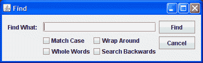

# Synth 示例

> 原文：[`docs.oracle.com/javase/tutorial/uiswing/lookandfeel/synthExample.html`](https://docs.oracle.com/javase/tutorial/uiswing/lookandfeel/synthExample.html)

在标题为 A GroupLayout Example 的课程中，使用 `GroupLayout` 创建了一个名为 "Find" 的搜索对话框。创建对话框的程序 `Find.java` 使用了跨平台（"Metal"）外观和 "Ocean" 主题：



这节课使用 Synth 创建了相同的对话框，使用了外部 XML 文件。这是 ``SynthDialog.java`` 文件的清单。

`SynthDialog.java` 与 `Find.java` 完全相同，只是 `initLookAndFeel()` 方法已经更改为使用 Synth 外观和一个名为 `synthDemo.xml` 的外部文件。这是新的 `initLookAndFeel()` 方法：

```java
private static void initLookAndFeel() {
   SynthLookAndFeel lookAndFeel = new SynthLookAndFeel();

   // SynthLookAndFeel load() method throws a checked exception
   // (java.text.ParseException) so it must be handled
   try {
      lookAndFeel.load(SynthDialog.class.getResourceAsStream("synthDemo.xml"),
                                                               SynthDialog.class);
      UIManager.setLookAndFeel(lookAndFeel);
   } 

   catch (ParseException e) {
      System.err.println("Couldn't get specified look and feel ("
                                   + lookAndFeel
                                    + "), for some reason.");
      System.err.println("Using the default look and feel.");
      e.printStackTrace();
   }
}

```

## XML 文件

XML 文件 `synthDemo.xml` 以一个绑定到所有区域的样式开始。这样做是一个好习惯，以确保没有绑定样式的区域将包含一些内容。这个样式使所有区域以不透明颜色绘制其背景。它还设置了默认字体和默认颜色。

```java
  <!-- Style that all regions will use -->
  <style id="backingStyle">
    <!-- Make all the regions opaque-->
    <opaque value="TRUE"/>
    <font name="Dialog" size="14"/>
    <state>
      <color value="#D8D987" type="BACKGROUND"/>
      <color value="RED" type="FOREGROUND"/>
    </state>
  </style>
  <bind style="backingStyle" type="region" key=".*"/>

```

* * *

**注意：**

1\. 颜色定义必须在 `<state>` 元素内部。这样可以根据状态改变颜色。`backingStyle` 中的 `<state>` 元素没有属性，因此适用于所有区域，无论它们的状态如何。如果一个区域有其他状态，这些状态将合并，优先考虑文件中后面出现的状态定义。

2\. 字体定义不在 `<state>` 元素内部，因为当状态改变时字体 *不应该* 改变（许多组件的大小取决于它们的字体，字体的改变可能会导致组件意外地改变大小）。

* * *

下一个定义的 `<style>` 元素是用于使用图像绘制的文本字段。

```java
  <style id="textfield">
    <insets top="4" left="6" bottom="4" right="6"/>
    <state>
       <font name="Verdana" size="14"/>
       <color value="#D2DFF2" type="BACKGROUND"/>
       <color value="#000000" type="TEXT_FOREGROUND"/>
    </state>
    <imagePainter method="textFieldBorder" path="images/textfield.png"
                  sourceInsets="4 6 4 6" paintCenter="false"/>
  </style>
  <bind style="textfield" type="region" key="TextField"/>

```

* * *

**注意：**

1\. 字体和颜色定义覆盖了 `backingStyle` 中的定义。

2\. `insets` 和 `sourceInsets` 被赋予相同的值，这只是一个巧合，因为它们彼此无关。

3\. 背景颜色，#D2DFF2，是一种淡蓝色，与图像 `textfield.png` 中的背景颜色相同。

4\. `paintCenter` 设置为 `false`，这样你就可以看到背景颜色。

* * *

下一个 `<style>` 元素是为使用不同图像绘制的按钮而定义的，取决于按钮的状态。当鼠标经过按钮时，其外观会改变。当点击（按下）按钮时，图像再次更改。

```java
 <style id="button">
        <!-- Shift the text one pixel when pressed -->
    <property key="Button.textShiftOffset" type="integer" value="1"/>
    <!-- set size of buttons -->
    <insets top="15" left="20" bottom="15" right="20"/>
    <state>
      <imagePainter method="buttonBackground" path="images/button.png"
                           sourceInsets="10 10 10 10" />
      <font name="Dialog" size="16"/>
      <color type="TEXT_FOREGROUND" value="#FFFFFF"/>
    </state>

    <state value="PRESSED"> 
      <imagePainter method="buttonBackground"
          path="images/button_press.png"
                   sourceInsets="10 10 10 10" />
    </state>

    <state value="MOUSE_OVER">    
      <imagePainter method="buttonBackground"
          path="images/button_over.png"
                 sourceInsets="10 10 10 10" />
    </state>
  </style>
  <bind style="button" type="region" key="Button"/>

```

* * *

**注意：**

1\. 在没有属性的 `<state>` 元素内部的字体和颜色定义适用于所有按钮状态。这是因为适用的所有状态的定义（而 `<state>` 元素没有属性是其中之一）将合并，没有其他可能优先的字体和颜色定义。

2\. `sourceInsets` 的值足够大，使按钮图像的曲线角不会被拉伸。

3\. `PRESSED` 和 `MOUSE_OVER` 状态的顺序很重要。由于鼠标在按下按钮时始终位于按钮上方，因此这两种状态都将应用于按下的按钮，并且将应用第一个定义的状态（`PRESSED`）。当鼠标悬停在按钮上但未按下时，只有 `MOUSE_OVER` 状态适用。如果 `PRESSED` 和 `MOUSE_OVER` 状态的顺序颠倒，那么 `PRESSED` 状态的图像将永远不会被使用。

* * *

下一个 <style> 元素用于根据复选框状态绘制不同图标的复选框。

```java
  <style id="checkbox">
    <imageIcon id="check_off" path="images/checkbox_off.png"/>
    <imageIcon id="check_on" path="images/checkbox_on.png"/>
    <property key="CheckBox.icon" value="check_off"/>
    <state value="SELECTED">   
      <property key="CheckBox.icon" value="check_on"/>
    </state>
  </style>
  <bind style="checkbox" type="region" key="Checkbox"/>    

```

* * *

**注：**

1\. 必须使用 <imageIcon> 元素来定义要使用的任何图标。

2\. <insets> 元素和 `sourceInsets` 属性不适用于图标，因为它们以固定大小呈现，不会被拉伸。

3\. 用于渲染复选框的图标是在 `CheckBox.icon` 属性中命名的图标（参见 [`javax/swing/plaf/synth/doc-files/componentProperties.html`](https://docs.oracle.com/javase/8/docs/api/javax/swing/plaf/synth/doc-files/componentProperties.html)），这是具有 id="check_off" 的图标，除非复选框状态为 `SELECTED`。

* * *

`synthDemo.xml` 文件由上述样式构成，包裹在 <synth></synth> 标签中。您可以通过点击 ``synthDemo.xml`` 打开完成的文件。

* * *

**试试这个：**

点击“启动”按钮以使用 [Java™ Web Start](http://www.oracle.com/technetwork/java/javase/javawebstart/index.html) 运行 SynthDialog 示例（[下载 JDK 7 或更高版本](http://www.oracle.com/technetwork/java/javase/downloads/index.html)）。或者，要自行编译和运行示例，请参考 示例索引</ a>.


* * *
