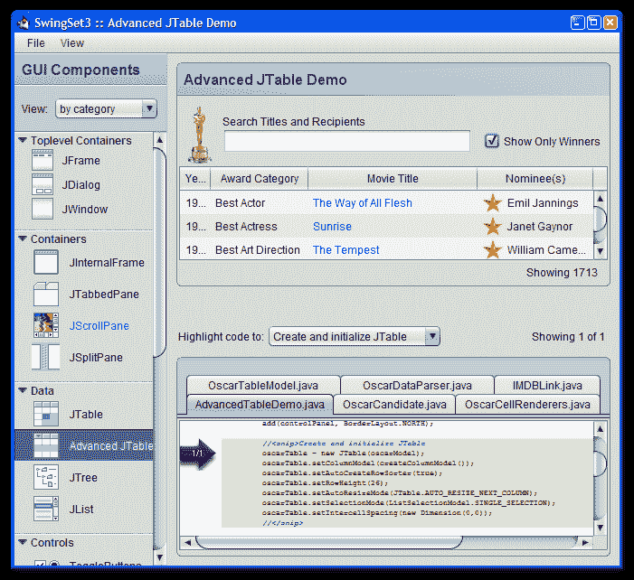

# Nimbus 外观

> 原文：[`docs.oracle.com/javase/tutorial/uiswing/lookandfeel/nimbus.html`](https://docs.oracle.com/javase/tutorial/uiswing/lookandfeel/nimbus.html)

Nimbus 是在 Java SE 6 更新 10（6u10）发布中引入的一个精心设计的跨平台外观。以下来自 SwingSet3 的屏幕截图展示了 Nimbus 外观。



Nimbus 使用 Java 2D 矢量图形来绘制用户界面（UI），而不是静态位图，因此 UI 可以在任何分辨率下清晰呈现。

Nimbus 是高度可定制的。您可以直接使用 Nimbus 外观，或者可以使用您自己的品牌*定制*外观。

## 启用 Nimbus 外观

为了向后兼容，Metal 仍然是默认的 Swing 外观，但您可以通过以下三种方式之一切换到 Nimbus：

+   在创建图形用户界面（GUI）之前，在事件分派线程中添加以下代码：

    ```java
    import javax.swing.UIManager.*;

    try {
        for (LookAndFeelInfo info : UIManager.getInstalledLookAndFeels()) {
            if ("Nimbus".equals(info.getName())) {
                UIManager.setLookAndFeel(info.getClassName());
                break;
            }
        }
    } catch (Exception e) {
        // If Nimbus is not available, you can set the GUI to another look and feel.
    }

    ```

    第一行代码检索平台上安装的所有外观实现的列表，然后遍历列表以确定 Nimbus 是否可用。如果是，则将 Nimbus 设置为外观。

    * * *

    **版本说明：** 不要通过调用`UIManager.setLookAndFeel`方法显式设置 Nimbus 外观，因为并非所有版本或实现的 Java SE 6 都支持 Nimbus。此外，在 JDK 6 更新 10 和 JDK 7 发布之间，Nimbus 包的位置发生了变化。遍历所有安装的外观实现是一种更健壮的方法，因为如果 Nimbus 不可用，则使用默认外观。对于 JDK 6 更新 10 版本，Nimbus 包位于`com.sun.java.swing.plaf.nimbus.NimbusLookAndFeel`。

    * * *

+   在命令行中为特定应用程序指定 Nimbus 作为默认外观，如下所示：

    ```java
    java -Dswing.defaultlaf=javax.swing.plaf.nimbus.NimbusLookAndFeel *MyApp*

    ```

+   通过将以下行添加到`<*JAVA_HOME*>/lib/swing.properties`文件中，将默认外观永久设置为 Nimbus：

    ```java
    swing.defaultlaf=javax.swing.plaf.nimbus.NimbusLookAndFeel

    ```

    如果`swing.properties`文件尚不存在，则需要创建它。
