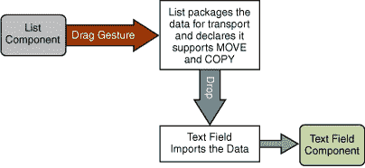
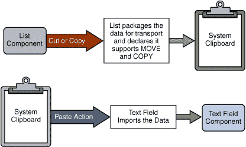

# DnD 简介

> 原文：[`docs.oracle.com/javase/tutorial/uiswing/dnd/intro.html`](https://docs.oracle.com/javase/tutorial/uiswing/dnd/intro.html)

如果您正在编写一个应用程序，您会希望支持在应用程序组件之间传输信息的能力。但您也希望您的应用程序与其他应用程序良好地配合 — 包括支持在您的应用程序和其他 Java 应用程序之间以及在您的应用程序和本地应用程序之间传输信息的能力。传输数据的能力有两种形式：

+   拖放（DnD）支持。以下图示展示了从`JList`拖动并放置到`JTextField`组件的过程（箭头显示数据的路径）：

+   剪切或复制粘贴的剪贴板传输。以下图示展示了从`JList`剪切（或复制）并粘贴到`JTextField`组件的过程：

## 拖放 — 幕后

假设有一个名为 Rollo 的用户，他正在运行一个 Java 应用程序。他想要从列表中拖动一些文本并将其放入文本字段中。（请注意，从本地应用程序拖动到 Java 应用程序时，过程是相同的。）简而言之，拖放过程如下进行：

+   Rollo 在*源*组件（列表）中选择了一行文本。在按住鼠标按钮的同时，Rollo 开始拖动文本 — 这启动了*拖动手势*。

+   当拖动开始时，列表会打包数据以进行*导出*，并声明它支持的*源操作*，比如`COPY`、`MOVE`或`LINK`。

+   当 Rollo 拖动数据时，Swing 不断计算位置并处理渲染。

+   如果 Rollo 在拖动过程中同时按住 Shift 和/或 Control 键，这个*用户操作*也是拖动手势的一部分。通常，普通拖动请求`MOVE`操作。在拖动时按住 Control 键请求`COPY`操作，同时按住 Shift 和 Control 请求`LINK`操作。

+   一旦 Rollo 将文本拖动到文本字段组件的边界上，*目标*会持续轮询以查看是否接受或拒绝潜在的放置。在拖动过程中，目标通过显示*放置位置*（可能是插入光标或高亮选择）来提供反馈。在这种情况下，文本字段（当前目标）允许替换选定文本和插入新文本。

+   当 Rollo 释放鼠标按钮时，文本组件会检查声明的源操作和任何用户操作，然后选择它想要的可用选项。在这种情况下，文本字段选择在放置点插入新文本。

+   最后，文本字段*导入*数据。

虽然这可能看起来是一个艰巨的过程，但 Swing 会为您处理大部分工作。这个框架被设计成您只需插入特定于您的组件的细节，其余的"就能运行"。

更多内容请参见下一节。

* * *

**注意：**

我们*不建议*您使用 AWT 类创建自己的拖放支持。这种实现将需要每个组件内部的显著复杂支持。在 1.4 版本发布之前，当拖放系统被重新设计时，开发人员偶尔会创建自己的拖放支持，但它无法处理像树和表格这样具有微妙选择和放置问题的复杂组件。

* * *
