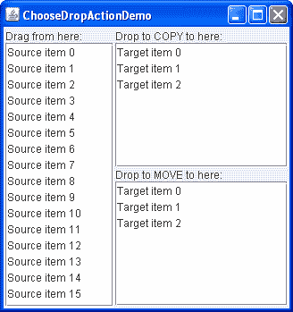

# 演示 - 选择放置操作

> 原文：[`docs.oracle.com/javase/tutorial/uiswing/dnd/dropactiondemo.html`](https://docs.oracle.com/javase/tutorial/uiswing/dnd/dropactiondemo.html)

以下演示`ChooseDropActionDemo`包含三个列表。如屏幕截图所示，左侧的列表标有“从这里拖动”，是拖动源。该列表支持移动和复制，但不实现导入，因此无法将内容拖放到其中。

右侧是两个充当放置目标的列表。顶部列表标有“在此处复制”，只允许将数据复制到其中。底部列表标有“在此处移动”，只允许将数据移动到其中。源列表只允许从中拖动数据。



* * *

**试一试：**

1.  点击“启动”按钮以使用[Java™ Web Start](http://www.oracle.com/technetwork/java/javase/javawebstart/index.html)运行`ChooseDropActionDemo`（[下载 JDK 7 或更高版本](http://www.oracle.com/technetwork/java/javase/downloads/index.html)）。或者，要自行编译和运行示例，请参考示例索引。

1.  在源列表中选择一个项目并拖动到上方目标列表。当你拖动到目标上方时，即使你没有按住 Control 键表示要进行复制操作，也会注意到显示复制放置鼠标指针。（请注意，在 Macintosh 平台上，除非按住 Option 键，否则不会显示复制指针。）

1.  放下项目。它被插入到目标列表中，但不会从源列表中移除 - 如期望的那样。

1.  再次从源列表拖动，但这次放入下方目标列表。放下项目。它被插入到目标列表中并从源列表中移除。

1.  在源列表中选择另一项，并在按住 Control 键的同时拖动该项到下方目标列表，表示偏好复制操作。

1.  将项目放入列表中。项目不会被插入 - 拖放被拒绝。传输处理程序的`canImport`方法被编码为拒绝复制操作，但也可以实现为返回 true，这样用户操作将占上风，复制将发生。

* * *

正如你所猜测的，``ChooseDropActionDemo.java``示例包含两个`TransferHandler`实现：

```java
/**
 * The FromTransferHandler allows dragging from the list and
 * supports both copy and move actions.  This transfer handler
 * does not support import.
 */
class FromTransferHandler extends TransferHandler {
    public int getSourceActions(JComponent comp) {
        return COPY_OR_MOVE;
    }

    private int index = 0;

    public Transferable createTransferable(JComponent comp) {
        index = dragFrom.getSelectedIndex();
        if (index < 0 || index >= from.getSize()) {
            return null;
        }

        return new StringSelection((String)dragFrom.getSelectedValue());
    }

    public void exportDone(JComponent comp, Transferable trans, int action) {
        if (action != MOVE) {
            return;
        }

        from.removeElementAt(index);
    }
}

/**
 * The ToTransferHandler has a constructor that specifies whether the
 * instance will support only the copy action or the move action.
 * This transfer handler does not support export.
 */
class ToTransferHandler extends TransferHandler {
    int action;

    public ToTransferHandler(int action) {
        this.action = action;
    }

    public boolean canImport(TransferHandler.TransferSupport support) {
        // for the demo, we will only support drops (not clipboard paste)
        if (!support.isDrop()) {
            return false;
        }

        // we only import Strings
        if (!support.isDataFlavorSupported(DataFlavor.stringFlavor)) {
            return false;
        }

        // check if the source actions contain the desired action -
        // either copy or move, depending on what was specified when
        // this instance was created
        boolean actionSupported = (action & support.getSourceDropActions()) == action;
        if (actionSupported) {
            support.setDropAction(action);
            return true;
        }

        // the desired action is not supported, so reject the transfer
        return false;
    }

    public boolean importData(TransferHandler.TransferSupport support) {
        // if we cannot handle the import, say so
        if (!canImport(support)) {
            return false;
        }

        // fetch the drop location
        JList.DropLocation dl = (JList.DropLocation)support.getDropLocation();

        int index = dl.getIndex();

        // fetch the data and bail if this fails
        String data;
        try {
            data = (String)support.getTransferable().getTransferData(DataFlavor.stringFlavor);
        } catch (UnsupportedFlavorException e) {
            return false;
        } catch (java.io.IOException e) {
            return false;
        }

        JList list = (JList)support.getComponent();
        DefaultListModel model = (DefaultListModel)list.getModel();
        model.insertElementAt(data, index);

        Rectangle rect = list.getCellBounds(index, index);
        list.scrollRectToVisible(rect);
        list.setSelectedIndex(index);
        list.requestFocusInWindow();

        return true;
    }  
} 

```

`FromTransferHandler`附加到源列表，允许从列表中拖动并支持复制和移动操作。如果尝试将内容放置到此列表中，将会被拒绝，因为`FromTransferHandler`未实现`canImport`和`importData`方法。

`ToTransferHandler` 被附加到*移动*和*复制*目标列表上，包含一个构造函数，指定目标列表是否只允许复制或只允许移动。支持复制操作的实例被附加到复制列表上，支持移动操作的实例被附加到移动列表上。

你可能也对顶层放置示例感兴趣，该示例还说明了如何选择放置操作。

接下来我们来看如何显示放置位置。
