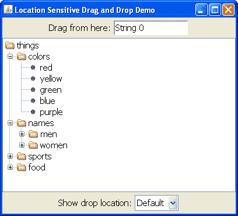

# 演示 - LocationSensitiveDemo

> 原文：[`docs.oracle.com/javase/tutorial/uiswing/dnd/locsensitivedemo.html`](https://docs.oracle.com/javase/tutorial/uiswing/dnd/locsensitivedemo.html)

下面的演示`LocationSensitiveDemo`展示了一个已配置为支持在除了名为"names"（或其子代）之外的任何节点上进行拖放的`JTree`。使用窗口顶部的文本字段作为拖动源（每次从那里拖动时，字符串编号会自动递增）。

树下方的一个下拉框允许您切换显示拖放位置的行为。Swing 的默认行为是仅在区域可以接受拖放时显示拖放位置。您可以覆盖此行为以始终显示拖放位置（即使区域无法接受拖放）或永远不显示拖放位置（即使区域可以接受拖放）。



* * *

**试试这个：**

1.  单击启动按钮以使用[Java™ Web Start](http://www.oracle.com/technetwork/java/javase/javawebstart/index.html)运行`LocationSensitiveDemo`（[下载 JDK 7 或更高版本](http://www.oracle.com/technetwork/java/javase/downloads/index.html)）。或者，要自行编译和运行示例，请参考示例索引。

1.  通过在文本字段中"String 0"上按下并将鼠标移动一小段距离来启动拖动。拖动到树中并向下移动。当你将鼠标悬停在大多数节点上时，拖动接受性会通过鼠标指针和节点高亮显示来指示。将文本放到"colors"节点上。新项目将成为该节点的子节点，并成为列出的颜色的同级节点。

1.  将"String 1"从文本字段拖动到树中。尝试将其放在"names"节点上。当你拖动到该节点或其子节点时，Swing 不会提供任何拖放位置反馈，也不会接受数据。

1.  将"Show drop location"下拉框更改为"Always"。

1.  重复步骤 1 和 2。现在拖放位置将显示在"names"节点，但你无法将数据放入该区域。

1.  将"Show drop location"下拉框更改为"Never"。

1.  重复步骤 1 和 2。拖放位置将不会显示在树的任何部分，尽管你仍然可以将数据放入除了"names"之外的节点。

* * *

``LocationSensitiveDemo``的`canImport`方法如下所示：

```java
public boolean canImport(TransferHandler.TransferSupport info) {
    // for the demo, we will only support drops (not clipboard paste)
    if (!info.isDrop()) {
        return false;
    }

    String item = (String)indicateCombo.getSelectedItem();

    if (item.equals("Always")) {
        info.setShowDropLocation(true);
    } else if (item.equals("Never")) {
        info.setShowDropLocation(false);
    }

    // we only import Strings
    if (!info.isDataFlavorSupported(DataFlavor.stringFlavor)) {
        return false;
    }

    // fetch the drop location
    JTree.DropLocation dl = (JTree.DropLocation)info.getDropLocation();

    TreePath path = dl.getPath();

    // we do not support invalid paths or descendants of the names folder
    if (path == null || namesPath.isDescendant(path)) {
        return false;
    }

    return true;
}

```

第一个显示为粗体的代码片段修改了拖放位置反馈机制。如果是"Always"，则始终显示拖放位置。如果是"Never"，则永远不显示拖放位置。否则，应用默认行为。

粗体显示的第二个代码片段包含确定树是否接受数据的逻辑。如果路径不是有效路径，或者不是名称路径（或其子路径），它将返回 false，导入将不被接受。
