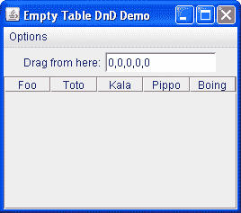

# 空表格拖放

> 原文：[`docs.oracle.com/javase/tutorial/uiswing/dnd/emptytable.html`](https://docs.oracle.com/javase/tutorial/uiswing/dnd/emptytable.html)

将内容拖放到空表格中会带来独特的挑战。遵循正确的步骤：

+   创建空表格。

+   创建并附加`TransferHandler`。

+   通过调用`setDragEnabled(true)`启用数据传输。

+   创建滚动窗格并将表格添加到滚动窗格中。

运行应用程序并尝试将有效数据拖放到表格中，但它拒绝了拖放。怎么回事？

原因在于空表格（不像空列表或空树）不占据滚动窗格中的任何空间。`JTable`不会自动拉伸以填充`JScrollPane`视口的高度 — 它只会占据所需的垂直空间以容纳其中的行。因此，当您拖动到空表格上时，实际上并不在表格上，因此拖放失败。

您可以通过调用[`JTable.setFillsViewportHeight(boolean)`](https://docs.oracle.com/javase/8/docs/api/javax/swing/JTable.html#setFillsViewportHeight-boolean-)来配置表格，以允许在视口中的任何位置进行拖放。此属性的默认值为 false，以确保向后兼容性。

以下示例`FillViewportHeightDemo`允许您尝试将数据拖放到空表格中。该演示包含一个具有五列的空表格，其拖放模式设置为插入行，并提供五个逗号分隔值的拖动源，这些值会自动递增。

* * *

**试试这个：**

1.  单击“启动”按钮以使用[Java™ Web Start](http://www.oracle.com/technetwork/java/javase/javawebstart/index.html)运行`FillViewportHeightDemo`（[下载 JDK 7 或更高版本](http://www.oracle.com/technetwork/java/javase/downloads/index.html)）。或者，要自行编译和运行示例，请参考示例索引。

1.  从标有“从这里拖动”的文本字段拖动到表格中。

1.  拖放到表格上。拖放被拒绝。

1.  双击拖动源。它会将当前值（0, 0, 0, 0, 0）放入表格中，并递增文本字段中的值。

1.  再次从文本字段拖动到表格中。您可以在行的上方或下方插入，但不能在下方的区域内插入。

1.  从“选项”菜单中选择“填充视口高度”以启用“fillsViewportHeight”属性。

1.  从“选项”菜单中选择“重置”以清空表格。

1.  从文本组件拖动到表格中。现在您可以在视口的任何位置放置数据，并将其插入到第 0 行。

* * *

你可以查看``FillViewportHeightDemo.java``的源代码，但要记住的主要观点是，通常应该在任何接受拖放数据的表格上调用`setFillsViewportHeight(true)`。
