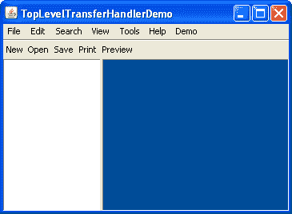

# 顶层拖放

> 原文：[`docs.oracle.com/javase/tutorial/uiswing/dnd/toplevel.html`](https://docs.oracle.com/javase/tutorial/uiswing/dnd/toplevel.html)

到目前为止，我们主要关注将`TransferHandler`附加到`JComponent`子类之一。但是您也可以直接在顶层容器上设置`TransferHandler`，例如`JFrame`和`JDialog`。

这对于导入文件的应用程序特别有用，例如编辑器、IDE、图像处理程序、CD 刻录程序。这样的应用程序通常包括一个菜单、一个工具栏、一个用于编辑文档的区域，以及可能包括一个用于在打开文档之间切换的列表或机制。

我们有这样一个示例，但由于此演示读取文件，我们不提供 Java Web Start 版本——您将不得不自行下载和编译演示。

如下面的屏幕截图所示，`TopLevelTransferHandlerDemo`有一个菜单（空的，除了 Demo 子菜单），一个（非功能性的）工具栏，一个（左侧的）显示打开文档列表的区域，以及一个（右侧的）显示每个打开文档内容的区域。在启动时，蓝色文档区域已分配了一个支持文件导入的传输处理程序——因此是唯一可以接受拖放的地方。



* * *

**试试这个：**

1.  编译并运行``TopLevelTransferHandlerDemo``示例，如果您想下载一个为 NetBeans 结构化的 zip 文件，请参考示例索引。

1.  从您的本机桌面或文件系统中拖动文件并将其放置在右侧的蓝色文档区域。文件将被打开，并填充其内容的框架将出现。文档区域，一个`JDesktopPane`，包含支持导入`javaFileListFlavor`的传输处理程序。

1.  拖动另一个文件并尝试将其放置在文档区域。您会发现无法将其放置在显示最后一个文件的框架上。您也无法将其放置在列表、菜单或工具栏上。您唯一可以放置的地方是文档区域的蓝色部分或先前打开的框架的菜单栏。在每个内容框架内都有一个文本组件的传输处理程序，它不理解文件拖放——您可以将文本拖放到该区域，但不能拖放文件。

1.  从菜单中选择 Demo->Use Top-Level TransferHandler 来在顶层容器——一个`JFrame`上安装传输处理程序。

1.  再次尝试拖动演示。接受拖放的区域数量已增加。现在您可以将其放置在应用程序的几乎任何位置，包括菜单栏、工具栏、框架的标题栏，但不能放置在列表（左侧）或先前打开文件的内容区域。`JList`和文本区域的传输处理程序都不知道如何导入文件。

1.  通过选择 Demo->从菜单中的列表和文本中删除 TransferHandler 来禁用剩余组件上的传输处理程序。

1.  再次拖动演示。现在您可以在应用程序的*任何位置*放置文件！

1.  从菜单中选择 Demo->使用 COPY 操作。

1.  再次拖动演示。请注意，鼠标光标现在显示为 COPY 光标 — 这提供了更准确的反馈，因为成功拖放不会从源文件中删除文件。目标可以根据选择拖放操作中描述的可用拖放操作进行选择。

* * *

注意在文本组件上禁用默认传输处理程序的一个不良副作用：您无法在编辑区域内再拖放（或剪切/复制/粘贴）文本。要解决此问题，您需要为文本组件实现一个自定义传输处理程序，该处理程序接受文件拖放，并重新实现缺失的文本传输支持。您可能想要查看[RFE 4830695](http://bugs.java.com/bugdatabase/view_bug.do?bug_id=4830695)，该请求允许在现有的`TransferHandler`上添加数据导入。

这是`TopLevelTransferHandlerDemo.java`的源代码：

```java
/**
 * Demonstration of the top-level {@code TransferHandler}
 * support on {@code JFrame}.
 */
public class TopLevelTransferHandlerDemo extends JFrame {

    private static boolean DEMO = false;

    private JDesktopPane dp = new JDesktopPane();
    private DefaultListModel listModel = new DefaultListModel();
    private JList list = new JList(listModel);
    private static int left;
    private static int top;
    private JCheckBoxMenuItem copyItem;
    private JCheckBoxMenuItem nullItem;
    private JCheckBoxMenuItem thItem;

    private class Doc extends InternalFrameAdapter implements ActionListener {
        String name;
        JInternalFrame frame;
        TransferHandler th;
        JTextArea area;

        public Doc(File file) {
            this.name = file.getName();
            try {
                init(file.toURI().toURL());
            } catch (MalformedURLException e) {
                e.printStackTrace();
            }
        }

        public Doc(String name) {
            this.name = name;
            init(getClass().getResource(name));
        }

        private void init(URL url) {
            frame = new JInternalFrame(name);
            frame.addInternalFrameListener(this);
            listModel.add(listModel.size(), this);

            area = new JTextArea();
            area.setMargin(new Insets(5, 5, 5, 5));

            try {
                BufferedReader reader = new BufferedReader(new InputStreamReader(url.openStream()));
                String in;
                while ((in = reader.readLine()) != null) {
                    area.append(in);
                    area.append("\n");
                }
                reader.close();
            } catch (Exception e) {
                e.printStackTrace();
                return;
            }

            th = area.getTransferHandler();
            area.setFont(new Font("monospaced", Font.PLAIN, 12));
            area.setCaretPosition(0);
            area.setDragEnabled(true);
            area.setDropMode(DropMode.INSERT);
            frame.getContentPane().add(new JScrollPane(area));
            dp.add(frame);
            frame.show();
            if (DEMO) {
                frame.setSize(300, 200);
            } else {
                frame.setSize(400, 300);
            }
            frame.setResizable(true);
            frame.setClosable(true);
            frame.setIconifiable(true);
            frame.setMaximizable(true);
            frame.setLocation(left, top);
            incr();
            SwingUtilities.invokeLater(new Runnable() {
                public void run() {
                    select();
                }
            });
            nullItem.addActionListener(this);
            setNullTH();
        }

        public void internalFrameClosing(InternalFrameEvent event) {
            listModel.removeElement(this);
            nullItem.removeActionListener(this);
        }

        public void internalFrameOpened(InternalFrameEvent event) {
            int index = listModel.indexOf(this);
            list.getSelectionModel().setSelectionInterval(index, index);
        }

        public void internalFrameActivated(InternalFrameEvent event) {
            int index = listModel.indexOf(this);
            list.getSelectionModel().setSelectionInterval(index, index);
        }

        public String toString() {
            return name;
        }

        public void select() {
            try {
                frame.toFront();
                frame.setSelected(true);
            } catch (java.beans.PropertyVetoException e) {}
        }

        public void actionPerformed(ActionEvent ae) {
            setNullTH();
        }

        public void setNullTH() {
            if (nullItem.isSelected()) {
                area.setTransferHandler(null);
            } else {
                area.setTransferHandler(th);
            }
        }
    }

    private TransferHandler handler = new TransferHandler() {
        public boolean canImport(TransferHandler.TransferSupport support) {
            if (!support.isDataFlavorSupported(DataFlavor.javaFileListFlavor)) {
                return false;
            }

            if (copyItem.isSelected()) {
                boolean copySupported = (COPY & support.getSourceDropActions()) == COPY;

                if (!copySupported) {
                    return false;
                }

                support.setDropAction(COPY);
            }

            return true;
        }

        public boolean importData(TransferHandler.TransferSupport support) {
            if (!canImport(support)) {
                return false;
            }

            Transferable t = support.getTransferable();

            try {
                java.util.List<File> l =
                    (java.util.List<File>)t.getTransferData(DataFlavor.javaFileListFlavor);

                for (File f : l) {
                    new Doc(f);
                }
            } catch (UnsupportedFlavorException e) {
                return false;
            } catch (IOException e) {
                return false;
            }

            return true;
        }
    };

    private static void incr() {
        left += 30;
        top += 30;
        if (top == 150) {
            top = 0;
        }
    }

    public TopLevelTransferHandlerDemo() {
        super("TopLevelTransferHandlerDemo");
        setJMenuBar(createDummyMenuBar());
        getContentPane().add(createDummyToolBar(), BorderLayout.NORTH);

        JSplitPane sp = new JSplitPane(JSplitPane.HORIZONTAL_SPLIT, list, dp);
        sp.setDividerLocation(120);
        getContentPane().add(sp);
        //new Doc("sample.txt");
        //new Doc("sample.txt");
        //new Doc("sample.txt");

        list.getSelectionModel().setSelectionMode(ListSelectionModel.SINGLE_SELECTION);

        list.addListSelectionListener(new ListSelectionListener() {
            public void valueChanged(ListSelectionEvent e) {
                if (e.getValueIsAdjusting()) {
                    return;
                }

                Doc val = (Doc)list.getSelectedValue();
                if (val != null) {
                    val.select();
                }
             }
        });

        final TransferHandler th = list.getTransferHandler();

        nullItem.addActionListener(new ActionListener() {
            public void actionPerformed(ActionEvent ae) {
                if (nullItem.isSelected()) {
                    list.setTransferHandler(null);
                } else {
                    list.setTransferHandler(th);
                }
            }
        });
        thItem.addActionListener(new ActionListener() {
            public void actionPerformed(ActionEvent ae) {
                if (thItem.isSelected()) {
                    setTransferHandler(handler);
                } else {
                    setTransferHandler(null);
                }
            }
        });
        dp.setTransferHandler(handler);
    }

    private static void createAndShowGUI(String[] args) {
        try {
            UIManager.setLookAndFeel(UIManager.getSystemLookAndFeelClassName());
        } catch (Exception e) {
        }

        TopLevelTransferHandlerDemo test = new TopLevelTransferHandlerDemo();
        test.setDefaultCloseOperation(JFrame.EXIT_ON_CLOSE);
        if (DEMO) {
            test.setSize(493, 307);
        } else {
            test.setSize(800, 600);
        }
        test.setLocationRelativeTo(null);
        test.setVisible(true);
        test.list.requestFocus();
    }

    public static void main(final String[] args) {
        SwingUtilities.invokeLater(new Runnable() {
            public void run() {
                //Turn off metal's use of bold fonts
                UIManager.put("swing.boldMetal", Boolean.FALSE);
                createAndShowGUI(args);
            }
        });
    }

    private JToolBar createDummyToolBar() {
        JToolBar tb = new JToolBar();
        JButton b;
        b = new JButton("New");
        b.setRequestFocusEnabled(false);
        tb.add(b);
        b = new JButton("Open");
        b.setRequestFocusEnabled(false);
        tb.add(b);
        b = new JButton("Save");
        b.setRequestFocusEnabled(false);
        tb.add(b);
        b = new JButton("Print");
        b.setRequestFocusEnabled(false);
        tb.add(b);
        b = new JButton("Preview");
        b.setRequestFocusEnabled(false);
        tb.add(b);
        tb.setFloatable(false);
        return tb;
    }

    private JMenuBar createDummyMenuBar() {
        JMenuBar mb = new JMenuBar();
        mb.add(createDummyMenu("File"));
        mb.add(createDummyMenu("Edit"));
        mb.add(createDummyMenu("Search"));
        mb.add(createDummyMenu("View"));
        mb.add(createDummyMenu("Tools"));
        mb.add(createDummyMenu("Help"));

        JMenu demo = new JMenu("Demo");
        demo.setMnemonic(KeyEvent.VK_D);
        mb.add(demo);

        thItem = new JCheckBoxMenuItem("Use Top-Level TransferHandler");
        thItem.setMnemonic(KeyEvent.VK_T);
        demo.add(thItem);

        nullItem = new JCheckBoxMenuItem("Remove TransferHandler from List and Text");
        nullItem.setMnemonic(KeyEvent.VK_R);
        demo.add(nullItem);

        copyItem = new JCheckBoxMenuItem("Use COPY Action");
        copyItem.setMnemonic(KeyEvent.VK_C);
        demo.add(copyItem);

        return mb;
    }

    private JMenu createDummyMenu(String str) {
        JMenu menu = new JMenu(str);
        JMenuItem item = new JMenuItem("[Empty]");
        item.setEnabled(false);
        menu.add(item);
        return menu;
    }
}

```
