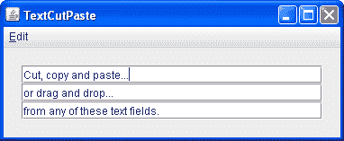

# 在文本组件中进行 CCP

> 原文：[`docs.oracle.com/javase/tutorial/uiswing/dnd/textpaste.html`](https://docs.oracle.com/javase/tutorial/uiswing/dnd/textpaste.html)

如果您正在使用 Swing 文本组件（文本字段、密码字段、格式化文本字段或文本区域）之一实现剪切、复制和粘贴，您的工作非常简单。这些文本组件利用了[`DefaultEditorKit`](https://docs.oracle.com/javase/8/docs/api/javax/swing/text/DefaultEditorKit.html)，它提供了内置的剪切、复制和粘贴操作。默认编辑工具包还处理了记住上次焦点在哪个组件的工作。这意味着如果用户使用菜单或键盘快捷键启动其中一个操作，正确的组件将接收该操作 —— 不需要额外的代码。

下面的演示`TextCutPaste`包含三个文本字段。如您在屏幕截图中所见，您可以剪切、复制和粘贴到任何一个文本字段或从中粘贴。它们还支持拖放操作。



* * *

**试一试：**

1.  点击启动按钮以使用[Java™ Web Start](http://www.oracle.com/technetwork/java/javase/javawebstart/index.html)运行`TextCutPaste`（[下载 JDK 7 或更高版本](http://www.oracle.com/technetwork/java/javase/downloads/index.html)）。或者，要自行编译和运行示例，请参考示例索引。

1.  在其中一个文本字段中选择文本。使用编辑菜单或键盘快捷键从源处剪切或复制文本。

1.  将光标定位到要粘贴文本的位置。

1.  使用菜单或键盘快捷键粘贴文本。

1.  使用拖放执行相同的操作。

* * *

这是创建编辑菜单的代码，通过将`DefaultEditorKit`中定义的内置剪切、复制和粘贴操作与菜单项连接起来。这适用于任何继承自`JComponent`的组件：

```java
    /**
     * Create an Edit menu to support cut/copy/paste.
     */
    public JMenuBar createMenuBar () {
        JMenuItem menuItem = null;
        JMenuBar menuBar = new JMenuBar();
        JMenu mainMenu = new JMenu("Edit");
        mainMenu.setMnemonic(KeyEvent.VK_E);

        menuItem = new JMenuItem(new DefaultEditorKit.CutAction());
        menuItem.setText("Cut");
        menuItem.setMnemonic(KeyEvent.VK_T);
        mainMenu.add(menuItem);

        menuItem = new JMenuItem(new DefaultEditorKit.CopyAction());
        menuItem.setText("Copy");
        menuItem.setMnemonic(KeyEvent.VK_C);
        mainMenu.add(menuItem);

        menuItem = new JMenuItem(new DefaultEditorKit.PasteAction());
        menuItem.setText("Paste");
        menuItem.setMnemonic(KeyEvent.VK_P);
        mainMenu.add(menuItem);

        menuBar.add(mainMenu);
        return menuBar;
    }

```

接下来我们将看看如何使用不具有`DefaultEditorKit`内置支持的组件实现相同的功能。
