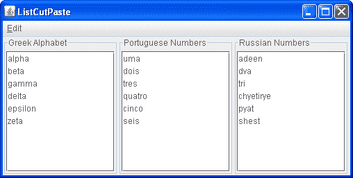

# 非文本组件中的 CCP

> 原文：[`docs.oracle.com/javase/tutorial/uiswing/dnd/listpaste.html`](https://docs.oracle.com/javase/tutorial/uiswing/dnd/listpaste.html)

如果您正在使用 Swing 组件之一来实现剪切、复制和粘贴，而不是文本组件，您需要进行一些额外的设置。首先，您需要在动作映射中安装剪切、复制和粘贴操作。以下方法显示了如何执行此操作：

```java
    private void setMappings(JList list) { 
        ActionMap map = list.getActionMap();
        map.put(TransferHandler.getCutAction().getValue(Action.NAME),
                TransferHandler.getCutAction());
        map.put(TransferHandler.getCopyAction().getValue(Action.NAME),
                TransferHandler.getCopyAction());
        map.put(TransferHandler.getPasteAction().getValue(Action.NAME),
                TransferHandler.getPasteAction());

```

当设置编辑菜单时，您还可以选择添加菜单加速器，以便用户可以输入 Control-C 来启动复制操作，例如。在下面的代码片段中，粗体文本显示了如何为剪切操作设置菜单加速器：

```java
    menuItem = new JMenuItem("Cut");
    menuItem.setActionCommand((String)TransferHandler.getCutAction().
             getValue(Action.NAME));
    menuItem.addActionListener(actionListener);
    menuItem.setAccelerator(
      KeyStroke.getKeyStroke(KeyEvent.VK_X, ActionEvent.CTRL_MASK));
    menuItem.setMnemonic(KeyEvent.VK_T);
    mainMenu.add(menuItem);

```

如果您已为 CCP 操作设置了菜单加速器，则下一步是多余的。如果您尚未设置菜单加速器，则需要将 CCP 绑定添加到输入映射中。以下代码片段显示了如何执行此操作：

```java
    // only required if you have not set the menu accelerators
    InputMap imap = this.getInputMap();
    imap.put(KeyStroke.getKeyStroke("ctrl X"),
        TransferHandler.getCutAction().getValue(Action.NAME));
    imap.put(KeyStroke.getKeyStroke("ctrl C"),
        TransferHandler.getCopyAction().getValue(Action.NAME));
    imap.put(KeyStroke.getKeyStroke("ctrl V"),
        TransferHandler.getPasteAction().getValue(Action.NAME));

```

一旦绑定已安装并且编辑菜单已设置，还有另一个问题需要解决：当用户启动剪切、复制或粘贴时，哪个组件应该接收该操作？在文本组件的情况下，`DefaultEditorKit`会记住上次焦点所在的组件，并将操作转发给该组件。以下类，`TransferActionListener`，为非文本 Swing 组件执行相同的功能。这个类可以被放入大多数应用程序中：

```java
public class TransferActionListener implements ActionListener,
                                              PropertyChangeListener {
    private JComponent focusOwner = null;

    public TransferActionListener() {
        KeyboardFocusManager manager = KeyboardFocusManager.
           getCurrentKeyboardFocusManager();
        manager.addPropertyChangeListener("permanentFocusOwner", this);
    }

    public void propertyChange(PropertyChangeEvent e) {
        Object o = e.getNewValue();
        if (o instanceof JComponent) {
            focusOwner = (JComponent)o;
        } else {
            focusOwner = null;
        }
    }

    public void actionPerformed(ActionEvent e) {
        if (focusOwner == null)
            return;
        String action = (String)e.getActionCommand();
        Action a = focusOwner.getActionMap().get(action);
        if (a != null) {
            a.actionPerformed(new ActionEvent(focusOwner,
                                              ActionEvent.ACTION_PERFORMED,
                                              null));
        }
    }
}

```

最后，您必须决定如何处理粘贴操作。在拖放的情况下，您将数据插入到放置位置。在粘贴的情况下，您没有用户指向所需粘贴位置的好处。您需要决定对您的应用程序来说什么是最合理的解决方案——在当前选择之前还是之后插入数据可能是最好的解决方案。

以下演示，ListCutPaste，展示了如何在一个`JList`实例中实现 CCP。如您在屏幕截图中所见，有三个列表，您可以在这些列表之间剪切、复制和粘贴。它们还支持拖放。对于这个演示，粘贴的数据将插入到当前选择之后。如果没有当前选择，则数据将附加到列表末尾。



* * *

**试一试：**

1.  点击“启动”按钮以使用[Java™ Web Start](http://www.oracle.com/technetwork/java/javase/javawebstart/index.html)运行 ListCutPaste（[下载 JDK 7 或更高版本](http://www.oracle.com/technetwork/java/javase/downloads/index.html)）。或者，要自行编译和运行示例，请参考示例索引。

1.  在其中一个列表中选择一个项目。使用编辑菜单或键盘快捷键从源中剪切或复制列表项。

1.  选择要粘贴项目的列表项。

1.  使用菜单或键盘等效方式粘贴文本。项目将在当前选择后粘贴。

1.  使用拖放执行相同操作。

* * *
