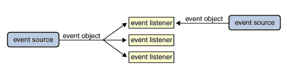
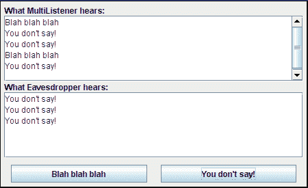

# 事件监听器简介

> 原文：[`docs.oracle.com/javase/tutorial/uiswing/events/intro.html`](https://docs.oracle.com/javase/tutorial/uiswing/events/intro.html)

如果你已经阅读了任何组件的操作指南页面，你可能已经了解了事件监听器的基础知识。

让我们看一个可能的最简单的事件处理示例。它被称为蜂鸣器，当你点击按钮时会发出蜂鸣声。

点击“启动”按钮以使用[Java™ Web Start](http://www.oracle.com/technetwork/java/javase/javawebstart/index.html)运行蜂鸣器（[下载 JDK 7 或更高版本](http://www.oracle.com/technetwork/java/javase/downloads/index.html)）。或者，要自行编译和运行示例，请参考示例索引。


您可以在`Beeper.java`中找到整个程序。以下是实现按钮事件处理的代码：

```java
public class Beeper ... implements ActionListener {
    ...
    *//where initialization occurs:*
        button.addActionListener(this);
    ...
    public void actionPerformed(ActionEvent e) {
        *...//Make a beep sound...*
    }
}

```

`Beeper`类实现了`ActionListener`接口，其中包含一个方法：`actionPerformed`。由于`Beeper`实现了`ActionListener`，一个`Beeper`对象可以注册为按钮触发的动作事件的监听器。一旦`Beeper`使用`Button`的`addActionListener`方法注册，每次点击按钮时都会调用`Beeper`的`actionPerformed`方法。

## 更复杂的示例

事件模型在前面的示例中展示得很简单，但非常强大和灵活。任意数量的事件监听器对象可以监听来自任意数量的事件源对象的各种事件。例如，一个程序可以为每个事件源创建一个监听器。或者一个程序可以对来自所有源的所有事件拥有一个单一的监听器。一个程序甚至可以对来自单个事件源的单一类型的事件拥有多个监听器。



多个监听器可以注册以接收特定类型的事件来自特定来源。此外，同一个监听器可以监听来自不同对象的通知。

每个事件都由一个对象表示，该对象提供有关事件的信息并标识事件源。事件源通常是组件或模型，但其他类型的对象也可以是事件源。

每当你想要检测特定组件的事件时，请首先查看该组件的操作指南部分。组件操作指南部分的列表在这里。操作指南部分提供了处理你可能关心的事件的示例。例如，在如何使用颜色选择器中，你会找到一个编写更改监听器以跟踪颜色选择器中颜色更改的示例。

以下示例演示了事件监听器可以注册在多个对象上，并且相同的事件可以发送给多个监听器。该示例包含两个事件源（`JButton`实例）和两个事件监听器。其中一个事件监听器（名为`MultiListener`的类的实例）监听来自两个按钮的事件。当它接收到事件时，它将事件的“动作命令”（设置为按钮标签上的文本）添加到顶部文本区域。第二个事件监听器（名为`Eavesdropper`的类的实例）仅监听一个按钮上的事件。当它接收到事件时，它将动作命令添加到底部文本区域。



* * *

**试试这个：**

1.  点击启动按钮以使用[Java™ Web Start](http://www.oracle.com/technetwork/java/javase/javawebstart/index.html)运行 MultiListener（[下载 JDK 7 或更高版本](http://www.oracle.com/technetwork/java/javase/downloads/index.html)）。或者，要自行编译和运行示例，请参考示例索引。

1.  点击*Blah blah blah*按钮。只有`MultiListener`对象被注册来监听这个按钮。

1.  点击*You do not say!*按钮。`MultiListener`对象和`Eavesdropper`对象都被注册来监听这个按钮。

* * *

你可以在`MultiListener.java`中找到整个程序。这里是实现按钮事件处理的代码：

```java
public class MultiListener ... implements ActionListener {
    ...
    *//where initialization occurs:*
        button1.addActionListener(this);
        button2.addActionListener(this);

        button2.addActionListener(new Eavesdropper(bottomTextArea));
    }

    public void actionPerformed(ActionEvent e) {
        topTextArea.append(e.getActionCommand() + newline);
    }
}

class Eavesdropper implements ActionListener {
    ...
    public void actionPerformed(ActionEvent e) {
        myTextArea.append(e.getActionCommand() + newline);
    }
}

```

在上述代码中，`MultiListener`和`Eavesdropper`都实现了`ActionListener`接口，并使用`JButton`的`addActionListener`方法注册为动作监听器。这两个类的`actionPerformed`方法的实现类似：它们只是将事件的动作命令添加到文本区域中。
