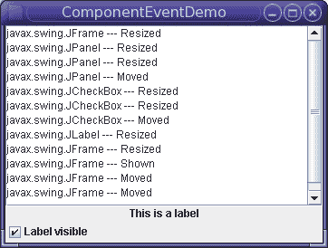

# 如何编写组件监听器

> 原文：[`docs.oracle.com/javase/tutorial/uiswing/events/componentlistener.html`](https://docs.oracle.com/javase/tutorial/uiswing/events/componentlistener.html)

组件监听器是用于接收组件事件的监听器接口。组件是具有图形表示的对象，可以显示在屏幕上并与用户交互。一些组件的示例是典型图形用户界面中的按钮、复选框和滚动条。

对于对处理组件事件感兴趣的类，要么实现此接口及其所有包含的方法，要么扩展抽象的 ComponentAdapter 类，只覆盖感兴趣的方法。然后，从该类创建的监听器对象将使用组件的 addComponentListener 方法注册到组件上。当组件的大小、位置或可见性发生变化时，监听器对象中的相关方法将被调用，并将 ComponentEvent 传递给它。

一个或多个组件事件是由`Component`对象在组件被隐藏、显示、移动或调整大小后立即触发的。

组件隐藏和组件显示事件仅在调用`Component`的`setVisible`方法时发生。例如，窗口可能被缩小为图标（图标化），而不会触发组件隐藏事件。

要编写一个简单的组件监听器程序，请按照以下步骤进行：

+   声明一个实现了组件监听器的类。例如：

    ```java
    public class ComponentEventDemo ... implements ComponentListener

    ```

+   确定您要捕获事件的组件。例如：面板、标签、复选框等。

+   将组件监听器添加到已识别的组件中。例如：

    ```java
    ....
    label.addComponentListener(this);
    .....
    checkbox.addComponentListener(this);
    ....
    panel.addComponentListener(this);
    ...
    frame.addComponentListener(this);

    ```

+   最后，通过使用组件监听器的四种方法来捕获这些组件的不同事件，如下所示：

    ```java
    public void componentHidden(ComponentEvent e) {
            displayMessage(e.getComponent().getClass().getName() + " --- Hidden");
        }

        public void componentMoved(ComponentEvent e) {
            displayMessage(e.getComponent().getClass().getName() + " --- Moved");
        }

        public void componentResized(ComponentEvent e) {
            displayMessage(e.getComponent().getClass().getName() + " --- Resized ");            
        }

        public void componentShown(ComponentEvent e) {
            displayMessage(e.getComponent().getClass().getName() + " --- Shown");

        }

    ```

以下示例演示了组件事件。窗口包含一个带有标签和复选框的面板。复选框控制标签是否可见。文本区域在窗口、面板、标签或复选框触发组件事件时显示消息。



* * *

**试一试：**

1.  点击“启动”按钮以使用[Java™ Web Start](http://www.oracle.com/technetwork/java/javase/javawebstart/index.html)运行 ComponentEventDemo（[下载 JDK 7 或更高版本](http://www.oracle.com/technetwork/java/javase/downloads/index.html)）。或者，要自行编译和运行示例，请参考示例索引。

1.  当窗口出现时，一个或多个组件显示事件已被触发。

1.  单击复选框以隐藏标签。

    标签触发了一个组件隐藏事件。面板触发了组件移动和组件调整大小事件。复选框触发了一个组件移动事件。

1.  再次点击复选框以显示标签。

    标签触发了一个组件显示事件。面板触发了组件移动和组件调整大小事件。复选框触发了一个组件移动事件。

1.  最小化然后还原窗口。

    你不会收到组件隐藏或显示事件。如果想要收到最小化事件的通知，应该使用窗口监听器或窗口状态监听器。

1.  调整窗口大小。

    你将会看到所有四个组件——标签、复选框、面板和框架——发出了组件调整大小（可能还有组件移动）事件。如果框架和面板的布局管理器没有使每个组件尽可能宽，那么面板、标签和复选框就不会被调整大小。

* * *

你可以在`ComponentEventDemo.java`中找到演示代码。这里只是与处理组件事件相关的代码：

```java
public class ComponentEventDemo ... implements ComponentListener {
    static JFrame frame;
    JLabel label;
    ...
    public ComponentEventDemo() {
        ...
        JPanel panel = new JPanel(new BorderLayout());
        label = new JLabel("This is a label", JLabel.CENTER);
        label.addComponentListener(this);
        panel.add(label, BorderLayout.CENTER);

        JCheckBox checkbox = new JCheckBox("Label visible", true);
        checkbox.addComponentListener(this);
        panel.add(checkbox, BorderLayout.PAGE_END);
        panel.addComponentListener(this);
        ...
        frame.addComponentListener(this);
    }
    ...
     public void componentHidden(ComponentEvent e) {
        displayMessage(e.getComponent().getClass().getName() + " --- Hidden");
    }

    public void componentMoved(ComponentEvent e) {
        displayMessage(e.getComponent().getClass().getName() + " --- Moved");
    }

    public void componentResized(ComponentEvent e) {
        displayMessage(e.getComponent().getClass().getName() + " --- Resized ");            
    }

    public void componentShown(ComponentEvent e) {
        displayMessage(e.getComponent().getClass().getName() + " --- Shown");

    }

    public static void main(String[] args) {
        ...
        //Create and set up the window.
        frame = new JFrame("ComponentEventDemo");
        ...
        JComponent newContentPane = new ComponentEventDemo();
        frame.setContentPane(newContentPane);
        ...
    }
}

```

## 组件监听器 API

组件监听器接口

*所有这些方法也在适配器类[`ComponentAdapter`](https://docs.oracle.com/javase/8/docs/api/java/awt/event/ComponentAdapter.html)中。*

| 方法 | 目的 |
| --- | --- |
| [componentHidden(ComponentEvent)](https://docs.oracle.com/javase/8/docs/api/java/awt/event/ComponentListener.html#componentHidden-java.awt.event.ComponentEvent-) | 在被监听的组件由于调用`setVisible`方法而被隐藏后调用。 |
| [componentMoved(ComponentEvent)](https://docs.oracle.com/javase/8/docs/api/java/awt/event/ComponentListener.html#componentMoved-java.awt.event.ComponentEvent-) | 在被监听的组件相对于其容器移动后调用。例如，如果移动了一个窗口，窗口会触发一个组件移动事件，但它包含的组件不会。 |
| [componentResized(ComponentEvent)](https://docs.oracle.com/javase/8/docs/api/java/awt/event/ComponentListener.html#componentResized-java.awt.event.ComponentEvent-) | 在被监听的组件的大小（矩形边界）发生变化后调用。 |
| [componentShown(ComponentEvent)](https://docs.oracle.com/javase/8/docs/api/java/awt/event/ComponentListener.html#componentShown-java.awt.event.ComponentEvent-) | 在被监听的组件由于调用`setVisible`方法而变为可见后调用。 |

组件事件类

| 方法 | 目的 |
| --- | --- |
| [Component getComponent()](https://docs.oracle.com/javase/8/docs/api/java/awt/event/ComponentEvent.html#getComponent--) | 返回触发事件的组件。你可以使用这个方法代替`getSource`方法。 |

## 使用组件监听器的示例

下表列出了使用组件监听器的示例。

| 示例 | 描述位置 | 注释 |
| --- | --- | --- |
| `ComponentEventDemo` | 本节 | 报告了发生在多个组件上的所有组件事件，以展示组件事件触发的情况。 |
