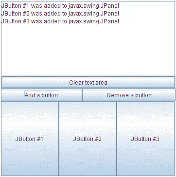

# 如何编写容器侦听器

> 原文：[`docs.oracle.com/javase/tutorial/uiswing/events/containerlistener.html`](https://docs.oracle.com/javase/tutorial/uiswing/events/containerlistener.html)

容器事件是由`Container`在组件被添加到容器或从容器中移除后触发的。这些事件仅用于通知 —— 组件成功添加或移除时不需要容器侦听器。

以下示例演示了容器事件。通过点击**添加按钮**或**移除按钮**，您可以向窗口底部的面板添加按钮或从中移除按钮。每次向面板添加或移除按钮时，面板都会触发一个容器事件，并通知面板的容器侦听器。侦听器在窗口顶部的文本区域中显示描述性消息。



* * *

**试一试：**

1.  点击启动按钮以使用[Java™ Web Start](http://www.oracle.com/technetwork/java/javase/javawebstart/index.html)运行 ContainerEventDemo（[下载 JDK 7 或更高版本](http://www.oracle.com/technetwork/java/javase/downloads/index.html)）。或者，要自行编译和运行示例，请参考示例索引。

1.  点击标有**添加按钮**的按钮。

    您将看到一个按钮出现在窗口底部附近。容器侦听器对产生的组件添加事件做出反应，通过在窗口顶部显示"JButton #1 was added to javax.swing.JPanel"。

1.  点击标有**移除按钮**的按钮。

    这将从面板中最近添加的按钮中移除一个，导致容器侦听器接收到组件移除事件。

* * *

您可以在`ContainerEventDemo.java`中找到演示的代码。以下是演示的容器事件处理代码：

```java
public class ContainerEventDemo ... implements ContainerListener ... {
    *...//where initialization occurs:*
        buttonPanel = new JPanel(new GridLayout(1,1));
        buttonPanel.addContainerListener(this);
    ...
    public void componentAdded(ContainerEvent e) {
        displayMessage(" added to ", e);
    }

    public void componentRemoved(ContainerEvent e) {
        displayMessage(" removed from ", e);
    }

    void displayMessage(String action, ContainerEvent e) {
        display.append(((JButton)e.getChild()).getText()
                       + " was"
                       + action
                       + e.getContainer().getClass().getName()
                       + newline);
    }
    ...
}

```

## 容器侦听器 API

容器侦听器接口

*相应的适配器类是[`ContainerAdapter`](https://docs.oracle.com/javase/8/docs/api/java/awt/event/ContainerAdapter.html)。*

| 方法 | 目的 |
| --- | --- |
| [componentAdded(ContainerEvent)](https://docs.oracle.com/javase/8/docs/api/java/awt/event/ContainerListener.html#componentAdded-java.awt.event.ContainerEvent-) | 在被监听容器中的组件被添加后调用。 |
| [componentRemoved(ContainerEvent)](https://docs.oracle.com/javase/8/docs/api/java/awt/event/ContainerListener.html#componentRemoved-java.awt.event.ContainerEvent-) | 在被监听容器中的组件被移除后调用。 |

ContainerEvent 类

| 方法 | 目的 |
| --- | --- |
| [获取子组件 getChild()](https://docs.oracle.com/javase/8/docs/api/java/awt/event/ContainerEvent.html#getChild--) | 返回触发此事件的组件的添加或移除。 |
| [获取容器 getContainer()](https://docs.oracle.com/javase/8/docs/api/java/awt/event/ContainerEvent.html#getContainer--) | 返回触发此事件的容器。您可以使用这个方法代替`getSource`方法。 |

## 使用容器监听器的示例

以下表格列出了使用容器监听器的示例。

| 示例 | 描述位置 | 备注 |
| --- | --- | --- |
| `ContainerEventDemo` | 本节 | 报告发生在单个面板上的所有容器事件，以展示触发容器事件的情况。 |
