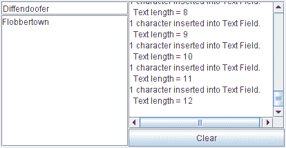

# 如何编写文档监听器

> 原文：[`docs.oracle.com/javase/tutorial/uiswing/events/documentlistener.html`](https://docs.oracle.com/javase/tutorial/uiswing/events/documentlistener.html)

Swing 文本组件使用[`Document`](https://docs.oracle.com/javase/8/docs/api/javax/swing/text/Document.html)来表示其内容。文档事件发生在文档的内容以任何方式更改时。你将文档监听器附加到文本组件的文档上，而不是文本组件本身。有关更多信息，请参见实现文档过滤器。

以下示例演示了两个纯文本组件上的文档事件。



* * *

**试一试：**

1.  点击“启动”按钮以使用[Java™ Web Start](http://www.oracle.com/technetwork/java/javase/javawebstart/index.html)运行 DocumentEventDemo（[下载 JDK 7 或更高版本](http://www.oracle.com/technetwork/java/javase/downloads/index.html)）。或者，要自行编译和运行示例，请参考示例索引。

1.  在窗口左上角的文本字段或文本字段下方的文本区域中键入文本。

    每次键入字符时都会触发一个文档事件。

1.  使用退格键删除文本。

    每次按退格键键入时都会触发一个文档事件。

1.  选择文本，然后通过按退格键或使用`CTRL-X`（剪切）等键盘命令删除。

    整个删除操作会触发一个文档事件。

1.  使用键盘命令如`CTRL-C`（复制）和`CTRL-V`（粘贴）将文本从一个文本组件复制到另一个文本组件。

    无论粘贴的文本长度如何，整个粘贴操作都会触发一个文档事件。如果在发出粘贴命令之前在目标文本组件中选择文本，则会触发额外的文档事件，因为首先删除所选文本。

* * *

你可以在`DocumentEventDemo.java`中找到演示代码。以下是演示文档事件处理代码：

```java
public class DocumentEventDemo ... {
    *...//where initialization occurs:*
    textField = new JTextField(20);
    textField.addActionListener(new MyTextActionListener());
    textField.getDocument().addDocumentListener(new MyDocumentListener());
    textField.getDocument().putProperty("name", "Text Field");

    textArea = new JTextArea();
    textArea.getDocument().addDocumentListener(new MyDocumentListener());
    textArea.getDocument().putProperty("name", "Text Area");
    ...

class MyDocumentListener implements DocumentListener {
    String newline = "\n";

    public void insertUpdate(DocumentEvent e) {
        updateLog(e, "inserted into");
    }
    public void removeUpdate(DocumentEvent e) {
        updateLog(e, "removed from");
    }
    public void changedUpdate(DocumentEvent e) {
        //Plain text components do not fire these events
    }

    public void updateLog(DocumentEvent e, String action) {
        Document doc = (Document)e.getDocument();
        int changeLength = e.getLength();
        displayArea.append(
            changeLength + " character" +
            ((changeLength == 1) ? " " : "s ") +
            action + doc.getProperty("name") + "." + newline +
            "  Text length = " + doc.getLength() + newline);
    }
}

```

文档监听器不应修改文档的内容；在监听器被通知更改时，更改已经完成。相反，编写一个自定义文档，覆盖`insertString`或`remove`方法，或两者都覆盖。详细信息请参见监听文档更改。

## 文档监听器 API

文档监听器接口

*`DocumentListener`没有适配器类。*

| 方法 | 目的 |
| --- | --- |
| [changedUpdate(DocumentEvent)](https://docs.oracle.com/javase/8/docs/api/javax/swing/event/DocumentListener.html#changedUpdate-javax.swing.event.DocumentEvent-) | 当监听文档中的一些文本样式发生变化时调用。这种事件仅从`StyledDocument`中触发 — `PlainDocument`不会触发这些事件。 |
| [insertUpdate(DocumentEvent)](https://docs.oracle.com/javase/8/docs/api/javax/swing/event/DocumentListener.html#insertUpdate-javax.swing.event.DocumentEvent-) | 当文本插入到监听文档中时调用。 |
| [removeUpdate(DocumentEvent)](https://docs.oracle.com/javase/8/docs/api/javax/swing/event/DocumentListener.html#removeUpdate-javax.swing.event.DocumentEvent-) | 当从监听文档中删除文本时调用。 |

文档事件接口

每个文档事件方法都会传递一个实现`DocumentEvent`接口的对象。通常，这是`AbstractDocument`中定义的[`DefaultDocumentEvent`](https://docs.oracle.com/javase/8/docs/api/javax/swing/text/AbstractDocument.DefaultDocumentEvent.html)的实例。

| 方法 | 目的 |
| --- | --- |
| [获取文档的 Document 对象](https://docs.oracle.com/javase/8/docs/api/javax/swing/event/DocumentEvent.html#getDocument--) | 返回触发事件的文档。请注意，`DocumentEvent`接口不继承自`EventObject`。因此，它不继承`getSource`方法。 |
| [获取长度的 int 方法](https://docs.oracle.com/javase/8/docs/api/javax/swing/event/DocumentEvent.html#getLength--) | 返回更改的长度。 |
| [获取偏移量的 int 方法](https://docs.oracle.com/javase/8/docs/api/javax/swing/event/DocumentEvent.html#getOffset--) | 返回更改的第一个字符在文档中的位置。 |
| [获取更改的 ElementChange 方法](https://docs.oracle.com/javase/8/docs/api/javax/swing/event/DocumentEvent.html#getChange-javax.swing.text.Element-) | 返回文档中已更改的元素及其详细信息。[`ElementChange`](https://docs.oracle.com/javase/8/docs/api/javax/swing/event/DocumentEvent.ElementChange.html)是在`DocumentEvent`接口中定义的一个接口。 |
| [获取类型的 EventType 方法](https://docs.oracle.com/javase/8/docs/api/javax/swing/event/DocumentEvent.html#getType--) | 返回发生的更改类型。[`EventType`](https://docs.oracle.com/javase/8/docs/api/javax/swing/event/DocumentEvent.EventType.html)是在`DocumentEvent`接口中定义的一个类，列举了文档上可能发生的更改类型：插入文本、删除文本和更改文本样式。 |

## 使用文档监听器的示例

以下表列出了使用文档监听器的示例。

| 示例 | 描述位置 | 注意事项 |
| --- | --- | --- |
| `DocumentEventDemo` | 本节 | 报告文本字段和文本区域上发生的所有文档事件。一个监听器同时监听两个文本组件，并使用文档上的客户端属性来确定哪个组件触发了事件。 |
| `TextComponentDemo` | 监听文档变化 | 每当被监听文档中的文本发生变化时更新变更日志。本示例中的文档支持样式文本，因此在本示例中调用`changedUpdate`。需要额外的源文件：`DocumentSizeFilter` |
