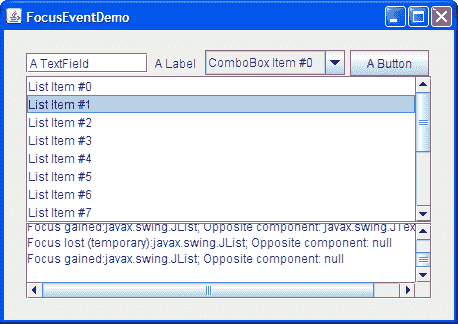

# 如何编写焦点监听器

> 原文：[`docs.oracle.com/javase/tutorial/uiswing/events/focuslistener.html`](https://docs.oracle.com/javase/tutorial/uiswing/events/focuslistener.html)

焦点事件在组件获得或失去键盘焦点时触发。无论焦点变化是通过鼠标、键盘还是程序化操作，都是如此。要熟悉基本的焦点概念或获取关于焦点的详细信息，请参阅如何使用焦点子系统。

本节解释了如何通过在特定组件上注册`FocusListener`实例来获取该组件的焦点事件。要仅获取窗口的焦点，请实现`WindowFocusListener`实例。要获取多个组件的焦点状态，请考虑在`KeyboardFocusManager`类上实现`PropertyChangeListener`实例，如跟踪多个组件的焦点变化中所述。

以下示例演示了焦点事件。窗口显示了各种组件。在每个组件上注册了焦点监听器，报告每个焦点获得和失去事件。对于每个事件，涉及焦点变化的另一个组件，即*对立组件*，都会被报告。例如，当焦点从按钮转移到文本字段时，按钮会触发焦点失去事件（文本字段为对立组件），然后文本字段会触发焦点获得事件（按钮为对立组件）。焦点失去和焦点获得事件都可以是临时的。例如，当窗口失去焦点时会发生临时焦点失去事件。弹出菜单上会发生临时焦点获得事件。



## 运行示例

1.  点击“启动”按钮以使用[Java™ Web Start](http://www.oracle.com/technetwork/java/javase/javawebstart/index.html)运行 FocusEventDemo（[下载 JDK 7 或更高版本](http://www.oracle.com/technetwork/java/javase/downloads/index.html)）。或者，要自行编译和运行示例，请参考示例索引。

1.  在文本区域中会看到“焦点获得：JTextField”的消息 — 其“对立组件”为 null，因为它是第一个获得焦点的组件。

1.  点击标签。因为标签默认情况下无法获得焦点，所以不会发生任何事情。

1.  点击下拉框。文本字段会触发一个焦点丢失事件，下拉框会触发一个焦点获得事件。下拉框现在显示它拥有焦点，可能会有一个虚线围绕文本的方式来表示。这种表示方式取决于外观和感觉。

    注意，当焦点从一个组件转移到另一个组件时，第一个组件会在第二个组件触发焦点获得事件之前触发焦点丢失事件。

1.  从下拉框的菜单中选择一个选项。再次点击下拉框。注意到没有焦点事件报告。只要用户操作同一组件，焦点就会保持在该组件上。

1.  点击打印焦点事件的文本区域。什么也不会发生，因为文本区域已经被设置为不可点击，使用了`setRequestFocusEnabled(false)`。

1.  点击文本字段以将焦点返回到初始组件。

1.  在键盘上按下 Tab 键。焦点移动到下拉框，并跳过标签。

1.  再次按下 Tab 键。焦点移动到按钮上。

1.  点击另一个窗口，使得 FocusEventDemo 窗口失去焦点。按钮会生成一个临时的焦点丢失事件。

1.  点击 FocusEventDemo 窗口的顶部。按钮会触发一个焦点获得事件。

1.  在键盘上再次按下 Tab 键。焦点移动到列表上。

1.  再次按下 Tab 键。焦点移动到文本区域。

    注意，即使你不能点击文本区域，你仍然可以通过 Tab 键到达它。这样做是为了让使用辅助技术的用户能够确定组件的存在以及其包含的内容。演示通过在文本区域上调用`setRequestFocusEnabled(false)`来禁用点击焦点，同时保留其通过 Tab 键获得焦点的能力。演示可以使用`setFocusable(false)`来真正将文本区域从焦点循环中移除，但这样做会使使用辅助技术的用户无法访问该组件。

1.  再次按下 Tab 键。焦点从列表返回到文本字段。你刚刚完成了一个*焦点循环*。请参阅介绍中的如何使用焦点子系统来讨论焦点术语和概念。

这个演示的完整代码在`FocusEventDemo.java`文件中。以下代码片段代表了焦点事件处理机制：

```java
public class FocusEventDemo ... implements FocusListener ... {
    public FocusEventDemo() {
        ...
        JTextField textField = new JTextField("A TextField");
        textField.addFocusListener(this);
        ...
        JLabel label = new JLabel("A Label");
        label.addFocusListener(this);
        ...
        JComboBox comboBox = new JComboBox(vector);
        comboBox.addFocusListener(this);
        ...
        JButton button = new JButton("A Button");
        button.addFocusListener(this);
        ...
        JList list = new JList(listVector);
        list.setSelectedIndex(1); //It's easier to see the focus change
                                  //if an item is selected.
        list.addFocusListener(this);
        JScrollPane listScrollPane = new JScrollPane(list);

        ...

        //Set up the area that reports focus-gained and focus-lost events.
        display = new JTextArea();
        display.setEditable(false);
        //The method setRequestFocusEnabled prevents a
        //component from being clickable, but it can still
        //get the focus through the keyboard - this ensures
        //user accessibility.
        display.setRequestFocusEnabled(false);
        display.addFocusListener(this);
        JScrollPane displayScrollPane = new JScrollPane(display);

        ...
    }
    ...
    public void focusGained(FocusEvent e) {
        displayMessage("Focus gained", e);
    }

    public void focusLost(FocusEvent e) {
        displayMessage("Focus lost", e);
    }

    void displayMessage(String prefix, FocusEvent e) {
        display.append(prefix
                       + (e.isTemporary() ? " (temporary):" : ":")
                       +  e.getComponent().getClass().getName()
                       + "; Opposite component: " 
                       + (e.getOppositeComponent() != null ?
                          e.getOppositeComponent().getClass().getName() : "null")
                       + newline); 
    }
    ...
}

```

## 焦点监听器 API

焦点监听器接口

*对应的适配器类是[`FocusAdapter`](https://docs.oracle.com/javase/8/docs/api/java/awt/event/FocusAdapter.html)。*

| 方法 | 目的 |
| --- | --- |
| [focusGained(FocusEvent)](https://docs.oracle.com/javase/8/docs/api/java/awt/event/FocusListener.html#focusGained-java.awt.event.FocusEvent-) | 在被监听组件获得焦点后调用。 |
| [focusLost(FocusEvent)](https://docs.oracle.com/javase/8/docs/api/java/awt/event/FocusListener.html#focusLost-java.awt.event.FocusEvent-) | 在监听到的组件失去焦点后调用。 |

焦点事件 API

| 方法 | 目的 |
| --- | --- |
| [boolean isTemporary()](https://docs.oracle.com/javase/8/docs/api/java/awt/event/FocusEvent.html#isTemporary--) | 如果焦点丢失或获得事件是临时的，则返回`true`。 |
| [Component getComponent()](https://docs.oracle.com/javase/8/docs/api/java/awt/event/ComponentEvent.html#getComponent--) (*在 `java.awt.event.ComponentEvent` 中*) | 返回触发焦点事件的组件。 |
| [Component getOppositeComponent()](https://docs.oracle.com/javase/8/docs/api/java/awt/event/FocusEvent.html#getOppositeComponent--) | 返回焦点变化中涉及的另一个组件。对于`FOCUS_GAINED`事件，这是失去焦点的组件。对于`FOCUS_LOST`事件，这是获得焦点的组件。如果焦点变化涉及本机应用程序、不同 VM 或上下文中的 Java 应用程序，或没有其他组件，则返回`null`。 |

## 使用焦点监听器的示例

以下表格列出了使用焦点监听器的示例。

| 示例 | 描述位置 | 备注 |
| --- | --- | --- |
| `FocusEventDemo` | 本节 | 报告发生在几个组件上的所有焦点事件，以演示触发焦点事件的情况。 |
| `TrackFocusDemo` | 如何使用焦点子系统 | 自定义组件`Picture`实现了焦点监听器，当它是当前焦点所有者时，会在组件周围绘制红色边框。 |
