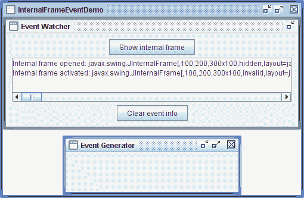

# 如何编写内部框架监听器

> 原文：[`docs.oracle.com/javase/tutorial/uiswing/events/internalframelistener.html`](https://docs.oracle.com/javase/tutorial/uiswing/events/internalframelistener.html)

`InternalFrameListener`类似于`WindowListener`。与窗口监听器类似，内部框架监听器监听发生在“窗口”首次显示、销毁、图标化、取消图标化、激活或停用时的事件。在使用内部框架监听器之前，请熟悉如何编写窗口监听器中的`WindowListener`接口。

下图中显示的应用程序演示了内部框架事件。该应用程序监听来自事件生成器框架的内部框架事件，显示描述每个事件的消息。



* * *

**试试这个：**

1.  点击“启动”按钮以使用[Java™ Web Start](http://www.oracle.com/technetwork/java/javase/javawebstart/index.html)运行 InternalFrameEventDemo（[下载 JDK 7 或更高版本](http://www.oracle.com/technetwork/java/javase/downloads/index.html)）。或者，要自行编译和运行示例，请参考示例索引。

1.  点击**显示内部框架**按钮，打开事件生成器内部框架。

    在显示区域中应该看到一个“内部框架已打开”的消息。

1.  尝试各种操作，看看会发生什么。例如，点击事件生成器以激活它。点击事件监视器以使事件生成器停用。点击事件生成器的装饰以将窗口图标化、最大化、最小化和关闭。

    查看如何编写窗口监听器以获取有关您将看到的事件类型的信息。

* * *

这是处理内部框架事件的代码：

```java
public class InternalFrameEventDemo ...
                     implements InternalFrameListener ... {
    ...

    public void internalFrameClosing(InternalFrameEvent e) {
        displayMessage("Internal frame closing", e);
    }

    public void internalFrameClosed(InternalFrameEvent e) {
        displayMessage("Internal frame closed", e);
        listenedToWindow = null;
    }

    public void internalFrameOpened(InternalFrameEvent e) {
        displayMessage("Internal frame opened", e);
    }

    public void internalFrameIconified(InternalFrameEvent e) {
        displayMessage("Internal frame iconified", e);
    }

    public void internalFrameDeiconified(InternalFrameEvent e) {
        displayMessage("Internal frame deiconified", e);
    }

    public void internalFrameActivated(InternalFrameEvent e) {
        displayMessage("Internal frame activated", e);
    }

    public void internalFrameDeactivated(InternalFrameEvent e) {
        displayMessage("Internal frame deactivated", e);
    }

    void displayMessage(String prefix, InternalFrameEvent e) {
        String s = prefix + ": " + e.getSource(); 
        display.append(s + newline);
    }

    public void actionPerformed(ActionEvent e) {
        if (SHOW.equals(e.getActionCommand())) {
            ...
            if (listenedToWindow == null) {
                listenedToWindow = new JInternalFrame("Event Generator",
                                                      true,  //resizable
                                                      true,  //closable
                                                      true,  //maximizable
                                                      true); //iconifiable
                //We want to reuse the internal frame, so we need to
                //make it hide (instead of being disposed of, which is
                //the default) when the user closes it.
                listenedToWindow.setDefaultCloseOperation(
                                        WindowConstants.HIDE_ON_CLOSE);

                listenedToWindow.addInternalFrameListener(this);
                ...
            }
        } 
        ...
    }
}

```

## 内部框架监听器 API

内部框架监听器接口

*相应的适配器类是[`InternalFrameAdapter`](https://docs.oracle.com/javase/8/docs/api/javax/swing/event/InternalFrameAdapter.html)。*

| 方法 | 目的 |
| --- | --- |
| [internalFrameOpened(InternalFrameEvent)](https://docs.oracle.com/javase/8/docs/api/javax/swing/event/InternalFrameListener.html#internalFrameOpened-javax.swing.event.InternalFrameEvent-) | 在监听的内部框架首次显示后调用。 |
| [internalFrameClosing(InternalFrameEvent)](https://docs.oracle.com/javase/8/docs/api/javax/swing/event/InternalFrameListener.html#internalFrameClosing-javax.swing.event.InternalFrameEvent-) | 响应用户请求关闭监听的内部框架时调用。默认情况下，`JInternalFrame`在用户关闭时隐藏窗口。您可以使用`JInternalFrame`的`setDefaultCloseOperation`方法指定另一个选项，该选项必须是`DISPOSE_ON_CLOSE`或`DO_NOTHING_ON_CLOSE`（都在`WindowConstants`中定义，`JInternalFrame`实现了该接口）。或者通过在内部框架的监听器中实现`internalFrameClosing`方法，您可以添加自定义行为（例如弹出对话框或保存数据）以响应内部框架的关闭。 |
| [internalFrameClosed(InternalFrameEvent)](https://docs.oracle.com/javase/8/docs/api/javax/swing/event/InternalFrameListener.html#internalFrameClosed-javax.swing.event.InternalFrameEvent-) | 在监听的内部框架被销毁后立即调用。 |
| [internalFrameIconified(InternalFrameEvent)](https://docs.oracle.com/javase/8/docs/api/javax/swing/event/InternalFrameEvent.html#internalFrameIconified-javax.swing.event.InternalFrameEvent-) [internalFrameDeiconified(InternalFrameEvent)](https://docs.oracle.com/javase/8/docs/api/javax/swing/event/InternalFrameEvent.html#internalFrameDeiconified-javax.swing.event.InternalFrameEvent-) | 在监听的内部框架被图标化或取消图标化后立即调用。 |
| [internalFrameActivated(InternalFrameEvent)](https://docs.oracle.com/javase/8/docs/api/javax/swing/event/InternalFrameListener.html#internalFrameActivated-javax.swing.event.InternalFrameEvent-) [internalFrameDeactivated(InternalFrameEvent)](https://docs.oracle.com/javase/8/docs/api/javax/swing/event/InternalFrameListener.html#internalFrameDeactivated-javax.swing.event.InternalFrameEvent-) | 在监听的内部框架被激活或停用后立即调用。 |

每个内部框架事件方法都有一个参数：一个[`InternalFrameEvent`](https://docs.oracle.com/javase/8/docs/api/javax/swing/event/InternalFrameEvent.html)对象。`InternalFrameEvent`类定义了没有通用用途的方法。要获取触发事件的内部框架，使用`getSource`方法，该方法是`InternalFrameEvent`从`java.util.EventObject`继承而来。

## 使用内部框架监听器的示例

目前没有其他源文件包含内部框架监听器。但是，内部框架监听器与`WindowListener`非常相似，几个 Swing 程序都有窗口监听器：

| 示例 | 描述位置 | 注释 |
| --- | --- | --- |
| `InternalFrameEventDemo` | 本节 | 报告发生在一个内部框架上的所有内部框架事件，以演示触发内部框架事件的情况。 |
| `DialogDemo` | 文本组件功能 | `CustomDialog.java` 使用 `setDefaultCloseOperation` 而不是窗口监听器来确定用户关闭窗口时要采取的操作。 |
| `SliderDemo` | 如何使用滑块 | 监听窗口最小化和最大化事件，以便在窗口不可见时停止动画。 |
