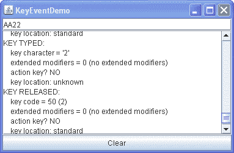

# 如何编写键盘监听器

> 原文：[`docs.oracle.com/javase/tutorial/uiswing/events/keylistener.html`](https://docs.oracle.com/javase/tutorial/uiswing/events/keylistener.html)

按键事件指示用户在键盘上输入时。具体来说，当用户按下或释放键盘键时，具有键盘焦点的组件会触发按键事件。有关焦点的详细信息，请参阅如何使用焦点子系统。

* * *

**注意：**

要定义对特定按键的特殊反应，请使用键绑定而不是键盘监听器。有关更多信息，请参阅如何使用键绑定。

* * *

有关两种基本按键事件的通知已发送：

+   输入 Unicode 字符

+   在键盘上按下或释放按键

第一种事件称为*按键输入*事件。第二种是*按键按下*或*按键释放*事件。

通常情况下，您只对按键事件做出反应，除非您需要知道用户何时按下与字符不对应的按键。例如，要知道用户何时输入 Unicode 字符——无论是通过按下一个键（如'a'）还是按顺序按下多个键——您需要处理按键输入事件。另一方面，要知道用户何时按下 F1 键，或者用户是否按下数字键盘上的'3'键，您需要处理按键按下事件。

* * *

**注意：**

要触发键盘事件，组件*必须*具有键盘焦点。

* * *

要使组件获得键盘焦点，请按照以下步骤进行：

1.  确保组件的`isFocusable`方法返回`true`。这种状态允许组件接收焦点。例如，您可以通过在标签上调用`setFocusable(true)`方法为`JLabel`组件启用键盘焦点。

1.  确保组件在适当时请求焦点。对于自定义组件，实现一个鼠标监听器，在组件被点击时调用`requestFocusInWindow`方法。

* * *

**版本说明：**

焦点子系统会消耗焦点遍历键，如 Tab 和 Shift Tab。如果您需要阻止焦点遍历键被消耗，您可以调用

```java
component.setFocusTraversalKeysEnabled(false)

```

在触发按键事件的组件上。然后，您的程序必须自行处理焦点遍历。或者，您可以使用[`KeyEventDispatcher`](https://docs.oracle.com/javase/8/docs/api/java/awt/KeyEventDispatcher.html)类预先监听所有按键事件。焦点页面详细介绍了焦点子系统。

* * *

您可以获取有关特定按键按下事件的详细信息。例如，您可以查询按键按下事件以确定它是否来自动作键。动作键的示例包括复制、粘贴、上翻页、撤销以及箭头和功能键。您还可以查询按键按下或按键释放事件以确定触发事件的按键位置。大多数按键事件都来自标准键盘，但某些按键的事件，例如 Shift，会提供用户是在键盘左侧还是右侧按下 Shift 键的信息。同样，数字 '2' 可以从标准键盘或数字键盘上输入。

对于按键事件，您可以获取按键字符值以及使用的任何修饰符。

* * *

**注意：**

除非涉及按键输入事件，否则不应依赖从 `getKeyChar` 返回的按键字符值。

* * *

以下示例演示了按键事件。它包括一个文本字段，您可以在其中输入内容，然后是一个文本区域，每当文本字段触发按键事件时，它会显示一条消息。窗口底部的按钮允许您清除文本字段和文本区域中的内容。



* * *

**尝试一下：**

1.  点击“启动”按钮以使用[Java™ Web Start](http://www.oracle.com/technetwork/java/javase/javawebstart/index.html)运行 KeyEventDemo（[下载 JDK 7 或更高版本](http://www.oracle.com/technetwork/java/javase/downloads/index.html)）。或者，要自行编译和运行示例，请参考示例索引。

1.  通过按下并释放键盘上的 A 键来输入小写字母 'a'。

    文本字段触发三个事件：按键按下事件、按键输入事件和按键释放事件。请注意，按键输入事件没有按键代码信息，按键按下和按键释放事件没有按键字符信息。到目前为止，所有事件都不是来自修饰键或动作键，而在按键按下和按键释放事件中报告的按键位置很可能是标准的。

1.  按下清除按钮。

    您可能希望在以下每个步骤之后执行此操作。

1.  按下并释放 Shift 键。

    文本字段触发两个事件：按键按下和按键释放。文本字段不会触发按键输入事件，因为 Shift 键本身不对应任何字符。

1.  通过按下 Shift 和 A 键来输入大写字母 'A'。

    您将看到以下事件，尽管可能不是按照这个顺序：按键按下（Shift）、按键按下（A）、按键输入（'A'）、按键释放（A）、按键释放（Shift）。请注意，Shift 在按键输入和按键按下事件中被列为修饰键。

1.  通过按下并释放大写锁定键，然后按下 A 键来输入大写字母 'A'。

    你应该看到以下事件：按下键（大写锁定键），按下键（A），键输入（'A'），释放键（A）。注意大写锁定键并未列为修饰键。

1.  按下 Tab 键。键盘事件监听器不会接收到 Tab 键按下或释放的事件。这是因为焦点子系统会消耗焦点遍历键，比如 Tab 和 Shift Tab。再按两次 Tab 键将焦点返回到文本区域。

1.  按下功能键，比如 F3。你会发现功能键是一个动作键。

1.  先按下左 Shift 键，然后按下右 Shift 键。按下和释放事件会指示哪个 Shift 键被按下。

1.  如果你的键盘有数字键盘，按下数字锁定键。

    至于大写锁定键，有一个按下事件，但没有释放事件。

1.  在数字键盘上按下 '2' 键。你会看到数字 '2' 的按下、键输入和释放事件。

1.  在标准键盘上按下 '2' 键。同样，你会看到三个事件消息。两个数字 2 键的键输入事件是相同的。但按下和释放事件会显示不同的键代码和不同的键位置。

1.  再次按下数字锁定键。会触发一个释放事件。

* * *

你可以在`KeyEventDemo.java`中找到示例代码。这是演示的键盘事件处理代码：

```java
public class KeyEventDemo ...  implements KeyListener ... {
    *...//where initialization occurs:*
        typingArea = new JTextField(20);
        typingArea.addKeyListener(this);

        //Uncomment this if you wish to turn off focus
        //traversal.  The focus subsystem consumes
        //focus traversal keys, such as Tab and Shift Tab.
        //If you uncomment the following line of code, this
        //disables focus traversal and the Tab events 
        //become available to the key event listener.
        //typingArea.setFocusTraversalKeysEnabled(false);
    ...
    /** Handle the key typed event from the text field. */
    public void keyTyped(KeyEvent e) {
        displayInfo(e, "KEY TYPED: ");
    }

    /** Handle the key-pressed event from the text field. */
    public void keyPressed(KeyEvent e) {
        displayInfo(e, "KEY PRESSED: ");
    }

    /** Handle the key-released event from the text field. */
    public void keyReleased(KeyEvent e) {
        displayInfo(e, "KEY RELEASED: ");
    }
    ...
    private void displayInfo(KeyEvent e, String keyStatus){

        //You should only rely on the key char if the event
        //is a key typed event.
        int id = e.getID();
        String keyString;
        if (id == KeyEvent.KEY_TYPED) {
            char c = e.getKeyChar();
            keyString = "key character = '" + c + "'";
        } else {
            int keyCode = e.getKeyCode();
            keyString = "key code = " + keyCode
                    + " ("
                    + KeyEvent.getKeyText(keyCode)
                    + ")";
        }

        int modifiersEx = e.getModifiersEx();
        String modString = "extended modifiers = " + modifiersEx;
        String tmpString = KeyEvent.getModifiersExText(modifiersEx);
        if (tmpString.length() > 0) {
            modString += " (" + tmpString + ")";
        } else {
            modString += " (no extended modifiers)";
        }

        String actionString = "action key? ";
        if (e.isActionKey()) {
            actionString += "YES";
        } else {
            actionString += "NO";
        }

        String locationString = "key location: ";
        int location = e.getKeyLocation();
        if (location == KeyEvent.KEY_LOCATION_STANDARD) {
            locationString += "standard";
        } else if (location == KeyEvent.KEY_LOCATION_LEFT) {
            locationString += "left";
        } else if (location == KeyEvent.KEY_LOCATION_RIGHT) {
            locationString += "right";
        } else if (location == KeyEvent.KEY_LOCATION_NUMPAD) {
            locationString += "numpad";
        } else { // (location == KeyEvent.KEY_LOCATION_UNKNOWN)
            locationString += "unknown";
        }

        *...//Display information about the KeyEvent...*
    }
}

```

## 键盘监听器 API

键盘监听器接口

*对应的适配器类是[`KeyAdapter`](https://docs.oracle.com/javase/8/docs/api/java/awt/event/KeyAdapter.html)。*

| 方法 | 目的 |
| --- | --- |
| [keyTyped(KeyEvent)](https://docs.oracle.com/javase/8/docs/api/java/awt/event/KeyListener.html#keyTyped-java.awt.event.KeyEvent-) | 在用户在监听组件中键入 Unicode 字符后调用。 |
| [keyPressed(KeyEvent)](https://docs.oracle.com/javase/8/docs/api/java/awt/event/KeyListener.html#keyPressed-java.awt.event.keyPressed-) | 在用户按下监听组件焦点时调用。 |
| [keyReleased(KeyEvent)](https://docs.oracle.com/javase/8/docs/api/java/awt/event/KeyListener.html#keyReleased-java.awt.event.KeyEvent-) | 在用户释放监听组件焦点时调用。 |

KeyEvent 类

`KeyEvent` 类从[`InputEvent`](https://docs.oracle.com/javase/8/docs/api/java/awt/event/InputEvent.html) 类继承了许多有用的方法，比如 `getModifiersEx`，以及从[`ComponentEvent`](https://docs.oracle.com/javase/8/docs/api/java/awt/event/ComponentEvent.html) 和 [`AWTEvent`](https://docs.oracle.com/javase/8/docs/api/java/awt/AWTEvent.html) 类继承了一些有用的方法。在鼠标监听器页面的 InputEvent 类表中查看完整列表。

| 方法 | 目的 |
| --- | --- |
| [int getKeyChar()](https://docs.oracle.com/javase/8/docs/api/java/awt/event/KeyEvent.html#getKeyChar--) | 获取与此事件关联的 Unicode 字符。仅在按键输入事件中依赖此值。 |
| [int getKeyCode()](https://docs.oracle.com/javase/8/docs/api/java/awt/event/KeyEvent.html#getKeyCode--) | 获取与此事件关联的键码。键码标识用户按下或释放的键盘上的特定键。`KeyEvent`类为常见键定义了许多键码常量。例如，`VK_A`指定标记为**A**的键，`VK_ESCAPE`指定 Escape 键。 |
| [String getKeyText(int)](https://docs.oracle.com/javase/8/docs/api/java/awt/event/KeyEvent.html#getKeyText-int-) [String getKeyModifiersText(int)](https://docs.oracle.com/javase/8/docs/api/java/awt/event/KeyEvent.html#getKeyModifiersText-int-) | 分别返回事件的键码和修饰键的文本描述。 |
| [int getModifiersEx()](https://docs.oracle.com/javase/8/docs/api/java/awt/event/InputEvent.html#getModifiersEx--) [String getModifiersExText(int modifiers)](https://docs.oracle.com/javase/8/docs/api/java/awt/event/InputEvent.html#getModifiersExText-int-) | 返回此事件的扩展修饰符掩码。有从`InputEvent`类继承的方法。扩展修饰符表示所有模态键的状态。`getModifiersExText`方法返回描述扩展修饰符键和鼠标按钮的字符串。由于`getModifiersEx`和`getModifiersExText`方法提供了更多关于按键事件的信息，因此它们比`getKeyText`或`getKeyModifiersText`方法更受青睐。 |
| [boolean isActionKey()](https://docs.oracle.com/javase/8/docs/api/java/awt/event/KeyEvent.html#isActionKey--) | 如果触发事件的键是动作键，则返回 true。动作键的示例包括剪切、复制、粘贴、翻页、大写锁定、箭头和功能键。此信息仅适用于按键按下和按键释放事件。 |
| [int getKeyLocation()](https://docs.oracle.com/javase/8/docs/api/java/awt/event/KeyEvent.html#getKeyLocation--) | 返回触发此事件的键的位置。这提供了一种区分键盘上出现多次的键的方法，例如两个 Shift 键。可能的值为`KEY_LOCATION_STANDARD`、`KEY_LOCATION_LEFT`、`KEY_LOCATION_RIGHT`、`KEY_LOCATION_NUMPAD`或`KEY_LOCATION_UNKNOWN`。对于按键输入事件，此方法始终返回`KEY_LOCATION_UNKNOWN`。 |

## 使用键盘监听器的示例

下表列出了使用键盘监听器的示例。

| 示例 | 描述位置 | 注释 |
| --- | --- | --- |
| `KeyEventDemo` | 本节 | 报告发生在文本字段上的所有按键事件，以演示触发按键事件的情况。 |
