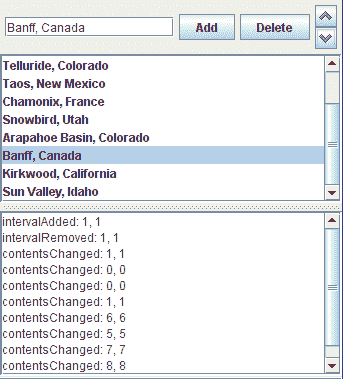

# 如何编写列表数据监听器

> 原文：[`docs.oracle.com/javase/tutorial/uiswing/events/listdatalistener.html`](https://docs.oracle.com/javase/tutorial/uiswing/events/listdatalistener.html)

当可变列表的内容发生变化时，会触发列表数据事件。由于模型而不是组件触发这些事件，因此您必须向列表模型注册列表数据监听器。如果您没有显式创建具有可变列表模型的列表，则您的列表是不可变的，其模型不会触发这些事件。

* * *

**注意：**

组合框 模型也会触发列表数据事件。但是，除非你正在创建自定义组合框模型，否则通常不需要了解它们。

* * *

以下示例演示了可变列表上的列表数据事件：



* * *

**试试这个：**

1.  点击启动按钮以使用[Java™ Web Start](http://www.oracle.com/technetwork/java/javase/javawebstart/index.html)运行 ListDataEventDemo（[下载 JDK 7 或更高版本](http://www.oracle.com/technetwork/java/javase/downloads/index.html)）。或者，要自行编译和运行示例，请参考示例索引。

1.  输入你最喜欢的滑雪胜地的名称，然后点击**添加**按钮。将触发一个 `intervalAdded` 事件。

1.  在列表中选择几个连续的项目，然后点击**删除**按钮。将触发一个 `intervalRemoved` 事件。

1.  选择一个项目，然后使用箭头按钮将其上移或下移。将触发两个 `contentsChanged` 事件 — 一个是移动的项目，另一个是被替换的项目。

* * *

你可以在`ListDataEventDemo.java`中找到演示的代码。以下是在列表模型上注册列表数据监听器并实现监听器的代码：

```java
//*...where member variables are declared...*
private DefaultListModel listModel;
...
//Create and populate the list model
listModel = new DefaultListModel();
...
listModel.addListDataListener(new MyListDataListener());

class MyListDataListener implements ListDataListener {
    public void contentsChanged(ListDataEvent e) {
        log.append("contentsChanged: " + e.getIndex0() +
                   ", " + e.getIndex1() + newline);
    }
    public void intervalAdded(ListDataEvent e) {
        log.append("intervalAdded: " + e.getIndex0() +
                   ", " + e.getIndex1() + newline);
    }
    public void intervalRemoved(ListDataEvent e) {
        log.append("intervalRemoved: " + e.getIndex0() +
                   ", " + e.getIndex1() + newline);
    }
} 

```

## 列表数据监听器 API

列表数据监听器接口

*`ListDataListener` 没有对应的适配器类。*

| 方法 | 目的 |
| --- | --- |
| [intervalAdded(ListDataEvent)](https://docs.oracle.com/javase/8/docs/api/javax/swing/event/ListDataListener.html#intervalAdded-javax.swing.event.ListDataEvent-) | 当一个或多个项目被添加到列表时调用。 |
| [intervalRemoved(ListDataEvent)](https://docs.oracle.com/javase/8/docs/api/javax/swing/event/ListDataListener.html#intervalRemoved-javax.swing.event.ListDataEvent-) | 当一个或多个项目从列表中被移除时调用。 |
| [contentsChanged(ListDataEvent)](https://docs.oracle.com/javase/8/docs/api/javax/swing/event/ListDataListener.html#contentsChanged-javax.swing.event.ListDataEvent-) | 当列表中一个或多个项目的内容发生更改时调用。 |

ListDataEvent API

| 方法 | 目的 |
| --- | --- |
| [Object getSource()](https://docs.oracle.com/javase/8/docs/api/java/util/EventObject.html#getSource--) (*在 `java.util.EventObject` 中*) | 返回触发事件的对象。 |
| [int getIndex0()](https://docs.oracle.com/javase/8/docs/api/javax/swing/event/ListDataEvent.html#getIndex0--) | 返回值发生更改的第一个项目的索引。 |
| [int getIndex1()](https://docs.oracle.com/javase/8/docs/api/javax/swing/event/ListDataEvent.html#getIndex1--) | 返回值发生更改的最后一个项目的索引。 |
| [int getType()](https://docs.oracle.com/javase/8/docs/api/javax/swing/event/ListDataEvent.html#getType--) | 返回事件类型。可能的值为：`CONTENTS_CHANGED`、`INTERVAL_ADDED` 或 `INTERVAL_REMOVED`。 |

## 使用列表数据监听器的示例

下表列出了使用列表数据监听器的示例。

| 示例 | 描述位置 | 备注 |
| --- | --- | --- |
| `ListDataEventDemo` | 本节 | 报告列表上发生的所有列表数据事件。 |
