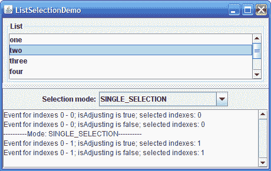
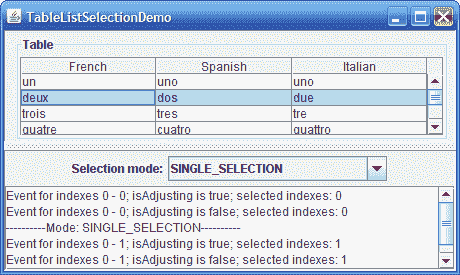

# 如何编写列表选择监听器

> 原文：[`docs.oracle.com/javase/tutorial/uiswing/events/listselectionlistener.html`](https://docs.oracle.com/javase/tutorial/uiswing/events/listselectionlistener.html)

列表选择事件发生在 列表 或 表格 中的选择正在更改或刚刚更改时。列表选择事件是从实现 [`ListSelectionModel`](https://docs.oracle.com/javase/8/docs/api/javax/swing/ListSelectionModel.html) 接口的对象中触发的。要获取表格的列表选择模型对象，可以使用 `getSelectionModel` 方法或 `getColumnModel().getSelectionModel()`。

要检测列表选择事件，您需要在适当的列表选择模型对象上注册监听器。`JList` 类还提供了在列表本身上注册监听器的选项，而不是直接在列表选择模型上注册。

本节将介绍两个示例，展示如何监听选择模型上的列表选择事件。使用列表选择监听器的示例 列出了直接在列表上监听的示例。

在这两个示例中，您可以动态更改选择模式为三种支持的模式之一：

+   单选模式

+   单区间选择模式

+   多区间选择模式

这是 ListSelectionDemo 示例在列表中运行的图片：



* * *

**试一试：**

1.  点击“启动”按钮以使用 [Java™ Web Start](http://www.oracle.com/technetwork/java/javase/javawebstart/index.html) 运行 ListSelectionDemo（[下载 JDK 7 或更高版本](http://www.oracle.com/technetwork/java/javase/downloads/index.html)）。或者，要自行编译和运行示例，请参考 示例索引。

1.  选择和取消列表中的项目。选择项目所需的鼠标和键盘命令取决于外观。对于 Java 外观，单击左鼠标按钮开始选择，使用 shift 键连续扩展选择，使用 control 键不连续扩展选择。请注意，有两种类型的选择：Lead 和 Anchor。Lead 是焦点项目，Anchor 是高亮项目。当您按下 ctrl 键并上下移动时，Lead 选择会导致事件被触发，即使实际选择没有改变。拖动鼠标会根据列表选择模式移动或扩展选择。

* * *

这是 TableListSelectionDemo 示例在表格中运行的图片：



* * *

**试试这个：**

1.  点击“启动”按钮以使用[Java™ Web Start](http://www.oracle.com/technetwork/java/javase/javawebstart/index.html)运行 TableListSelectionDemo（[下载 JDK 7 或更高版本](http://www.oracle.com/technetwork/java/javase/downloads/index.html)）。或者，要自行编译和运行示例，请参考示例索引。

1.  在表格中选择和取消选择项目。选择项目所需的鼠标和键盘命令取决于外观。对于 Java 外观，单击左鼠标按钮开始选择，使用 Shift 键连续扩展选择，使用 Control 键不连续扩展选择。请注意，有两种类型的选择：Lead 和 Anchor。Lead 是焦点项目，Anchor 是突出显示的项目。当按下 ctrl 键并向上或向下移动时，主选择会导致事件被触发，即使实际选择没有更改。拖动鼠标会移动或扩展选择，具体取决于列表选择模式。

* * *

您可以在``ListSelectionDemo.java``中找到 ListSelectionDemo 的整个程序，以及在``TableListSelectionDemo.java``中找到 TableListSelectionDemo 的整个程序。

这是设置选择模型并向其添加监听器的`ListSelectionDemo`中的代码：

```java
*...//where the member variables are defined*
JList list;
    *...//in the init method:*
    listSelectionModel = list.getSelectionModel();
    listSelectionModel.addListSelectionListener(
                            new SharedListSelectionHandler());
    ...

```

这是适用于所有可能的选择模式的监听器代码：

```java
class SharedListSelectionHandler implements ListSelectionListener {
    public void valueChanged(ListSelectionEvent e) {
        ListSelectionModel lsm = (ListSelectionModel)e.getSource();

        int firstIndex = e.getFirstIndex();
        int lastIndex = e.getLastIndex();
        boolean isAdjusting = e.getValueIsAdjusting();
        output.append("Event for indexes "
                      + firstIndex + " - " + lastIndex
                      + "; isAdjusting is " + isAdjusting
                      + "; selected indexes:");

        if (lsm.isSelectionEmpty()) {
            output.append(" <none>");
        } else {
            // Find out which indexes are selected.
            int minIndex = lsm.getMinSelectionIndex();
            int maxIndex = lsm.getMaxSelectionIndex();
            for (int i = minIndex; i <= maxIndex; i++) {
                if (lsm.isSelectedIndex(i)) {
                    output.append(" " + i);
                }
            }
        }
        output.append(newline);
    }
}

```

这个`valueChanged`方法显示了事件报告的第一个和最后一个索引，事件的`isAdjusting`标志的值，以及当前选定的索引。

请注意，事件报告的第一个和最后一个索引指示了选择已更改的项目的包含范围。如果选择模式是多区间选择，则范围内的某些项目可能未更改。如果用户仍在操作选择，则`isAdjusting`标志为`true`，如果用户已完成更改选择，则为`false`。

传递给`valueChanged`的`ListSelectionEvent`对象仅指示选择已更改。事件不包含有关当前选择的任何信息。因此，此方法查询选择模型以确定当前选择。

## 列表选择监听器 API

列表选择监听器接口

*因为`ListSelectionListener`只有一个方法，所以没有相应的适配器类。*

| 方法 | 目的 |
| --- | --- |
| [valueChanged(ListSelectionEvent)](https://docs.oracle.com/javase/8/docs/api/javax/swing/event/ListSelectionListener.html#valueChanged-javax.swing.ListSelectionEvent-) | 响应选择更改时调用。 |

ListSelectionEvent API

| 方法 | 目的 |
| --- | --- |
| [Object getSource()](https://docs.oracle.com/javase/8/docs/api/java/util/EventObject.html#getSource--) (*在`java.util.EventObject`中*) | 返回触发事件的对象。如果直接在列表上注册列表选择监听器，则每个事件的源是列表。否则，源是选择模型。 |
| [int getFirstIndex()](https://docs.oracle.com/javase/8/docs/api/javax/swing/event/ListSelectionEvent.html#getFirstIndex--) | 返回选择值已更改的第一项的索引。请注意，对于多个间隔选择，保证第一个和最后一个项目已更改，但它们之间的项目可能没有更改。但是，当您按下 ctrl 键并向上或向下移动时，主选择会导致事件被触发，即使实际选择没有更改。 |
| [int getLastIndex()](https://docs.oracle.com/javase/8/docs/api/javax/swing/event/ListSelectionEvent.html#getLastIndex--) | 返回选择值已更改的最后一项的索引。请注意，对于多个间隔选择，保证第一个和最后一个项目已更改，但它们之间的项目可能没有更改。但是，当您按下 ctrl 键并上下移动时，主选择会导致事件被触发，即使实际选择没有更改。 |
| [boolean getValueIsAdjusting()](https://docs.oracle.com/javase/8/docs/api/javax/swing/event/ListSelectionEvent.html#getValueIsAdjusting--) | 如果选择仍在更改，则返回`true`。许多列表选择监听器仅对选择的最终状态感兴趣，并且可以在此方法返回`true`时忽略列表选择事件。 |

## 使用列表选择监听器的示例

下表列出了使用列表选择监听器的示例。

| 示例 | 描述位置 | 备注 |
| --- | --- | --- |
| `ListSelectionDemo` | 本节 | 报告列表上发生的所有列表选择事件。允许用户动态更改选择模式。 |
| `TableListSelectionDemo` | 本节 | 报告表上发生的所有列表选择事件。允许用户动态更改选择模式。 |
| `ListDemo` | 如何使用列表 | 监听单选列表上的事件（而不是其选择模型）。根据列表中是否选择了任何项目来启用或禁用按钮。 |
| `SplitPaneDemo` | 如何使用列表 | 监听单选列表上的事件（而不是其选择模型）。 |
| `SimpleTableSelectionDemo` | 如何使用表格 | 在一个表格上使用两种不同的列表选择监听器。一个监听器监听表格列上的列表选择事件，另一个监听器监听表格行上的列表选择事件。 |
