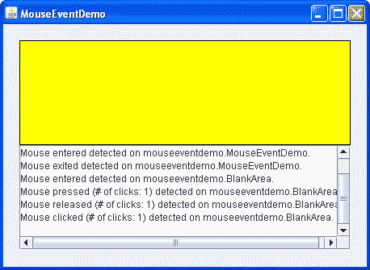

# 如何编写鼠标监听器

> 原文：[`docs.oracle.com/javase/tutorial/uiswing/events/mouselistener.html`](https://docs.oracle.com/javase/tutorial/uiswing/events/mouselistener.html)

鼠标事件通知用户使用鼠标（或类似输入设备）与组件交互时发生。鼠标事件发生在光标进入或退出组件的屏幕区域时，以及用户按下或释放鼠标按钮时。

跟踪光标的移动比跟踪其他鼠标事件需要更多的系统开销。这就是为什么鼠标移动事件被分为鼠标移动监听器类型（参见如何编写鼠标移动监听器）。

要跟踪鼠标滚轮事件，您可以注册一个鼠标滚轮监听器。有关更多信息，请参阅如何编写鼠标滚动监听器。

如果应用程序需要检测鼠标事件和鼠标移动事件，请使用[`MouseInputAdapter`](https://docs.oracle.com/javase/8/docs/api/javax/swing/event/MouseInputAdapter.html)类。该类实现了[`MouseInputListener`](https://docs.oracle.com/javase/8/docs/api/javax/swing/event/MouseInputListener.html)，这是一个方便的接口，实现了`MouseListener`和`MouseMotionListener`接口。但是，`MouseInputListener`接口不实现`MouseWheelListener`接口。

或者，使用相应的 AWT [`MouseAdapter`](https://docs.oracle.com/javase/8/docs/api/java/awt/event/MouseAdapter.html) 类，该类实现了`MouseListener`、`MouseMotionListener`和`MouseWheelListener`接口。

以下示例显示了一个鼠标监听器。窗口顶部是一个空白区域（由名为`BlankArea`的类实现）。鼠标监听器同时监听`BlankArea`和其容器`MouseEventDemo`的事件。每次发生鼠标事件时，在空白区域下方显示一个描述性消息。通过将光标移动到空白区域上方并偶尔按下鼠标按钮，您可以触发鼠标事件。



* * *

**试试这个：**

1.  点击“启动”按钮以使用[Java™ Web Start](http://www.oracle.com/technetwork/java/javase/javawebstart/index.html)运行 MouseEventDemo（[下载 JDK 7 或更高版本](http://www.oracle.com/technetwork/java/javase/downloads/index.html)）。或者，要自行编译和运行示例，请参考示例索引。

1.  将光标移动到窗口顶部的黄色矩形中。

    您将看到一个或多个鼠标进入事件。

1.  按住左鼠标按钮不要移动鼠标。

    你会看到一个鼠标按下事件。你可能会看到一些额外的鼠标事件，比如鼠标退出然后鼠标进入。

1.  释放鼠标按钮。

    你会看到一个鼠标释放事件。如果你没有移动鼠标，将会接着是一个鼠标点击事件。

1.  再次按住鼠标按钮，然后拖动鼠标，使光标最终移出窗口。释放鼠标按钮。

    你会看到一个鼠标按下事件，接着是一个鼠标退出事件，然后是一个鼠标释放事件。你*不会*收到有关光标移动的通知。要获取鼠标移动事件，你需要实现一个鼠标移动监听器。

* * *

你可以在`MouseEventDemo.java`和`BlankArea.java`中找到演示代码。这里是演示的鼠标事件处理代码：

```java
public class MouseEventDemo ... implements MouseListener {
        *//where initialization occurs:*
        //Register for mouse events on blankArea and the panel.
        blankArea.addMouseListener(this);
        addMouseListener(this);
    ...

    public void mousePressed(MouseEvent e) {
       saySomething("Mouse pressed; # of clicks: "
                    + e.getClickCount(), e);
    }

    public void mouseReleased(MouseEvent e) {
       saySomething("Mouse released; # of clicks: "
                    + e.getClickCount(), e);
    }

    public void mouseEntered(MouseEvent e) {
       saySomething("Mouse entered", e);
    }

    public void mouseExited(MouseEvent e) {
       saySomething("Mouse exited", e);
    }

    public void mouseClicked(MouseEvent e) {
       saySomething("Mouse clicked (# of clicks: "
                    + e.getClickCount() + ")", e);
    }

    void saySomething(String eventDescription, MouseEvent e) {
        textArea.append(eventDescription + " detected on "
                        + e.getComponent().getClass().getName()
                        + "." + newline);
    }
}

```

## 鼠标监听器 API

鼠标监听器接口

| 方法 | 目的 |
| --- | --- |
| [mouseClicked(MouseEvent)](https://docs.oracle.com/javase/8/docs/api/java/awt/event/MouseListener.html#mouseClicked-java.awt.event.MouseEvent-) | 在用户点击监听组件后立即调用。 |
| [mouseEntered(MouseEvent)](https://docs.oracle.com/javase/8/docs/api/java/awt/event/MouseListener.html#mouseEntered-java.awt.event.MouseEvent-) | 在光标进入监听组件边界后立即调用。 |
| [mouseExited(MouseEvent)](https://docs.oracle.com/javase/8/docs/api/java/awt/event/MouseListener.html#mouseExited-java.awt.event.MouseEvent-) | 在光标退出监听组件边界后立即调用。 |
| [mousePressed(MouseEvent)](https://docs.oracle.com/javase/8/docs/api/java/awt/event/MouseListener.html#mousePressed-java.awt.event.MouseEvent-) | 在光标位于监听组件上方时用户按下鼠标按钮后立即调用。 |
| [mouseReleased(MouseEvent)](https://docs.oracle.com/javase/8/docs/api/java/awt/event/MouseListener.html#mouseReleased-java.awt.event.MouseEvent-) | 在鼠标按下监听组件后释放鼠标按钮后立即调用。 |

[`MouseAdapter`](https://docs.oracle.com/javase/8/docs/api/java/awt/event/MouseAdapter.html) 类（AWT 适配器类）是抽象的。它的所有方法都是空的。因此开发人员可以为特定于应用程序的事件定义方法。你也可以使用[`MouseInputAdapter`](https://docs.oracle.com/javase/8/docs/api/javax/swing/event/MouseInputAdapter.html) 类，它具有从`MouseListener`和`MouseMotionListener`中可用的所有方法。

鼠标事件类

| 方法 | 目的 |
| --- | --- |
| [int getClickCount()](https://docs.oracle.com/javase/8/docs/api/java/awt/event/MouseEvent.html#getClickCount--) | 返回用户连续快速点击的次数（包括此事件）。例如，双击返回 2。 |

| [int getX()](https://docs.oracle.com/javase/8/docs/api/java/awt/event/MouseEvent.html#getX--) [int getY()](https://docs.oracle.com/javase/8/docs/api/java/awt/event/MouseEvent.html#getY--)

[Point getPoint()](https://docs.oracle.com/javase/8/docs/api/java/awt/event/MouseEvent.html#getPoint--) | 返回事件发生的（x，y）位置，相对于触发事件的组件。

| [int getXOnScreen()](https://docs.oracle.com/javase/8/docs/api/java/awt/event/MouseEvent.html#getXOnScreen--) [int getYOnScreen()](https://docs.oracle.com/javase/8/docs/api/java/awt/event/MouseEvent.html#getYOnScreen--)

[int getLocationOnScreen()](https://docs.oracle.com/javase/8/docs/api/java/awt/event/MouseEvent.html#getLocationOnScreen--) | 返回事件的绝对（x，y）位置。这些坐标是相对于多屏环境的虚拟坐标系。否则，这些坐标是相对于与组件的图形配置相关联的坐标系。

| [int getButton()](https://docs.oracle.com/javase/8/docs/api/java/awt/event/MouseEvent.html#getButton--) | 返回已更改状态的鼠标按钮（如果有）。返回以下常量之一：`NOBUTTON`、`BUTTON1`或`BUTTON2`或`BUTTON3`。 |
| --- | --- |
| [boolean isPopupTrigger()](https://docs.oracle.com/javase/8/docs/api/java/awt/event/MouseEvent.html#isPopupTrigger--) | 如果鼠标事件应该引起弹出菜单出现，则返回`true`。因为弹出触发器是平台相关的，如果您的程序使用弹出菜单，您应该为所有可以出现弹出菜单的组件触发的所有鼠标按下和鼠标释放事件调用`isPopupTrigger`。有关弹出菜单的更多信息，请参见弹出菜单。 |
| [String getMouseModifiersText(int)](https://docs.oracle.com/javase/8/docs/api/java/awt/event/MouseEvent.html#getMouseModifiersText-int-) | 返回描述事件期间活动的修改键和鼠标按钮的`String`，例如"Shift"或"Ctrl+Shift"。这些字符串可以使用 awt.properties 文件进行本地化。 |

`InputEvent` 类

`MouseEvent` 类从[InputEvent](https://docs.oracle.com/javase/8/docs/api/java/awt/event/InputEvent.html)类继承了许多有用的方法，还从[`ComponentEvent`](https://docs.oracle.com/javase/8/docs/api/java/awt/event/ComponentEvent.html)和[`AWTEvent`](https://docs.oracle.com/javase/8/docs/api/java/awt/AWTEvent.html)类中继承了一些方便的方法。

| 方法 | 目的 |
| --- | --- |
| [int getID()](https://docs.oracle.com/javase/8/docs/api/java/awt/AWTEvent.html#getID--) (*在`java.awt.AWTEvent`中*) | 返回事件类型，定义了特定的操作。例如，MouseEvent id 反映了每个鼠标事件的鼠标按钮状态。MouseEvent id 可以指定以下状态：`MouseEvent.MOUSE_PRESSED`、`MouseEvent.MOUSE_RELEASED`和`MouseEvent.MOUSE_CLICKED`。 |
| [Component getComponent()](https://docs.oracle.com/javase/8/docs/api/java/awt/event/ComponentEvent.html#getComponent--)（*在 `ComponentEvent` 中*） | 返回触发事件的组件。您可以使用此方法代替 `getSource` 方法。 |
| [int getWhen()](https://docs.oracle.com/javase/8/docs/api/java/awt/event/InputEvent.html#getWhen--) | 返回事件发生时的时间戳。时间戳越高，事件发生的时间越近。 |

| [boolean isAltDown()](https://docs.oracle.com/javase/8/docs/api/java/awt/event/InputEvent.html#isAltDown--) [boolean isControlDown()](https://docs.oracle.com/javase/8/docs/api/java/awt/event/InputEvent.html#isControlDown--)

[boolean isMetaDown()](https://docs.oracle.com/javase/8/docs/api/java/awt/event/InputEvent.html#isMetaDown--)

[boolean isShiftDown()](https://docs.oracle.com/javase/8/docs/api/java/awt/event/InputEvent.html#isShiftDown--)

| 返回事件触发时各个修改键的状态。 |
| --- |

| [int getModifiers()](https://docs.oracle.com/javase/8/docs/api/java/awt/event/InputEvent.html#getModifiers--) | 返回事件触发时所有修改键和鼠标按钮的状态。您可以使用此方法确定鼠标事件触发时按下（或释放）了哪个鼠标按钮。`InputEvent` 类为 `getModifiers` 方法定义了以下常量：`ALT_MASK`、`BUTTON1_MASK`、`BUTTON2_MASK`、`BUTTON3_MASK`、`CTRL_MASK`、`META_MASK` 和 `SHIFT_MASK`。例如，如果按下了右键，则以下表达式为真：

```java
(mouseEvent.getModifiers() & InputEvent.BUTTON3_MASK)
== InputEvent.BUTTON3_MASK

```

|

| [int getModifiersEx()](https://docs.oracle.com/javase/8/docs/api/java/awt/event/InputEvent.html#getModifiersEx--) | 返回此事件的扩展修改器掩码。扩展修改器表示鼠标按钮和所有模态键（如 ALT、CTRL、META）在事件发生后的状态。您可以使用以下预定义位掩码之一来检查修改器的状态：`SHIFT_DOWN_MASK`、`CTRL_DOWN_MASK`、`META_DOWN_MASK`、`ALT_DOWN_MASK`、`BUTTON1_DOWN_MASK`、`BUTTON2_DOWN_MASK`、`BUTTON3_DOWN_MASK` 或 `ALT_GRAPH_DOWN_MASK`。例如，要检查按钮 1 是否按下，但按钮 2 和按钮 3 没有按下，您可以使用以下代码片段：

```java
if (event.getModifiersEx() & (BUTTON1_DOWN_MASK &#124;
                              BUTTON2_DOWN_MASK &#124;
                              BUTTON3_DOWN_MASK)
                               == BUTTON1_DOWN_MASK) {
    ...
}

```

|

| [int getModifiersExText(int)](https://docs.oracle.com/javase/8/docs/api/java/awt/event/InputEvent.html#getModifiersExText-int-) | 返回描述扩展修改键和鼠标按钮的字符串，如 "Shift"、"Button1" 或 "Ctrl+Shift"。这些字符串可以通过更改 awt.properties 文件进行本地化。 |
| --- | --- |

鼠标信息类

[`MouseInfo`](https://docs.oracle.com/javase/8/docs/api/java/awt/MouseInfo.html) 类提供了在应用程序运行时随时获取鼠标指针位置信息的方法。

| 方法 | 目的 |
| --- | --- |
| [getPointerInfo()](https://docs.oracle.com/javase/8/docs/api/java/awt/MouseInfo.html#getPointerInfo--) | 返回一个代表鼠标指针当前位置的`PointerInfo`实例。 |
| [getNumberOfButtons()](https://docs.oracle.com/javase/8/docs/api/java/awt/MouseInfo.html#getNumberOfButtons--) | 返回鼠标上的按钮数量，如果系统不支持鼠标则返回`-1`。 |

## 使用鼠标监听器的示例

下表列出了使用鼠标监听器的示例。

| 示例 | 描述位置 | 注释 |
| --- | --- | --- |
| `MouseEventDemo` | 本节 | 报告在空白面板内发生的所有鼠标事件，以演示触发鼠标事件的情况。 |
| `GlassPaneDemo` | 如何使用根窗格 | 使用`MouseInputAdapter`的子类来监听根窗格的玻璃窗格上的鼠标事件和鼠标移动事件。重新分派事件给底层组件。 |
| `TableSortDemo` | 如何使用表格 | 监听表头上的鼠标事件。对所选列中的数据进行排序。 |
| `PopupMenuDemo` | 如何使用菜单 | 在鼠标点击时显示弹出菜单。 |
| `TrackFocusDemo` | 如何使用焦点子系统 | 自定义组件`Picture`实现了一个鼠标监听器，当用户点击组件时请求焦点。 |
