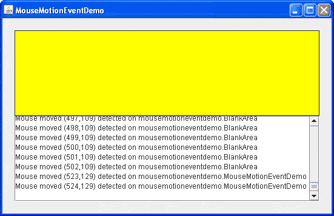

# 如何编写鼠标移动监听器

> 原文：[`docs.oracle.com/javase/tutorial/uiswing/events/mousemotionlistener.html`](https://docs.oracle.com/javase/tutorial/uiswing/events/mousemotionlistener.html)

鼠标移动事件通知用户使用鼠标（或类似输入设备）移动屏幕上的光标。有关监听其他类型鼠标事件（如点击）的信息，请参阅如何编写鼠标监听器。有关监听鼠标滚轮事件的信息，请参阅如何编写鼠标滚轮监听器。

如果应用程序需要检测鼠标事件和鼠标移动事件，可以使用[`MouseInputAdapter`](https://docs.oracle.com/javase/8/docs/api/javax/swing/event/MouseInputAdapter.html)类，该类实现了[`MouseInputListener`](https://docs.oracle.com/javase/8/docs/api/javax/swing/event/MouseInputListener.html)一个方便的接口，实现了`MouseListener`和`MouseMotionListener`接口。

或者，使用相应的[`MouseAdapter`](https://docs.oracle.com/javase/8/docs/api/java/awt/event/MouseAdapter.html) AWT 类，该类实现了`MouseMotionListener`接口，以创建一个`MouseMotionEvent`并重写特定事件的方法。

以下演示代码包含一个鼠标移动监听器。这个演示与如何编写鼠标监听器部分描述的演示完全相同，只是用`MouseMotionListener`接口替换了`MouseListener`接口。此外，MouseMotionEventDemo 实现了`mouseDragged`和`mouseMoved`方法，而不是鼠标监听器方法，并显示坐标而不是点击次数。



* * *

**试试看：**

1.  点击“启动”按钮以运行 MouseMotionEventDemo，使用[Java™ Web Start](http://www.oracle.com/technetwork/java/javase/javawebstart/index.html)（[下载 JDK 7 或更高版本](http://www.oracle.com/technetwork/java/javase/downloads/index.html)）。或者，要自行编译和运行示例，请参考示例索引。

1.  将光标移入窗口顶部的黄色矩形中。

    你将看到一个或多个鼠标移动事件。

1.  按住鼠标按钮，然后移动鼠标，使光标移出黄色矩形。

    你将看到鼠标拖动事件。

* * *

您可以在 `MouseMotionEventDemo.java` 和 `BlankArea.java` 中找到演示代码。以下来自 `MouseMotionEventDemo` 的代码片段实现了鼠标移动事件处理：

```java
public class MouseMotionEventDemo extends JPanel 
                                  implements MouseMotionListener {
    *//...in initialization code:*
        //Register for mouse events on blankArea and panel.
        blankArea.addMouseMotionListener(this);
        addMouseMotionListener(this);
        ...
    }

    public void mouseMoved(MouseEvent e) {
       saySomething("Mouse moved", e);
    }

    public void mouseDragged(MouseEvent e) {
       saySomething("Mouse dragged", e);
    }

    void saySomething(String eventDescription, MouseEvent e) {
        textArea.append(eventDescription 
                        + " (" + e.getX() + "," + e.getY() + ")"
                        + " detected on "
                        + e.getComponent().getClass().getName()
                        + newline);
    }
}

```

SelectionDemo 示例，绘制一个矩形来说明用户当前的拖动。为了绘制矩形，应用程序必须实现三种类型的鼠标事件的事件处理程序：鼠标按下、鼠标拖动和鼠标释放。为了被所有这些事件通知，处理程序必须同时实现 `MouseListener` 和 `MouseMotionListener` 接口，并且注册为鼠标监听器和鼠标移动监听器。为了避免定义空方法，处理程序不直接实现任何监听器接口。相反，它扩展了 `MouseInputAdapter`，如下面的代码片段所示。

```java
*...//where initialization occurs:*
    MyListener myListener = new MyListener();
    addMouseListener(myListener);
    addMouseMotionListener(myListener);
...
private class MyListener extends MouseInputAdapter {
    public void mousePressed(MouseEvent e) {
        int x = e.getX();
        int y = e.getY();
        currentRect = new Rectangle(x, y, 0, 0);
        updateDrawableRect(getWidth(), getHeight());
        repaint();
    }

    public void mouseDragged(MouseEvent e) {
        updateSize(e);
    }

    public void mouseReleased(MouseEvent e) {
        updateSize(e);
    }

    void updateSize(MouseEvent e) {
        int x = e.getX();
        int y = e.getY();
        currentRect.setSize(x - currentRect.x,
                            y - currentRect.y);
        updateDrawableRect(getWidth(), getHeight());
        Rectangle totalRepaint = rectToDraw.union(previouseRectDrawn); 
        repaint(totalRepaint.x, totalRepaint.y,
                totalRepaint.width, totalRepaint.height);
    }
}

```

## 鼠标移动监听器 API

鼠标移动监听器接口

*相应的适配器类是 [`MouseMotionAdapter`](https://docs.oracle.com/javase/8/docs/api/java/awt/event/MouseMotionAdapter.html) 和 [`MouseAdapter`](https://docs.oracle.com/javase/8/docs/api/java/awt/event/MouseAdapter.html)。*

| 方法 | 目的 |
| --- | --- |
| [mouseDragged(MouseEvent)](https://docs.oracle.com/javase/8/docs/api/java/awt/event/MouseMotionListener.html#mouseDragged-java.awt.event.MouseEvent-) | 当用户按住鼠标按钮移动鼠标时调用。即使光标不再位于该组件上，此事件也由最近触发鼠标按下事件的组件触发。 |
| [mouseMoved(MouseEvent)](https://docs.oracle.com/javase/8/docs/api/java/awt/event/MouseMotionListener.html#mouseMoved-java.awt.event.MouseEvent-) | 当用户移动鼠标而没有按下鼠标按钮时调用。此事件由当前位于光标下的组件触发。 |

每个鼠标移动事件方法都有一个参数 —— 并且*不*叫做 `MouseMotionEvent`！相反，每个鼠标移动事件方法使用一个 `MouseEvent` 参数。有关使用 `MouseEvent` 对象的信息，请参阅鼠标事件 API。 

## 使用鼠标移动监听器的示例

以下表格列出了使用鼠标移动监听器的示例。

| 示例 | 描述位置 | 备注 |
| --- | --- | --- |
| `MouseMotionEventDemo` | 此部分 | 报告在空白面板内发生的所有鼠标移动事件，以展示触发鼠标移动事件的情况。 |
| `LayeredPaneDemo` 和 `LayeredPaneDemo2` | 如何使用分层窗格 | 在响应鼠标移动事件时，在分层窗格内移动杜克的图像。 |
| `SelectionDemo` |   | 允许用户拖动矩形选择图像的一部分。使用 MouseInputAdapter 的子类监听鼠标事件和鼠标移动事件。 |
| `GlassPaneDemo` | 如何使用根窗格 | 使用 MouseInputAdapter 的子类监听根窗格的玻璃窗格上的鼠标事件和鼠标移动事件。重新分派事件给底层组件。 |
| `ScrollDemo` | 如何使用滚动窗格 | 标签子类 ScrollablePicture 使用鼠标移动监听器，允许用户在将光标拖出窗口时滚动图片。 |
