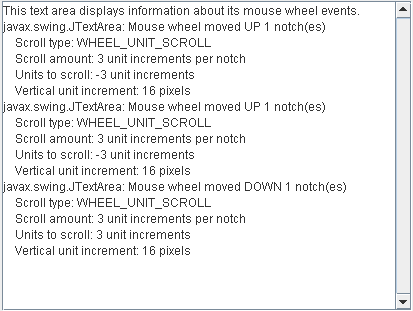

# 如何编写鼠标滚轮监听器

> 原文：[`docs.oracle.com/javase/tutorial/uiswing/events/mousewheellistener.html`](https://docs.oracle.com/javase/tutorial/uiswing/events/mousewheellistener.html)

鼠标滚轮事件会在鼠标滚轮旋转时通知。有关监听其他鼠标事件（如点击）的信息，请参阅如何编写鼠标监听器。有关监听鼠标拖动事件的信息，请参阅如何编写鼠标移动监听器。并非所有鼠标都配备鼠标滚轮，在这种情况下，将不会生成鼠标滚轮事件。无法通过编程方式检测鼠标是否配备鼠标滚轮。

或者，使用相应的[`MouseAdapter`](https://docs.oracle.com/javase/8/docs/api/java/awt/event/MouseAdapter.html) AWT 类，该类实现了`MouseWheelListener`接口，以创建`MouseWheelEvent`并重写特定事件的方法。

通常不需要实现鼠标滚轮监听器，因为鼠标滚轮主要用于滚动。滚动窗格会自动注册鼠标滚轮监听器，以适当地响应鼠标滚轮。

但是，要创建一个自定义组件用于滚动窗格内部，您可能需要自定义其滚动行为 —— 具体来说，您可能需要设置单位和块增量。例如，对于文本区域，滚动一个单位意味着滚动一行文本。块增量通常会滚动整个“页面”或视口的大小。有关更多信息，请参阅实现滚动智能客户端页面中的如何使用滚动窗格。

要生成鼠标滚轮事件，光标必须位于已注册监听鼠标滚轮事件的组件*上方*。发生的滚动类型，无论是`WHEEL_UNIT_SCROLL`还是`WHEEL_BLOCK_SCROLL`，都取决于平台。鼠标滚轮滚动的量也取决于平台。滚动的类型和量都可以通过平台的鼠标控制面板进行设置。

以下示例演示了鼠标滚轮事件。



* * *

**试试这个：**

1.  单击“启动”按钮以使用[Java™ Web Start](http://www.oracle.com/technetwork/java/javase/javawebstart/index.html)运行 MouseWheelEventDemo（[下载 JDK 7 或更高版本](http://www.oracle.com/technetwork/java/javase/downloads/index.html)）。或者，要自行编译和运行示例，请参阅示例索引。

1.  将光标移动到文本区域上。

1.  将鼠标滚轮远离您。您将看到一个或多个鼠标滚轮事件向*上*方向。

1.  将鼠标滚轮向相反方向旋转。您将看到鼠标滚轮事件向*下*方向。

1.  尝试更改系统的鼠标控制面板中鼠标滚轮的滚动行为，看看输出如何变化。您不需要重新启动演示以使更改生效。

* * *

对于其鼠标滚轮使用单位增量的系统的 MouseWheelEventDemo 的输出可能如下所示：

```java
javax.swing.JTextArea: Mouse wheel moved UP 1 notch(es)
    Scroll type: WHEEL_UNIT_SCROLL
    Scroll amount: 3 unit increments per notch
    Units to scroll: -3 unit increments
    Vertical unit increment: 16 pixels

```

由`getScrollAmount`方法返回的滚动量指示将滚动多少个单位，并始终呈现正数。由`getUnitsToScroll`方法返回的滚动单位在向下滚动时为正，在向上滚动时为负。垂直单位的像素数是使用`getUnitIncrement`方法从垂直滚动条获取的。在前面的示例中，向上滚动鼠标滚轮一个刻度应导致文本区域向上滚动 48 像素（3x16）。

对于使用块增量进行鼠标滚轮滚动的系统，对于鼠标滚轮的相同移动，输出可能如下所示：

```java
javax.swing.JTextArea: Mouse wheel moved UP 1 notch(es)
    Scroll type: WHEEL_BLOCK_SCROLL
    Vertical block increment: 307 pixels

```

垂直块增量是使用`getBlockIncrement`方法从垂直滚动条获取的。在这种情况下，向上滚动鼠标滚轮一个刻度意味着文本区域应向上滚动 307 像素。

在`MouseWheelEventDemo.java`文件中找到演示的代码。以下代码片段与鼠标滚轮事件处理相关：

```java
public class MouseWheelEventDemo ... implements MouseWheelListener ... {
    public MouseWheelEventDemo() {
        *//where initialization occurs:*
        //Register for mouse-wheel events on the text area.
        textArea.addMouseWheelListener(this);
        ...
    }

    public void mouseWheelMoved(MouseWheelEvent e) {
       String message;
       int notches = e.getWheelRotation();
       if (notches < 0) {
           message = "Mouse wheel moved UP "
                        + -notches + " notch(es)" + newline;
       } else {
           message = "Mouse wheel moved DOWN "
                        + notches + " notch(es)" + newline;
       }
       if (e.getScrollType() == MouseWheelEvent.WHEEL_UNIT_SCROLL) {
           message += "    Scroll type: WHEEL_UNIT_SCROLL" + newline;
           message += "    Scroll amount: " + e.getScrollAmount()
                   + " unit increments per notch" + newline;
           message += "    Units to scroll: " + e.getUnitsToScroll()
                   + " unit increments" + newline;
           message += "    Vertical unit increment: "
               + scrollPane.getVerticalScrollBar().getUnitIncrement(1)
               + " pixels" + newline;
       } else { //scroll type == MouseWheelEvent.WHEEL_BLOCK_SCROLL
           message += "    Scroll type: WHEEL_BLOCK_SCROLL" + newline;
           message += "    Vertical block increment: "
               + scrollPane.getVerticalScrollBar().getBlockIncrement(1)
               + " pixels" + newline;
       }
       saySomething(message, e);
    }
    ...
}

```

## 鼠标滚轮监听器 API

鼠标滚轮监听器接口

尽管`MouseWheelListener`只有一个方法，但它有相应的适配器类——`MouseAdapter`。这种能力使应用程序只需一个适配器类实例来管理来自鼠标指针的所有类型的事件。

| 方法 | 目的 |
| --- | --- |
| [mouseWheelMoved(MouseWheelEvent)](https://docs.oracle.com/javase/8/docs/api/java/awt/event/MouseWheelListener.html#mouseWheelMoved-java.awt.event.MouseWheelEvent-) | 当鼠标滚轮旋转时调用。 |

鼠标滚轮事件类

| 方法 | 目的 |
| --- | --- |
| [int getScrollType()](https://docs.oracle.com/javase/8/docs/api/java/awt/event/MouseWheelEvent.html#getScrollType--) | 返回要使用的滚动类型。可能的值为`WHEEL_BLOCK_SCROLL`和`WHEEL_UNIT_SCROLL`，由本机平台确定。 |
| [int getWheelRotation()](https://docs.oracle.com/javase/8/docs/api/java/awt/event/MouseWheelEvent.html#getWheelRotation--) | 返回鼠标滚轮旋转的刻度数。如果鼠标滚轮朝向用户（向下）旋转，则值为正。如果鼠标滚轮远离用户（向上）旋转，则值为负。 |
| [int getScrollAmount()](https://docs.oracle.com/javase/8/docs/api/java/awt/event/MouseWheelEvent.html#getScrollAmount--) | 返回每个刻度应滚动的单位数。这始终是一个正数，并且仅在滚动类型为`MouseWheelEvent.WHEEL_UNIT_SCROLL`时有效。 |
| [int getUnitsToScroll()](https://docs.oracle.com/javase/8/docs/api/java/awt/event/MouseWheelEvent.html#getUnitsToScroll--) | 返回当前事件应滚动的正负单位数。仅在滚动类型为`MouseWheelEvent.WHEEL_UNIT_SCROLL`时有效。 |

## 使用鼠标滚轮监听器的示例

下表列出了使用鼠标滚轮监听器的示例。

| 示例 | 描述位置 | 备注 |
| --- | --- | --- |
| `MouseWheelEventDemo` | 本节 | 报告在文本区域内发生的所有鼠标滚轮事件，以展示触发鼠标滚轮事件的情况。 |
