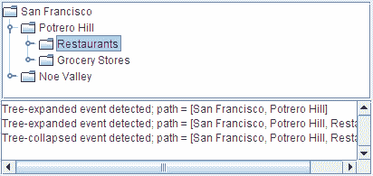

# 如何编写树展开监听器

> 原文：[`docs.oracle.com/javase/tutorial/uiswing/events/treeexpansionlistener.html`](https://docs.oracle.com/javase/tutorial/uiswing/events/treeexpansionlistener.html)

有时在使用树时，您可能需要在分支展开或折叠时做出反应。例如，您可能需要加载或保存数据。

有两种监听器报告展开和折叠事件：*树展开*监听器和*树将展开*监听器。本页讨论*树展开*监听器。有关树将展开监听器的描述，请参阅如何编写树将展开监听器。

树展开监听器会检测展开或折叠是否已经发生。一般来说，除非需要阻止展开或折叠发生，否则应该实现树展开监听器。

本示例演示了一个简单的树展开监听器。窗口底部的文本区域在每次发生树展开事件时显示一条消息。这是一个直接简单的演示。要查看一个更有趣的版本，可以否决展开，请参阅如何编写树将展开监听器。



* * *

**试试这个：**

1.  点击“启动”按钮以使用[Java™ Web Start](http://www.oracle.com/technetwork/java/javase/javawebstart/index.html)运行 TreeExpandEventDemo（[下载 JDK 7 或更高版本](http://www.oracle.com/technetwork/java/javase/downloads/index.html)）。或者，要自行编译和运行示例，请参考示例索引。

1.  展开一个节点。将触发树展开事件。

1.  折叠节点。将触发树折叠事件。

* * *

以下代码显示了程序如何处理展开事件。您可以在`TreeExpandEventDemo.java`中找到此示例的源代码。

```java
public class TreeExpandEventDemo ... {
    ...
    void saySomething(String eventDescription, TreeExpansionEvent e) {
        textArea.append(eventDescription + "; "
                        + "path = " + e.getPath()
                        + newline);
    }

    class DemoArea ... implements TreeExpansionListener {
        ...
        public DemoArea() {
            ...
            tree.addTreeExpansionListener(this);
            ...
        }
        ...
        // Required by TreeExpansionListener interface.
        public void treeExpanded(TreeExpansionEvent e) {
            saySomething("Tree-expanded event detected", e);
        }

        // Required by TreeExpansionListener interface.
        public void treeCollapsed(TreeExpansionEvent e) {
            saySomething("Tree-collapsed event detected", e);
        }
    }
}

```

## 树展开监听器 API

TreeExpansionListener 接口

*`TreeExpansionListener`没有适配器类。*

| 方法 | 目的 |
| --- | --- |
| [treeCollapsed(TreeExpansionEvent)](https://docs.oracle.com/javase/8/docs/api/javax/swing/event/TreeExpansionListener.html#treeCollapsed-javax.swing.event.TreeExpansionEvent-) | 在树节点折叠后调用。 |
| [treeExpanded(TreeExpansionEvent)](https://docs.oracle.com/javase/8/docs/api/javax/swing/event/TreeExpansionListener.html#treeExpanded-javax.swing.event.TreeExpansionEvent-) | 在树节点展开后调用。 |

TreeExpansionEvent API

| 方法 | 目的 |
| --- | --- |
| [Object getSource()](https://docs.oracle.com/javase/8/docs/api/java/util/EventObject.html#getSource--) | 返回触发事件的对象。 |
| [TreePath getPath()](https://docs.oracle.com/javase/8/docs/api/javax/swing/event/TreeExpansionEvent.html#getPath--) | 返回一个[`TreePath`](https://docs.oracle.com/javase/8/docs/api/javax/swing/tree/TreePath.html)对象，该对象标识从树的根节点到折叠/展开节点的每个节点，包括它们自身。 |

## 使用树展开监听器的示例

下表列出了使用树展开监听器的示例。

| 示例 | 描述位置 | 备注 |
| --- | --- | --- |
| `TreeExpandEventDemo` | 本节 | 每当发生树展开事件时显示一条消息。 |
| `TreeExpandEventDemo2` | 如何编写树展开监听器 | 为`TreeExpandEventDemo`添加了一个树展开监听器。 |
