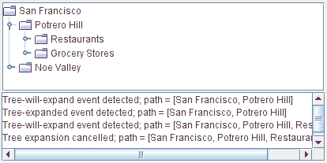

# 如何编写树展开监听器

> 原文：[`docs.oracle.com/javase/tutorial/uiswing/events/treewillexpandlistener.html`](https://docs.oracle.com/javase/tutorial/uiswing/events/treewillexpandlistener.html)

*树展开*监听器阻止树节点展开或折叠。要在展开或折叠发生后立即收到通知，应该使用*树展开监听器*。

此演示向`TreeExpandEventDemo`示例中讨论的如何编写树展开监听器添加了一个树展开监听器。此处添加的代码演示了*树展开*监听器阻止节点展开和折叠：每次尝试展开节点时，监听器都会提示您确认。



* * *

**试试这个：**

1.  点击“启动”按钮以使用[Java™ Web Start](http://www.oracle.com/technetwork/java/javase/javawebstart/index.html)运行 TreeExpandEventDemo2（[下载 JDK 7 或更高版本](http://www.oracle.com/technetwork/java/javase/downloads/index.html)）。或者，要自行编译和运行示例，请参考示例索引。

1.  点击**Potrero Hill**节点左侧的图形。这告诉树你想要展开该节点。

    一个对话框出现，询问您是否真的要展开节点。

1.  点击“展开”或关闭对话框。

    文本区域中的消息告诉您发生了树展开事件和树展开事件。每条消息的末尾都是展开节点的路径。

1.  尝试展开另一个节点，但这次在对话框中按下“取消展开”按钮。

    节点不会展开。文本区域中的消息告诉您发生了树展开事件，并且您取消了树展开。

1.  折叠**Potrero Hill**节点。

    节点在没有对话框出现的情况下折叠，因为事件处理程序的`treeWillCollapse`方法允许折叠发生，没有争议。

* * *

以下代码片段显示了此程序添加到`TreeExpandEventDemo`的代码。粗体行阻止了树展开的发生。您可以在`TreeExpandEventDemo2.java`中找到所有演示的源代码。

```java
public class TreeExpandEventDemo2 ... {
    ...
    class DemoArea ... implements ... TreeWillExpandListener {
        ...
        public DemoArea() {
            ...
            tree.addTreeWillExpandListener(this);
            ...
        }
        ...
        //Required by TreeWillExpandListener interface.
        public void treeWillExpand(TreeExpansionEvent e) 
                    throws ExpandVetoException {
            saySomething("Tree-will-expand event detected", e);
            *//...show a dialog...*
            if (*/* user said to cancel the expansion */*) {
                //Cancel expansion.
                saySomething("Tree expansion cancelled", e);
                throw new ExpandVetoException(e);
            }
        }

        //Required by TreeWillExpandListener interface.
        public void treeWillCollapse(TreeExpansionEvent e) {
            saySomething("Tree-will-collapse event detected", e);
        }
        ...
    }
}

```

## 树展开监听器 API

TreeWillExpandListener 接口

*`TreeWillExpandListener`没有适配器类。

| 方法 | 目的 |
| --- | --- |
| [treeWillCollapse(TreeExpansionEvent)](https://docs.oracle.com/javase/8/docs/api/javax/swing/event/TreeWillExpandListener.html#treeWillCollapse-javax.swing.event.TreeExpansionEvent-) | 在树节点折叠之前调用。为了阻止折叠发生，你的方法实现应该抛出一个[`ExpandVetoException`](https://docs.oracle.com/javase/8/docs/api/javax/swing/tree/ExpandVetoException.html) 事件。 |
| [treeWillExpand(TreeExpansionEvent)](https://docs.oracle.com/javase/8/docs/api/javax/swing/event/TreeWillExpandListener.html#treeWillExpand-javax.swing.event.TreeExpansionEvent-) | 在树节点展开之前调用。为了阻止展开发生，你的方法实现应该抛出一个[`ExpandVetoException`](https://docs.oracle.com/javase/8/docs/api/javax/swing/tree/ExpandVetoException.html) 事件。 |

查看树展开事件 API 以获取有关前述方法的[`TreeExpansionEvent`](https://docs.oracle.com/javase/8/docs/api/javax/swing/event/TreeExpansionEvent.html)参数的信息。

## 使用树将展开监听器的示例

在本节中展示的`TreeExpandEventDemo2`是我们唯一使用树将展开监听器的示例。
