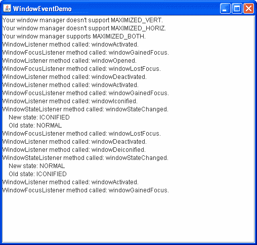

# 如何编写窗口监听器

> 原文：[`docs.oracle.com/javase/tutorial/uiswing/events/windowlistener.html`](https://docs.oracle.com/javase/tutorial/uiswing/events/windowlistener.html)

本节解释了如何实现三种与窗口相关的事件处理程序：`WindowListener`、`WindowFocusListener` 和 `WindowStateListener`。所有三个监听器处理 `WindowEvent` 对象。所有三个事件处理程序中的方法都由抽象的 `WindowAdapter` 类实现。

当适当的监听器已在窗口（如框架或对话框）上注册时，窗口事件将在窗口活动或状态发生后立即触发。如果此窗口接收键盘输入，则将其视为“焦点所有者”。

以下窗口活动或状态可能在窗口事件之前发生：

+   打开窗口 — 第一次显示窗口。

+   关闭窗口 — 从屏幕上移除窗口。

+   图标化窗口 — 将窗口缩小为桌面上的图标。

+   取消图标化窗口 — 将窗口恢复到原始大小。

+   焦点窗口 — 包含“焦点所有者”的窗口。

+   激活窗口（框架或对话框） — 这个窗口要么是焦点窗口，要么拥有焦点窗口。

+   非激活窗口 — 这个窗口失去了焦点。有关焦点的更多信息，请参阅[AWT 焦点子系统](https://docs.oracle.com/javase/6/docs/api/java/awt/doc-files/FocusSpec.html)规范。

+   最大化窗口 — 将窗口的大小增加到允许的最大尺寸，可以是垂直方向、水平方向或两个方向都增加。

    `WindowListener` 接口定义了处理大多数窗口事件的方法，例如打开和关闭窗口的事件，窗口的激活和非激活，以及窗口的图标化和取消图标化。

    另外两个窗口监听器接口是 `WindowFocusListener` 和 `WindowStateListener`。`WindowFocusListener` 包含用于检测窗口何时成为焦点所有者或失去焦点所有者状态的方法。`WindowStateListener` 有一个方法用于检测窗口状态的更改，例如窗口被图标化、取消图标化、最大化或恢复为正常状态。

    虽然您可以使用 `WindowListener` 方法来检测一些窗口状态，例如图标化，但有两个原因使 `WindowStateListener` 更可取：它只有一个需要您实现的方法，并且它支持最大化。

    * * *

    **注意：** 并非所有窗口管理器/本地平台都支持所有窗口状态。`java.awt.Toolkit` 方法 [`isFrameStateSupported(int)`](https://docs.oracle.com/javase/8/docs/api/java/awt/Toolkit.html#isFrameStateSupported-int-) 可用于确定特定窗口状态是否受特定窗口管理器支持。稍后在本节中描述的 WindowEventDemo 示例展示了如何使用此方法。

    * * *

    窗口监听器通常用于实现自定义窗口关闭行为。例如，窗口监听器用于在关闭窗口之前保存数据，或者在最后一个窗口关闭时退出程序。

    用户不一定需要实现窗口监听器来指定用户关闭窗口时窗口应该执行的操作。默认情况下，当用户关闭窗口时，窗口变为不可见。要指定不同的行为，请使用`JFrame`或`JDialog`类的`setDefaultCloseOperation`方法。要实现窗口关闭处理程序，请使用`setDefaultCloseOperation(WindowConstants.DO_NOTHING_ON_CLOSE)`方法，以便使窗口监听器提供所有窗口关闭职责。有关如何使用`setDefaultCloseOperation`的详细信息，请参见响应窗口关闭事件。

    当 Java 虚拟机（VM）中的最后一个可显示窗口被销毁时，VM 可能会终止。但请注意，在程序自动退出之前可能会有延迟，并且在某些情况下程序可能会继续运行。使用`System.exit(int)`显式退出程序更快更安全。有关更多信息，请参见[AWT 线程问题](https://docs.oracle.com/javase/8/docs/api/java/awt/doc-files/AWTThreadIssues.html#Autoshutdown)。

    窗口监听器通常也用于在窗口最小化时停止线程并释放资源，并在窗口恢复正常时重新启动。这样可以避免不必要地使用处理器或其他资源。例如，当包含动画的窗口被最小化时，应该停止其动画线程并释放任何大型缓冲区。当窗口恢复正常时，可以重新启动线程并重新创建缓冲区。

    以下示例演示了窗口事件。一个不可编辑的文本区域报告了由其窗口触发的所有窗口事件。此演示实现了`WindowListener`、`WindowFocusListener`和`WindowStateListener`接口中的所有方法。您可以在`WindowEventDemo.java`中找到演示的代码。

    

    * * *

    **试试这个：**

    1.  单击“启动”按钮以使用[Java™ Web Start](http://www.oracle.com/technetwork/java/javase/javawebstart/index.html)运行 WindowEventDemo（[下载 JDK 7 或更高版本](http://www.oracle.com/technetwork/java/javase/downloads/index.html)）。或者，要自行编译和运行示例，请参考示例索引。

    1.  当窗口出现时，已经显示了几条消息。一行报告您的窗口管理器是否支持 MAXIMIZED_BOTH。如果窗口管理器不支持其他窗口状态，也会报告此条件。接下来，会显示几行，报告窗口的窗口监听器已接收到窗口打开、激活和获得焦点事件。窗口中显示的所有消息也会发送到标准输出。

    1.  单击另一个窗口。将显示“窗口失去焦点”和“窗口失活”消息。如果此窗口不是框架或对话框，则会接收激活或失活事件。

    1.  单击 WindowEventDemo 窗口。您将看到“窗口激活”和“窗口获得焦点”消息。

    1.  使用窗口控件将窗口图标化。将显示两条图标化消息，一条来自窗口监听器，另一条来自窗口状态监听器。除非您查看标准输出，否则这些消息将在窗口取消图标化之前不会显示。还会报告窗口失活和窗口失去焦点事件。

    1.  取消图标化窗口。窗口监听器和窗口状态监听器都会显示两条取消图标化消息。`WindowStateListener`类中的`windowStateChanged`方法提供了与`WindowListener`类中的`windowIconified`和`windowDeiconified`方法相同的信息。还会报告窗口激活和窗口获得焦点事件。

    1.  最大化窗口，如果你的外观提供了这样的功能。请注意，一些外观在一些窗口管理器上运行，比如在 dtwm 上的 Java 外观，提供了最大化窗口的方法，但不会报告任何事件。这是因为 dtwm 通过调整窗口大小来模拟最大化，但这不是真正的最大化事件。一些外观只提供在垂直或水平方向上最大化窗口的方法。尝试使用窗口控件来查看有哪些选项可用。

    1.  使用窗口控件关闭窗口。将显示一个窗口关闭消息。一旦窗口关闭，将向标准输出发送一个窗口关闭消息。

    * * *

    这是演示窗口事件处理代码：

    ```java
    public class WindowEventDemo extends JFrame implements WindowListener,
                                                WindowFocusListener,
                                                WindowStateListener {
        ...
        static WindowEventDemo frame = new WindowEventDemo("WindowEventDemo");
        JTextArea display;
        ...

        private void addComponentsToPane() {
            display = new JTextArea();
            display.setEditable(false);
            JScrollPane scrollPane = new JScrollPane(display);
            scrollPane.setPreferredSize(new Dimension(500, 450));
            getContentPane().add(scrollPane, BorderLayout.CENTER);

            addWindowListener(this);
            addWindowFocusListener(this);
            addWindowStateListener(this);

            checkWM();
        }

        public WindowEventDemo(String name) {
            super(name);
        }

        //Some window managers don't support all window states.

        public void checkWM() {
            Toolkit tk = frame.getToolkit();
            if (!(tk.isFrameStateSupported(Frame.ICONIFIED))) {
                displayMessage(
                        "Your window manager doesn't support ICONIFIED.");
            }  else displayMessage(
                    "Your window manager supports ICONIFIED.");
            if (!(tk.isFrameStateSupported(Frame.MAXIMIZED_VERT))) {
                displayMessage(
                        "Your window manager doesn't support MAXIMIZED_VERT.");
            }  else displayMessage(
                    "Your window manager supports MAXIMIZED_VERT.");
            if (!(tk.isFrameStateSupported(Frame.MAXIMIZED_HORIZ))) {
                displayMessage(
                        "Your window manager doesn't support MAXIMIZED_HORIZ.");
            } else displayMessage(
                    "Your window manager supports MAXIMIZED_HORIZ.");
            if (!(tk.isFrameStateSupported(Frame.MAXIMIZED_BOTH))) {
                displayMessage(
                        "Your window manager doesn't support MAXIMIZED_BOTH.");
            } else {
                displayMessage(
                        "Your window manager supports MAXIMIZED_BOTH.");
            }
        }

        public void windowClosing(WindowEvent e) {
            displayMessage("WindowListener method called: windowClosing.");
            //A pause so user can see the message before
            //the window actually closes.
            ActionListener task = new ActionListener() {
                boolean alreadyDisposed = false;
                public void actionPerformed(ActionEvent e) {
                    if (frame.isDisplayable()) {
                        alreadyDisposed = true;
                        frame.dispose();
                    }
                }
            };
            Timer timer = new Timer(500, task); //fire every half second
            timer.setInitialDelay(2000);        //first delay 2 seconds
            timer.setRepeats(false);
            timer.start();
        }

        public void windowClosed(WindowEvent e) {
            //This will only be seen on standard output.
            displayMessage("WindowListener method called: windowClosed.");
        }

        public void windowOpened(WindowEvent e) {
            displayMessage("WindowListener method called: windowOpened.");
        }

        public void windowIconified(WindowEvent e) {
            displayMessage("WindowListener method called: windowIconified.");
        }

        public void windowDeiconified(WindowEvent e) {
            displayMessage("WindowListener method called: windowDeiconified.");
        }

        public void windowActivated(WindowEvent e) {
            displayMessage("WindowListener method called: windowActivated.");
        }

        public void windowDeactivated(WindowEvent e) {
            displayMessage("WindowListener method called: windowDeactivated.");
        }

        public void windowGainedFocus(WindowEvent e) {
            displayMessage("WindowFocusListener method called: windowGainedFocus.");
        }

        public void windowLostFocus(WindowEvent e) {
            displayMessage("WindowFocusListener method called: windowLostFocus.");
        }

        public void windowStateChanged(WindowEvent e) {
            displayStateMessage(
              "WindowStateListener method called: windowStateChanged.", e);
        }

        void displayMessage(String msg) {
            display.append(msg + newline);
            System.out.println(msg);
        }

        void displayStateMessage(String prefix, WindowEvent e) {
            int state = e.getNewState();
            int oldState = e.getOldState();
            String msg = prefix
                       + newline + space
                       + "New state: "
                       + convertStateToString(state)
                       + newline + space
                       + "Old state: "
                       + convertStateToString(oldState);
            displayMessage(msg);
        }

        String convertStateToString(int state) {
            if (state == Frame.NORMAL) {
                return "NORMAL";
            }
            String strState = " ";
            if ((state & Frame.ICONIFIED) != 0) {
                strState += "ICONIFIED";
            }
            //MAXIMIZED_BOTH is a concatenation of two bits, so
            //we need to test for an exact match.
            if ((state & Frame.MAXIMIZED_BOTH) == Frame.MAXIMIZED_BOTH) {
                strState += "MAXIMIZED_BOTH";
            } else {
                if ((state & Frame.MAXIMIZED_VERT) != 0) {
                    strState += "MAXIMIZED_VERT";
                }
                if ((state & Frame.MAXIMIZED_HORIZ) != 0) {
                    strState += "MAXIMIZED_HORIZ";
                }
                if (" ".equals(strState)){
                    strState = "UNKNOWN";
                }
            }
            return strState.trim();
        }
    }

    ```

    ## 窗口监听器 API

    窗口监听器 API 由三个窗口监听器接口和`WindowEvent`类组成。它们的方法列在以下表中：

    +   WindowListener 接口

    +   WindowFocusListener 接口

    +   WindowStateListener 接口

    +   WindowEvent 类所有三个接口的方法都可以通过[`WindowAdapter`](https://docs.oracle.com/javase/8/docs/api/java/awt/event/WindowAdapter.html)类来使用。

    WindowListener 接口

    | 方法 | 目的 |
    | --- | --- |
    | [windowOpened(WindowEvent)](https://docs.oracle.com/javase/8/docs/api/java/awt/event/WindowListener.html#windowOpened-java.awt.event.WindowEvent-) | 在所监听窗口首次显示后立即调用。 |
    | [windowClosing(WindowEvent)](https://docs.oracle.com/javase/8/docs/api/java/awt/event/WindowListener.html#windowClosing-java.awt.event.WindowEvent-) | 响应用户请求关闭所监听窗口时调用。要实际关闭窗口，监听器应调用窗口的`dispose`或`setVisible(false)`方法。 |
    | [windowClosed(WindowEvent)](https://docs.oracle.com/javase/8/docs/api/java/awt/event/WindowListener.html#windowClosed-java.awt.event.WindowEvent-) | 在所监听窗口关闭后立即调用。 |
    | [windowIconified(WindowEvent)](https://docs.oracle.com/javase/8/docs/api/java/awt/event/WindowListener.html#windowIconified-java.awt.event.WindowEvent-) [windowDeiconified(WindowEvent)](https://docs.oracle.com/javase/8/docs/api/java/awt/event/WindowListener.html#windowDeiconified-java.awt.event.WindowEvent-) | 在所监听窗口最小化或取消最小化后立即调用。 |
    | [windowActivated(WindowEvent)](https://docs.oracle.com/javase/8/docs/api/java/awt/event/WindowListener.html#windowActivated-java.awt.event.WindowEvent-) [windowDeactivated(WindowEvent)](https://docs.oracle.com/javase/8/docs/api/java/awt/event/WindowListener.html#windowDeactivated-java.awt.event.WindowEvent-) | 在所监听窗口激活或停用后立即调用。这些方法不会发送给非框架或对话框的窗口。因此，更倾向于使用`windowGainedFocus`和`windowLostFocus`方法来确定窗口何时获得或失去焦点。 |

    窗口焦点监听器接口

    | Method | Purpose |
    | --- | --- |
    | [windowGainedFocus(WindowEvent)](https://docs.oracle.com/javase/8/docs/api/java/awt/event/WindowFocusListener.html#windowGainedFocus-java.awt.event.WindowEvent-) [windowLostFocus(WindowEvent)](https://docs.oracle.com/javase/8/docs/api/java/awt/event/WindowFocusListener.html#windowLostFocus-java.awt.event.WindowEvent-) | 在所监听窗口获得或失去焦点后立即调用。 |

    窗口状态监听器接口

    | Method | Purpose |
    | --- | --- |

    | [windowStateChanged(WindowEvent)](https://docs.oracle.com/javase/8/docs/api/java/awt/event/WindowStateListener.html#windowStateChanged-java.awt.event.WindowEvent-) | 在所监听窗口的状态通过最小化、最大化或恢复正常而改变后立即调用。状态通过`WindowEvent`以位掩码的形式可用。可能的值在`java.awt.Frame`中定义为：

    +   NORMAL. 表示没有设置任何状态位。

    +   ICONIFIED.

    +   MAXIMIZED_HORIZ.

    +   MAXIMIZED_VERT.

    +   MAXIMIZED_BOTH. 连接`MAXIMIZED_HORIZ`和`MAXIMIZED_VERT`。窗口管理器可能支持`MAXIMIZED_BOTH`，而不支持`MAXIMIZED_HORIZ`或`MAXIMIZED_VERT`。[`java.awt.Toolkit`](https://docs.oracle.com/javase/8/docs/api/java/awt/Toolkit.html)方法[`isFrameStateSupported(int)`](https://docs.oracle.com/javase/8/docs/api/java/awt/Toolkit.html#isFrameStateSupported-int-)可用于确定窗口管理器支持哪些状态。

    |

    WindowEvent 类

    | 方法 | 目的 |
    | --- | --- |
    | [Window getWindow()](https://docs.oracle.com/javase/8/docs/api/java/awt/event/WindowEvent.html#getWindow--) | 返回触发事件的窗口。您可以使用这个方法代替`getSource`方法。 |
    | [Window getOppositeWindow()](https://docs.oracle.com/javase/8/docs/api/java/awt/event/WindowEvent.html#getOppositeWindow--) | 返回与此焦点或激活更改相关的另一个窗口。对于`WINDOW_ACTIVATED`或`WINDOW_GAINED_FOCUS`事件，返回失去激活或焦点的窗口。对于`WINDOW_DEACTIVATED`或`WINDOW_LOST_FOCUS`事件，返回获得激活或焦点的窗口。对于具有不同 VM 或上下文中的 Java 应用程序的任何其他类型的`WindowEvent`，或者没有其他窗口的情况，返回`null`。 |
    | [int getOldState()](https://docs.oracle.com/javase/8/docs/api/java/awt/event/WindowEvent.html#getOldState--) [int getNewState()](https://docs.oracle.com/javase/8/docs/api/java/awt/event/WindowEvent.html#getNewState--) | 对于`WINDOW_STATE_CHANGED`事件，这些方法返回窗口的先前状态或新状态作为位掩码。 |

    ## 使用窗口监听器的示例

    以下表格列出了使用窗口监听器的示例。

    | 示例 | 描述位置 | 注释 |
    | --- | --- | --- |
    | `WindowEventDemo` | 本节 | 报告在一个窗口上发生的所有窗口事件，以展示触发窗口事件的情况。 |
    | `SliderDemo` | 如何使用滑块 | 监听窗口最小化和还原事件，以便在窗口不可见时停止动画。 |
    | `InternalFrameEventDemo` | 如何编写内部框架监听器 | 报告在一个内部框架上发生的所有内部框架事件，以展示触发内部框架事件的情况。内部框架事件类似于窗口事件。 |
    | `DialogDemo` | 文本组件特性 | `CustomDialog.java` 使用`setDefaultCloseOperation`而不是窗口监听器来确定用户关闭窗口时要采取的操作。 |
    | `框架` | — | 一个允许创建和销毁多个窗口的演示。 |
