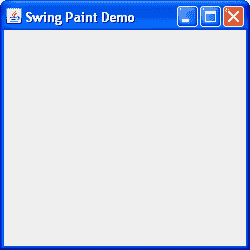

# 创建演示应用程序（第 1 步）

> 原文：[`docs.oracle.com/javase/tutorial/uiswing/painting/step1.html`](https://docs.oracle.com/javase/tutorial/uiswing/painting/step1.html)

所有图形用户界面都需要某种主应用程序框架来显示。在 Swing 中，这是`javax.swing.JFrame`的一个实例。因此，我们的第一步是实例化这个类，并确保一切按预期工作。请注意，在 Swing 中编程时，你的 GUI 创建代码应该放在事件分发线程（EDT）上。这将防止潜在的竞争条件，可能导致死锁。以下代码清单显示了如何实现这一点。



一个`javax.swing.JFrame`的实例

单击“启动”按钮以使用[Java™ Web Start](http://www.oracle.com/technetwork/java/javase/javawebstart/index.html)运行 SwingPaintDemo1（[下载 JDK 7 或更高版本](http://www.oracle.com/technetwork/java/javase/downloads/index.html)）。或者，要自行编译和运行示例，请参考示例索引。


```java
package painting;

import javax.swing.SwingUtilities;
import javax.swing.JFrame;

public class SwingPaintDemo1 {

    public static void main(String[] args) {
        SwingUtilities.invokeLater(new Runnable() {
            public void run() {
                createAndShowGUI();
            }
        });
    }

    private static void createAndShowGUI() {
        System.out.println("Created GUI on EDT? "+
                SwingUtilities.isEventDispatchThread());
        JFrame f = new JFrame("Swing Paint Demo");
        f.setDefaultCloseOperation(JFrame.EXIT_ON_CLOSE);
        f.setSize(250,250);
        f.setVisible(true);
    }
}

```

这将创建框架，设置其标题，并使一切可见。我们使用`SwingUtilities`辅助类在事件分发线程上构建此 GUI。请注意，默认情况下，当用户单击“关闭”按钮时，`JFrame`不会退出应用程序。我们通过调用`setDefaultCloseOperation`方法并传入适当的参数来提供此行为。此外，我们明确设置框架的大小为 250 x 250 像素。一旦我们开始向框架添加组件，这一步将不再必要。

练习：

1.  编译并运行应用程序。

1.  测试最小化和最大化按钮。

1.  单击关闭按钮（应用程序应该退出）。
