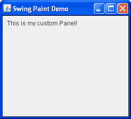

# 创建演示应用程序（第 2 步）

> 原文：[`docs.oracle.com/javase/tutorial/uiswing/painting/step2.html`](https://docs.oracle.com/javase/tutorial/uiswing/painting/step2.html)

接下来，我们将向框架添加一个自定义绘图表面。为此，我们将创建一个 `javax.swing.JPanel` 的子类（一个通用的轻量级容器），它将提供渲染我们自定义绘图的代码。



一个 javax.swing.JPanel 子类

点击“启动”按钮以使用 [Java™ Web Start](http://www.oracle.com/technetwork/java/javase/javawebstart/index.html) 运行 SwingPaintDemo2（[下载 JDK 7 或更高版本](http://www.oracle.com/technetwork/java/javase/downloads/index.html)）。或者，要自行编译和运行示例，请参考 示例索引。


```java
package painting;

import javax.swing.SwingUtilities;
import javax.swing.JFrame;
import javax.swing.JPanel;
import javax.swing.BorderFactory;
import java.awt.Color;
import java.awt.Dimension;
import java.awt.Graphics; 
public class SwingPaintDemo2 {

    public static void main(String[] args) {
        SwingUtilities.invokeLater(new Runnable() {
            public void run() {
                createAndShowGUI(); 
            }
        });
    }

    private static void createAndShowGUI() {
        System.out.println("Created GUI on EDT? "+
        SwingUtilities.isEventDispatchThread());
        JFrame f = new JFrame("Swing Paint Demo");
        f.setDefaultCloseOperation(JFrame.EXIT_ON_CLOSE);
        f.add(new MyPanel());
        f.pack();
        f.setVisible(true);
    }
}

class MyPanel extends JPanel {

    public MyPanel() {
        setBorder(BorderFactory.createLineBorder(Color.black));
    }

    public Dimension getPreferredSize() {
        return new Dimension(250,200);
    }

    public void paintComponent(Graphics g) {
        super.paintComponent(g);       

        // Draw Text
        g.drawString("This is my custom Panel!",10,20);
    }  
} 

```

你将注意到的第一个变化是我们现在导入了许多额外的类，比如 `JPanel`、`Color` 和 `Graphics`。由于一些旧的 AWT 类仍然在现代 Swing 应用程序中使用，所以在一些导入语句中看到 `java.awt` 包是正常的。我们还定义了一个名为 `MyPanel` 的自定义 `JPanel` 子类，它包含了大部分新代码。

`MyPanel` 类定义有一个构造函数，它在其边缘周围设置了黑色边框。这是一个细微的细节，一开始可能很难看到（如果看不到，只需注释掉 `setBorder` 的调用，然后重新编译）。`MyPanel` 还重写了 `getPreferredSize`，它返回面板的期望宽度和高度（在本例中，宽度为 250，高度为 200）。因此，`SwingPaintDemo` 类不再需要指定框架的像素大小。它只需将面板添加到框架中，然后调用 `pack`。

`paintComponent` 方法是所有自定义绘制发生的地方。这个方法由 `javax.swing.JComponent` 定义，然后被你的子类重写以提供它们的自定义行为。它唯一的参数，一个 [`java.awt.Graphics`](https://docs.oracle.com/javase/8/docs/api/java/awt/Graphics.html) 对象，提供了许多用于绘制 2D 形状和获取有关应用程序图形环境信息的方法。在大多数情况下，实际接收到这个方法的对象将是 [`java.awt.Graphics2D`](https://docs.oracle.com/javase/8/docs/api/java/awt/Graphics2D.html) 的一个实例（`Graphics` 的子类），它提供了对复杂的 2D 图形渲染的支持。

大多数标准的 Swing 组件都通过单独的"UI Delegate"对象实现其外观和感觉。调用`super.paintComponent(g)`将图形上下文传递给组件的 UI 代理，后者绘制面板的背景。要更仔细地了解这个过程，请参见上述 SDN 文章中标题为"绘制和 UI 代理"的部分。

练习：

1.  现在你已经向屏幕绘制了一些自定义文本，请尝试像之前那样最小化和恢复应用程序。

1.  用另一个窗口遮挡文本的一部分，然后将该窗口移开以重新显示自定义文本。在这两种情况下，绘制子系统将确定组件已损坏，并确保调用你的`paintComponent`方法。
