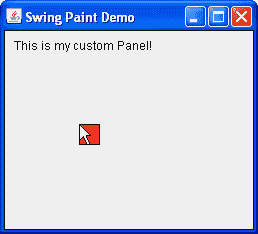

# 创建演示应用程序（第 3 步）

> 原文：[`docs.oracle.com/javase/tutorial/uiswing/painting/step3.html`](https://docs.oracle.com/javase/tutorial/uiswing/painting/step3.html)

最后，我们将添加事件处理代码，以在用户单击或拖动鼠标时以编程方式重新绘制组件。为了尽可能高效地保持我们的自定义绘画，我们将跟踪鼠标坐标并仅重新绘制屏幕上发生变化的区域。这是一个推荐的最佳实践，将使您的应用程序尽可能高效地运行。



完成的应用程序

图 3：完成的应用程序

点击“启动”按钮以使用[Java™ Web Start](http://www.oracle.com/technetwork/java/javase/javawebstart/index.html)运行 SwingPaintDemo3（[下载 JDK 7 或更高版本](http://www.oracle.com/technetwork/java/javase/downloads/index.html)）。或者，要自行编译和运行示例，请参考示例索引。


```java
package painting;

import javax.swing.SwingUtilities;
import javax.swing.JFrame;
import javax.swing.JPanel;
import javax.swing.BorderFactory;
import java.awt.Color;
import java.awt.Dimension;
import java.awt.Graphics;
import java.awt.event.MouseEvent;
import java.awt.event.MouseListener;
import java.awt.event.MouseAdapter;
import java.awt.event.MouseMotionListener;
import java.awt.event.MouseMotionAdapter;

public class SwingPaintDemo3 {

    public static void main(String[] args) {
        SwingUtilities.invokeLater(new Runnable() {
            public void run() {
                createAndShowGUI(); 
            }
        });
    }

    private static void createAndShowGUI() {
        System.out.println("Created GUI on EDT? "+
        SwingUtilities.isEventDispatchThread());
        JFrame f = new JFrame("Swing Paint Demo");
        f.setDefaultCloseOperation(JFrame.EXIT_ON_CLOSE); 
        f.add(new MyPanel());
        f.pack();
        f.setVisible(true);
    } 
}

class MyPanel extends JPanel {

    private int squareX = 50;
    private int squareY = 50;
    private int squareW = 20;
    private int squareH = 20;

    public MyPanel() {

        setBorder(BorderFactory.createLineBorder(Color.black));

        addMouseListener(new MouseAdapter() {
            public void mousePressed(MouseEvent e) {
                moveSquare(e.getX(),e.getY());
            }
        });

        addMouseMotionListener(new MouseAdapter() {
            public void mouseDragged(MouseEvent e) {
                moveSquare(e.getX(),e.getY());
            }
        }); 
    }
    private void moveSquare(int x, int y) {
        int OFFSET = 1;
        if ((squareX!=x) || (squareY!=y)) {
            repaint(squareX,squareY,squareW+OFFSET,squareH+OFFSET);
            squareX=x;
            squareY=y;
            repaint(squareX,squareY,squareW+OFFSET,squareH+OFFSET);
        } 
    } 

    public Dimension getPreferredSize() {
        return new Dimension(250,200);
    }

    protected void paintComponent(Graphics g) {
        super.paintComponent(g);       
        g.drawString("This is my custom Panel!",10,20);
        g.setColor(Color.RED);
        g.fillRect(squareX,squareY,squareW,squareH);
        g.setColor(Color.BLACK);
        g.drawRect(squareX,squareY,squareW,squareH);
    }  
}

```

这个变化首先从`java.awt.event`包中导入各种鼠标类，使应用程序能够响应用户的鼠标活动。构造函数已更新以注册鼠标按下和拖动的事件侦听器。每当接收到`MouseEvent`时，它会被转发到`moveSquare`方法，该方法会智能地更新正方形的坐标并重新绘制组件。请注意，默认情况下，放置在这些事件处理程序中的任何代码都将在事件分发线程上执行。

但最重要的变化是调用`repaint`方法。这个方法由`java.awt.Component`定义，是允许你以编程方式重新绘制给定组件表面的机制。它有一个无参版本（重新绘制整个组件）和一个多参数版本（重新绘制指定区域）。这个区域也被称为*剪辑区*。调用`repaint`的多参数版本需要额外的努力，但可以保证你的绘画代码不会浪费时间重新绘制屏幕上未改变的区域。

因为我们手动设置了剪辑区域，我们的`moveSquare`方法不是一次调用 repaint 方法，而是两次。第一次调用告诉 Swing 重新绘制组件中方块*之前*所在的区域（继承的行为使用 UI Delegate 来填充该区域的当前背景颜色）。第二次调用绘制组件中方块*当前*所在的区域。值得注意的重要一点是，尽管我们在同一个事件处理程序中连续两次调用 repaint，但 Swing 足够智能，可以将这些信息合并在一个单一的绘制操作中重新绘制屏幕的这些部分。换句话说，Swing 不会连续两次重绘组件，即使代码看起来是这样做的。

练习：

1.  将第一次调用 repaint 注释掉，并注意当你点击或拖动鼠标时会发生什么。因为那一行负责填充背景，你应该注意到所有方块在被绘制后仍然保留在屏幕上。

1.  在屏幕上有多个方块的情况下，最小化和恢复应用程序窗口。会发生什么？你应该注意到最大化屏幕会导致系统完全重绘组件表面，这将擦除除当前方块外的所有方块。

1.  将两次调用 repaint 都注释掉，并在 paintComponent 方法的末尾添加一行调用 repaint 的零参数版本。应用程序将看起来恢复到其原始行为，但现在绘制效率会降低，因为整个组件的表面区域现在都在被绘制。你可能会注意到性能变慢，特别是如果应用程序被最大化时。
