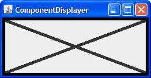
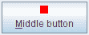
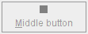
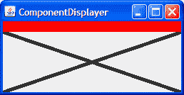

# 问题和练习：执行自定义绘图

> 原文：[`docs.oracle.com/javase/tutorial/uiswing/QandE/questions-ch6.html`](https://docs.oracle.com/javase/tutorial/uiswing/QandE/questions-ch6.html)

## 问题

1\. `JComponent` 定义的哪个方法绘制组件的内部？

2\. 以下哪个代码片段绘制了一个大小为 100x100 像素的矩形（填充或不填充）？

a. `g.fillRect(x, y, 100, 100)`

b. `g.fillRect(x, y, 99, 99)`

c. `g.drawRect(x, y, 100, 100)`

d. b 和 c

e. a 和 c

3\. 你会使用什么代码使组件使用背景颜色的 50%透明度执行下一个绘图操作？

## 练习

1\. 使用标准边框和自定义组件绘制，实现一个首选大小为 250x100 的组件，默认情况下是不透明的，有一个 5 像素的黑色边框，并在前景色中绘制一个“X”（使用 5 像素粗线），如下图所示。

2\. 实现一个图标，大小为 10x10 像素，绘制填充整个 10x10 区域的实心矩形。如果图标的组件启用，则矩形应为红色；如果禁用，则为灰色。制作一个使用你自定义的`Icon`替换中间按钮显示`middle.gif`的`ButtonDemo.java`的副本。以下图片展示了图标应该是什么样子。

|  |  |
| --- | --- |

3\. 实现一个边框，它在其组件顶部整个宽度处绘制一个红色的 15 像素高条纹。通过将此边框替换为练习 1 中创建的组件上的边框来测试此边框。结果应如下图所示。  检查你的答案。
