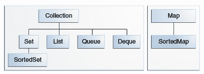

# 课程：接口

> 原文：[`docs.oracle.com/javase/tutorial/collections/interfaces/index.html`](https://docs.oracle.com/javase/tutorial/collections/interfaces/index.html)

*核心集合接口*封装了不同类型的集合，如下图所示。这些接口允许独立于其表示细节来操作集合。核心集合接口是 Java 集合框架的基础。如下图所示，核心集合接口形成了一个层次结构。



核心集合接口。

`Set` 是一种特殊类型的 `Collection`，`SortedSet` 是一种特殊类型的 `Set`，依此类推。还要注意，层次结构由两个不同的树组成 — `Map` 不是真正的 `Collection`。

请注意，所有核心集合接口都是泛型的。例如，这是 `Collection` 接口的声明。

```java
public interface Collection<E>...

```

`<E>` 语法告诉你该接口是泛型的。当你声明一个 `Collection` 实例时，你可以*并且应该*指定集合中包含的对象类型。指定类型允许编译器在编译时验证你放入集合中的对象类型是否正确，从而减少运行时错误。有关泛型类型的信息，请参阅泛型（已更新）课程。

当你了解如何使用这些接口时，你将了解大部分关于 Java 集合框架的知识。本章讨论了有效使用接口的一般准则，包括何时使用哪个接口。您还将学习每个接口的编程习惯用法，以帮助您充分利用它。

为了使核心集合接口的数量可管理，Java 平台没有为每种集合类型的每种变体提供单独的接口。（这些变体可能包括不可变、固定大小和仅追加的。）相反，每个接口中的修改操作被指定为*可选的* — 给定的实现可以选择不支持所有操作。如果调用了不受支持的操作，集合会抛出一个[`UnsupportedOperationException`](https://docs.oracle.com/javase/8/docs/api/java/lang/UnsupportedOperationException.html)。实现负责记录支持哪些可选操作。Java 平台的通用实现支持所有可选操作。

以下列表描述了核心集合接口：

+   `Collection` — 集合层次结构的根。一个集合代表一组称为其*元素*的对象。`Collection`接口是所有集合实现的最小公分母，用于在需要最大一般性时传递集合并操作它们。某些类型的集合允许重复元素，而其他类型则不允许。有些是有序的，而其他是无序的。Java 平台没有直接提供这个接口的任何实现，但提供了更具体的子接口的实现，比如`Set`和`List`。另请参阅集合接口部分。

+   `Set` — 一个不能包含重复元素的集合。这个接口模拟了数学集合抽象，并用于表示集合，比如组成扑克手的牌，组成学生课程表的课程，或者机器上运行的进程。另请参阅集合接口部分。

+   `List` — 一个有序集合（有时被称为*序列*）。`List`可以包含重复元素。`List`的用户通常可以精确控制每个元素在列表中的插入位置，并且可以通过它们的整数索引（位置）访问元素。如果你使用过`Vector`，那么你对`List`的一般特性已经很熟悉。另请参阅列表接口部分。

+   `Queue` — 用于在处理之前保存多个元素的集合。除了基本的`Collection`操作外，`Queue`还提供额外的插入、提取和检查操作。

    队列通常按照 FIFO（先进先出）的方式对元素进行排序，但并非必须如此。优先队列是其中的例外，它根据提供的比较器或元素的自然顺序对元素进行排序。无论使用何种排序方式，队列的头部都是通过调用`remove`或`poll`将被移除的元素。在 FIFO 队列中，所有新元素都插入到队列的尾部。其他类型的队列可能使用不同的放置规则。每个`Queue`实现必须指定其排序属性。另请参阅队列接口部分。

+   `Deque` — 用于在处理之前保存多个元素的集合。除了基本的`Collection`操作外，`Deque`还提供额外的插入、提取和检查操作。

    双端队列可以同时作为 FIFO（先进先出）和 LIFO（后进先出）使用。在双端队列中，所有新元素都可以在两端插入、检索和移除。另请参阅双端队列接口部分。

+   `Map` — 一个将键映射到值的对象。`Map`不能包含重复键；每个键最多可以映射到一个值。如果你使用过`Hashtable`，那么你已经熟悉`Map`的基础知识。另请参阅映射接口部分。

最后两个核心集合接口仅仅是`Set`和`Map`的排序版本：

+   `SortedSet` — 一个按升序维护其元素的`Set`。提供了几个额外的操作来利用排序。排序集用于自然排序的集合，比如单词列表和成员名单。另请参阅 SortedSet 接口部分。

+   `SortedMap` — 一个按升序维护其映射的`Map`。这是`SortedSet`的`Map`类比。排序映射用于自然排序的键/值对集合，比如字典和电话目录。另请参阅 SortedMap 接口部分。

要了解排序接口如何维护其元素的顺序，请参阅对象排序部分。
