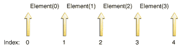

# 列表接口

> 原文：[`docs.oracle.com/javase/tutorial/collections/interfaces/list.html`](https://docs.oracle.com/javase/tutorial/collections/interfaces/list.html)

一个[`List`](https://docs.oracle.com/javase/8/docs/api/java/util/List.html)是一个有序的[`Collection`](https://docs.oracle.com/javase/8/docs/api/java/util/Collection.html)（有时称为*序列*）。列表可以包含重复元素。除了从`Collection`继承的操作外，`List`接口还包括以下操作：

+   `Positional access` — 根据列表中元素的数字位置来操作元素。这包括诸如`get`、`set`、`add`、`addAll`和`remove`等方法。

+   `Search` — 在列表中搜索指定对象并返回其数字位置。搜索方法包括`indexOf`和`lastIndexOf`。

+   `Iteration` — 扩展`Iterator`语义以利用列表的顺序性质。`listIterator`方法提供了这种行为。

+   `Range-view` — `sublist`方法在列表上执行任意*范围操作*。

Java 平台包含两个通用的`List`实现。[`ArrayList`](https://docs.oracle.com/javase/8/docs/api/java/util/ArrayList.html)，通常是性能更好的实现，以及[`LinkedList`](https://docs.oracle.com/javase/8/docs/api/java/util/LinkedList.html)，在某些情况下提供更好的性能。

## 集合操作

从`Collection`继承的操作都会做你期望的事情，假设你已经熟悉它们。如果你对`Collection`中的操作不熟悉，现在是阅读集合接口部分的好时机。`remove`操作总是从列表中移除*第一个*指定元素的出现。`add`和`addAll`操作总是将新元素追加到列表的*末尾*。因此，以下习语将一个列表连接到另一个列表。

```java
list1.addAll(list2);

```

这是这个习语的非破坏性形式，它产生一个由第二个列表附加到第一个列表的第三个`List`。

```java
List<Type> list3 = new ArrayList<Type>(list1);
list3.addAll(list2);

```

请注意，这个习语在其非破坏性形式中利用了`ArrayList`的标准转换构造函数。

这里有一个示例（JDK 8 及更高版本），将一些名称聚合到一个`List`中：

```java
List<String> list = people.stream()
.map(Person::getName)
.collect(Collectors.toList());

```

像[`Set`](https://docs.oracle.com/javase/8/docs/api/java/util/Set.html)接口一样，`List`加强了对`equals`和`hashCode`方法的要求，以便可以比较两个`List`对象的逻辑相等性，而不考虑它们的实现类。如果两个`List`对象包含相同顺序的相同元素，则它们相等。

## 位置访问和搜索操作

基本的`positional access`操作是`get`、`set`、`add`和`remove`。（`set`和`remove`操作返回被覆盖或移除的旧值。）其他操作（`indexOf`和`lastIndexOf`）返回列表中指定元素的第一个或最后一个索引。

`addAll`操作在指定位置插入指定`Collection`的所有元素。元素按照指定`Collection`的迭代器返回的顺序插入。这个调用是`Collection`的`addAll`操作的位置访问模拟。

这是一个在`List`中交换两个索引值的小方法。

```java
public static <E> void swap(List<E> a, int i, int j) {
    E tmp = a.get(i);
    a.set(i, a.get(j));
    a.set(j, tmp);
}

```

当然，有一个很大的区别。这是一个多态算法：它在任何`List`中交换两个元素，而不管其实现类型如何。这是另一个使用前面`swap`方法的多态算法。

```java
public static void shuffle(List<?> list, Random rnd) {
    for (int i = list.size(); i > 1; i--)
        swap(list, i - 1, rnd.nextInt(i));
}

```

这个算法包含在 Java 平台的[`Collections`](https://docs.oracle.com/javase/8/docs/api/java/util/Collections.html)类中，使用指定的随机源随机排列指定的列表。这有点微妙：它从底部向上运行列表，重复地将随机选择的元素交换到当前位置。与大多数天真的洗牌尝试不同，它是*公平*的（假设随机源是无偏的，所有排列发生的概率相等），并且*快速*（只需要`list.size()-1`次交换）。以下程序使用这个算法以随机顺序打印其参数列表中的单词。

```java
import java.util.*;

public class Shuffle {
    public static void main(String[] args) {
        List<String> list = new ArrayList<String>();
        for (String a : args)
            list.add(a);
        Collections.shuffle(list, new Random());
        System.out.println(list);
    }
}

```

实际上，这个程序甚至可以变得更短更快。[`Arrays`](https://docs.oracle.com/javase/8/docs/api/java/util/Arrays.html)类有一个名为`asList`的静态工厂方法，允许将数组视为`List`。这个方法不会复制数组。对`List`的更改会写入数组，反之亦然。由于结果列表不是通用的`List`实现，因为它不实现（可选的）`add`和`remove`操作：数组不可调整大小。利用`Arrays.asList`并调用库版本的`shuffle`，它使用默认的随机源，你会得到以下`小程序`，其行为与之前的程序相同。

```java
import java.util.*;

public class Shuffle {
    public static void main(String[] args) {
        List<String> list = Arrays.asList(args);
        Collections.shuffle(list);
        System.out.println(list);
    }
}

```

## 迭代器

正如你所期望的，由`List`的`iterator`操作返回的`Iterator`以正确的顺序返回列表的元素。`List`还提供了一个更丰富的迭代器，称为`ListIterator`，允许你在任一方向遍历列表，在迭代期间修改列表，并获取迭代器的当前位置。

`ListIterator`从`Iterator`继承的三个方法（`hasNext`、`next`和`remove`）在两个接口中完全相同。`hasPrevious`和`previous`操作是`hasNext`和`next`的确切类比。前者操作指的是（隐式）光标之前的元素，而后者指的是光标之后的元素。`previous`操作将光标向后移动，而`next`将其向前移动。

这是通过列表向后迭代的标准习语。

```java
for (ListIterator<Type> it = list.listIterator(list.size()); it.hasPrevious(); ) {
    Type t = it.previous();
    ...
}

```

注意前面习语中`listIterator`的参数。`List`接口有两种形式的`listIterator`方法。没有参数的形式返回一个位于列表开头的`ListIterator`；带有一个`int`参数的形式返回一个位于指定索引处的`ListIterator`。索引指的是初始调用`next`时将返回的元素。初始调用`previous`将返回索引为`index-1`的元素。在长度为`n`的列表中，`index`有`n+1`个有效值，从`0`到`n`，包括`0`。

直观地说，光标始终位于两个元素之间 — 一个是调用`previous`返回的元素，另一个是调用`next`返回的元素。`n+1`个有效的`index`值对应于`n+1`个元素之间的间隙，从第一个元素之前的间隙到最后一个元素之后的间隙。以下图显示了包含四个元素的列表中的五个可能的光标位置。



五个可能的光标位置。

可以交替调用`next`和`previous`，但你必须小心。第一次调用`previous`返回的元素与最后一次调用`next`返回的元素相同。类似地，一系列调用`previous`后第一次调用`next`返回的元素与最后一次调用`previous`返回的元素相同。

`nextIndex`方法返回的是下一次调用`next`时将返回的元素的索引，而`previousIndex`返回的是下一次调用`previous`时将返回的元素的索引。这些调用通常用于报告找到某物的位置或记录`ListIterator`的位置，以便可以创建另一个具有相同位置的`ListIterator`。

`nextIndex`返回的数字始终比`previousIndex`返回的数字大`1`，这意味着两个边界情况的行为：(1) 当光标位于初始元素之前时，调用`previousIndex`返回`-1`，(2) 当光标位于最后一个元素之后时，调用`nextIndex`返回`list.size()`。为了使所有这些具体化，以下是`List.indexOf`的可能实现。

```java
public int indexOf(E e) {
    for (ListIterator<E> it = listIterator(); it.hasNext(); )
        if (e == null ? it.next() == null : e.equals(it.next()))
            return it.previousIndex();
    // Element not found
    return -1;
}

```

注意，尽管`indexOf`方法在正向遍历列表，但返回`it.previousIndex()`。原因是`it.nextIndex()`将返回我们即将检查的元素的索引，而我们想返回我们刚刚检查的元素的索引。

`Iterator` 接口提供了 `remove` 操作，用于从 `Collection` 中移除 `next` 返回的最后一个元素。对于 `ListIterator`，此操作会移除 `next` 或 `previous` 返回的最后一个元素。`ListIterator` 接口提供了两个额外的操作来修改列表 — `set` 和 `add`。`set` 方法用指定的元素覆盖 `next` 或 `previous` 返回的最后一个元素。以下多态算法使用 `set` 来替换所有指定值的出现。

```java
public static <E> void replace(List<E> list, E val, E newVal) {
    for (ListIterator<E> it = list.listIterator(); it.hasNext(); )
        if (val == null ? it.next() == null : val.equals(it.next()))
            it.set(newVal);
}

```

这个示例中唯一棘手的部分是 `val` 和 `it.next` 之间的相等测试。你需要特殊处理 `val` 值为 `null`，以防止 `NullPointerException`。

`add` 方法在当前光标位置之前立即插入一个新元素到列表中。以下多态算法示例演示了用指定列表中包含的值序列替换所有指定值的出现。

```java
public static <E> 
    void replace(List<E> list, E val, List<? extends E> newVals) {
    for (ListIterator<E> it = list.listIterator(); it.hasNext(); ){
        if (val == null ? it.next() == null : val.equals(it.next())) {
            it.remove();
            for (E e : newVals)
                it.add(e);
        }
    }
}

```

## 范围视图操作

`range-view` 操作，`subList(int fromIndex, int toIndex)`，返回一个 `List` 视图，其索引范围从 `fromIndex`（包括）到 `toIndex`（不包括）。这个 *半开区间* 与典型的 `for` 循环相似。

```java
for (int i = fromIndex; i < toIndex; i++) {
    ...
}

```

如术语 *view* 所示，返回的 `List` 是由调用 `subList` 的 `List` 支持的，因此前者的更改会反映在后者中。

这个方法消除了显式范围操作的需要（通常对数组存在）。任何期望一个 `List` 的操作都可以通过传递一个 `subList` 视图而不是整个 `List` 来作为范围操作。例如，以下习语从一个 `List` 中移除一系列元素。

```java
list.subList(fromIndex, toIndex).clear();

```

可以构建类似的习语来在一个范围内搜索元素。

```java
int i = list.subList(fromIndex, toIndex).indexOf(o);
int j = list.subList(fromIndex, toIndex).lastIndexOf(o);

```

请注意，前述习语返回的是在 `subList` 中找到元素的索引，而不是在支持的 `List` 中的索引。

任何在 `List` 上操作的多态算法，比如 `replace` 和 `shuffle` 示例，都适用于 `subList` 返回的 `List`。

这是一个多态算法，其实现使用 `subList` 从一副牌中发牌。也就是说，它返回一个包含指定数量元素的新 `List`（"手牌"），这些元素取自指定 `List`（"牌堆"）的末尾。手牌中返回的元素会从牌堆中移除。

```java
public static <E> List<E> dealHand(List<E> deck, int n) {
    int deckSize = deck.size();
    List<E> handView = deck.subList(deckSize - n, deckSize);
    List<E> hand = new ArrayList<E>(handView);
    handView.clear();
    return hand;
}

```

请注意，该算法从牌堆的 *末尾* 移除手牌。对于许多常见的 `List` 实现，比如 `ArrayList`，从列表末尾移除元素的性能要比从列表开头移除元素的性能好得多。

以下是一个使用 `dealHand` 方法结合 `Collections.shuffle` 从一副普通的 52 张牌的牌堆中生成手牌的 `程序`。该程序接受两个命令行参数：（1）要发的手牌数和（2）每手牌的牌数。

```java
import java.util.*;

public class Deal {
    public static void main(String[] args) {
        if (args.length < 2) {
            System.out.println("Usage: Deal hands cards");
            return;
        }
        int numHands = Integer.parseInt(args[0]);
        int cardsPerHand = Integer.parseInt(args[1]);

        // Make a normal 52-card deck.
        String[] suit = new String[] {
            "spades", "hearts", 
            "diamonds", "clubs" 
        };
        String[] rank = new String[] {
            "ace", "2", "3", "4",
            "5", "6", "7", "8", "9", "10", 
            "jack", "queen", "king" 
        };

        List<String> deck = new ArrayList<String>();
        for (int i = 0; i < suit.length; i++)
            for (int j = 0; j < rank.length; j++)
                deck.add(rank[j] + " of " + suit[i]);

        // Shuffle the deck.
        Collections.shuffle(deck);

        if (numHands * cardsPerHand > deck.size()) {
            System.out.println("Not enough cards.");
            return;
        }

        for (int i = 0; i < numHands; i++)
            System.out.println(dealHand(deck, cardsPerHand));
    }

    public static <E> List<E> dealHand(List<E> deck, int n) {
        int deckSize = deck.size();
        List<E> handView = deck.subList(deckSize - n, deckSize);
        List<E> hand = new ArrayList<E>(handView);
        handView.clear();
        return hand;
    }
}

```

运行该程序会产生如下输出。

```java
% java Deal 4 5

[8 of hearts, jack of spades, 3 of spades, 4 of spades,
    king of diamonds]
[4 of diamonds, ace of clubs, 6 of clubs, jack of hearts,
    queen of hearts]
[7 of spades, 5 of spades, 2 of diamonds, queen of diamonds,
    9 of clubs]
[8 of spades, 6 of diamonds, ace of spades, 3 of hearts,
    ace of hearts]

```

虽然`subList`操作非常强大，但在使用时必须小心。如果在任何方式上除了通过返回的`List`之外对支持`List`进行添加或删除元素，那么`subList`返回的`List`的语义将变得不确定。因此，强烈建议您仅将`subList`返回的`List`用作临时对象，用于在支持`List`上执行一个或一系列范围操作。您使用`subList`实例的时间越长，您通过直接修改支持`List`或通过另一个`subList`对象来破坏它的可能性就越大。请注意，修改子列表的子列表并继续使用原始子列表（尽管不是同时）是合法的。

## 列表算法

`Collections`类中的大多数多态算法专门适用于`List`。拥有所有这些算法使得操作列表变得非常容易。以下是这些算法的摘要，在 Algorithms 部分中有更详细的描述。

+   `sort` — 使用归并排序算法对`List`进行排序，这提供了一种快速、稳定的排序。（*稳定排序*是指不重新排列相等元素的排序。）

+   `shuffle` — 随机排列`List`中的元素。

+   `reverse` — 颠倒`List`中元素的顺序。

+   `rotate` — 将`List`中的所有元素按指定距离旋转。

+   `swap` — 交换`List`中指定位置的元素。

+   `replaceAll` — 用另一个指定值替换所有出现的值。

+   `fill` — 用指定值覆盖`List`中的每个元素。

+   `copy` — 将源`List`复制到目标`List`中。

+   `binarySearch` — 使用二分搜索算法在有序`List`中搜索元素。

+   `indexOfSubList` — 返回一个`List`中与另一个相等的第一个子列表的索引。

+   `lastIndexOfSubList` — 返回一个`List`中与另一个相等的最后一个子列表的索引。
