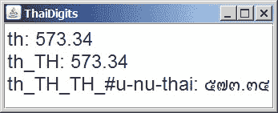

# 创建 Locale

> 原文：[`docs.oracle.com/javase/tutorial/i18n/locale/create.html`](https://docs.oracle.com/javase/tutorial/i18n/locale/create.html)

有几种方法可以创建 `Locale` 对象。无论使用哪种技术，创建可以简单地指定语言代码。但是，您还可以通过设置区域（也称为“国家”）和变体代码来进一步区分区域。如果您使用 JDK 7 发布或更高版本，还可以指定脚本代码和 Unicode 区域扩展。

创建 `Locale` 对象的四种方法是：

+   `Locale.Builder` 类

+   `Locale` 构造函数

+   `Locale.forLanguageTag` 工厂方法

+   `Locale` 常量

* * *

**版本说明：** `Locale.Builder` 类和 `forLanguageTag` 方法是在 Java SE 7 发布中添加的。

* * *

## `LocaleBuilder` 类

[`Locale.Builder`](https://docs.oracle.com/javase/8/docs/api/java/util/Locale.Builder.html) 实用类可用于构造符合 IETF BCP 47 语法的 `Locale` 对象。例如，要指定法语和加拿大国家，您可以调用 `Locale.Builder` 构造函数，然后链接设置器方法如下：

```java
Locale aLocale = new Locale.Builder().setLanguage("fr").setRegion("CA").build();

```

下一个示例创建了英语在美国和英国的 `Locale` 对象：

```java
Locale bLocale = new Locale.Builder().setLanguage("en").setRegion("US").build();
Locale cLocale = new Locale.Builder().setLanguage("en").setRegion("GB").build();

```

最后一个示例创建了俄语的 `Locale` 对象：

```java
Locale dLocale = new Locale.Builder().setLanguage("ru").setScript("Cyrl").build();

```

## `Locale` 构造函数

`Locale` 类有三个可用的构造函数用于创建 `Locale` 对象：

+   [`Locale(String language)`](https://docs.oracle.com/javase/8/docs/api/java/util/Locale.html#Locale-java.lang.String-)

+   [`Locale(String language, String country)`](https://docs.oracle.com/javase/8/docs/api/java/util/Locale.html#Locale-java.lang.String-java.lang.String-)

+   [`Locale(String language, String country, String variant)`](https://docs.oracle.com/javase/8/docs/api/java/util/Locale.html#Locale-java.lang.String-java.lang.String-java.lang.String-)

以下示例创建了法语在加拿大，英语在美国和英国，以及俄语的 `Locale` 对象。

```java
aLocale = new Locale("fr", "CA");
bLocale = new Locale("en", "US");
cLocale = new Locale("en", "GB");
dLocale = new Locale("ru");

```

在 JDK 7 之前的版本中，无法在 `Locale` 对象上设置脚本代码。

## `forLanguageTag` 工厂方法

如果您有符合 IETF BCP 47 标准的语言标记字符串，可以使用在 Java SE 7 发布中引入的 [`forLanguageTag(String)`](https://docs.oracle.com/javase/8/docs/api/java/util/Locale.html#forLanguageTag-java.lang.String-) 工厂方法。例如：

```java
Locale aLocale = Locale.forLanguageTag("en-US");
Locale bLocale = Locale.forLanguageTag("ja-JP-u-ca-japanese");

```

## `Locale` 常量

为了方便起见，`Locale` 类为一些语言和国家提供了[常量](https://docs.oracle.com/javase/8/docs/api/java/util/Locale.html#field_summary)。例如：

```java
cLocale = Locale.JAPAN;
dLocale = Locale.CANADA_FRENCH;

```

当您指定语言常量时，`Locale` 的区域部分是未定义的。下面的三个语句创建等效的 `Locale` 对象：

```java
j1Locale = Locale.JAPANESE;
j2Locale = new Locale.Builder().setLanguage("ja").build();
j3Locale = new Locale("ja");

```

由以下三个语句创建的`Locale`对象也是等效的：

```java
j4Locale = Locale.JAPAN;
j5Locale = new Locale.Builder().setLanguage("ja").setRegion("JP").build();
j6Locale = new Locale("ja", "JP");

```

## 代码

以下部分讨论语言代码和可选的脚本、地区和变体代码。

### 语言代码

语言代码是符合 ISO 639 标准的两个或三个小写字母。您可以在[`www.loc.gov/standards/iso639-2/php/code_list.php`](http://www.loc.gov/standards/iso639-2/php/code_list.php)找到 ISO 639 代码的完整列表。

以下表格列出了一些语言代码。

示例语言代码

| 语言代码 | 描述 |
| --- | --- |
| `de` | 德语 |
| `en` | 英语 |
| `fr` | 法语 |
| `ru` | 俄语 |
| `ja` | 日语 |
| `jv` | 爪哇语 |
| `ko` | 韩语 |
| `zh` | 中文 |

### 脚本代码

脚本代码以大写字母开头，后跟三个小写字母，并符合 ISO 15924 标准。您可以在[`unicode.org/iso15924/iso15924-codes.html`](http://unicode.org/iso15924/iso15924-codes.html)找到 ISO 15924 代码的完整列表。

以下表格列出了一些脚本代码。

示例脚本代码

| 脚本代码 | 描述 |
| --- | --- |
| `Arab` | 阿拉伯语 |
| `Cyrl` | 西里尔字母 |
| `Kana` | 片假名 |
| `Latn` | 拉丁字母 |

有三种方法可以检索`Locale`的脚本信息：

+   [`getScript()`](https://docs.oracle.com/javase/8/docs/api/java/util/Locale.html#getScript--) – 返回`Locale`对象的 4 字母脚本代码。如果未为区域设置定义脚本，则返回空字符串。

+   [`getDisplayScript()`](https://docs.oracle.com/javase/8/docs/api/java/util/Locale.html#getDisplayScript--) – 返回适合显示给用户的区域设置脚本的名称。如果可能，名称将针对默认区域设置进行本地化。因此，例如，如果脚本代码是"Latn"，则返回的显示脚本名称将在英语语言区域设置下为"Latin"。

+   [`getDisplayScript(Locale)`](https://docs.oracle.com/javase/8/docs/api/java/util/Locale.html#getDisplayScript-java.util.Locale-) – 返回指定`Locale`的显示名称，如果可能的话进行本地化。

### 地区代码

地区（国家）代码由符合 ISO 3166 标准的两个或三个大写字母组成，或者符合 UN M.49 标准的三个数字。代码的副本可以在[`www.chemie.fu-berlin.de/diverse/doc/ISO_3166.html`](http://www.chemie.fu-berlin.de/diverse/doc/ISO_3166.html)找到。

以下表格包含几个示例国家和地区代码。

示例地区代码

| A-2 代码 | A-3 代码 | 数字代码 | 描述 |
| --- | --- | --- | --- |
| `AU` | `AUS` | `036` | 澳大利亚 |
| `BR` | `BRA` | `076` | 巴西 |
| `CA` | `CAN` | `124` | 加拿大 |
| `CN` | `CHN` | `156` | 中国 |
| `DE` | `DEU` | `276` | 德国 |
| `FR` | `FRA` | `250` | 法国 |
| `IN` | `IND` | `356` | 印度 |
| `RU` | `RUS` | `643` | 俄罗斯联邦 |
| `US` | `USA` | `840` | 美国 |

### 变体代码

可选的`variant`代码可用于进一步区分您的`Locale`。例如，变体代码可用于指示区域代码未涵盖的方言差异。

* * *

**版本说明：** 在 Java SE 7 发布之前，变体代码有时用于标识不特定于语言或区域的差异。例如，它可能已用于标识计算平台之间的差异，如 Windows 或 UNIX。根据 IETF BCP 47 标准，不鼓励此用法。

要定义与您的环境相关的非语言特定变体，请使用扩展机制，如 BCP 47 扩展中所解释的那样。

* * *

自 Java SE 7 发布以来，符合 IETF BCP 47 标准的变体代码专门用于指示定义语言或其方言的附加变体。IETF BCP 47 标准对变体子标记施加了语法限制。您可以在[`www.iana.org/assignments/language-subtag-registry`](http://www.iana.org/assignments/language-subtag-registry)上查看变体代码列表（搜索*变体*）。

例如，Java SE 使用变体代码支持泰语。按照惯例，`th` 和 `th_TH` 区域设置的`NumberFormat`对象将使用常见的阿拉伯数字形状或阿拉伯数字来格式化泰国数字。然而，`th_TH_TH` 区域设置的`NumberFormat`将使用泰国数字形状。`ThaiDigits.java`中的摘录演示了这一点：

```java
String outputString = new String();
Locale[] thaiLocale = {
             new Locale("th"),
             new Locale("th", "TH"),
             new Locale("th", "TH", "TH")
         };

for (Locale locale : thaiLocale) {
    NumberFormat nf = NumberFormat.getNumberInstance(locale);
    outputString = outputString + locale.toString() + ": ";
    outputString = outputString + nf.format(573.34) + "\n";
}

```

以下是此示例的屏幕截图：


