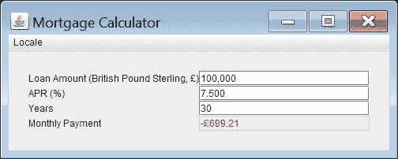

# 使用预定义格式

> 原文：[`docs.oracle.com/javase/tutorial/i18n/format/numberFormat.html`](https://docs.oracle.com/javase/tutorial/i18n/format/numberFormat.html)

通过调用[`NumberFormat`](https://docs.oracle.com/javase/8/docs/api/java/text/NumberFormat.html)类提供的方法，你可以根据[`Locale`](https://docs.oracle.com/javase/8/docs/api/java/util/Locale.html)格式化数字、货币和百分比。接下来的内容演示了如何使用一个名为`NumberFormatDemo.java`的示例程序进行格式化技术。

## 数字

你可以使用[`NumberFormat`](https://docs.oracle.com/javase/8/docs/api/java/text/NumberFormat.html)方法来格式化原始类型数字，比如`double`，以及它们对应的包装对象，比如[`Double`](https://docs.oracle.com/javase/8/docs/api/java/lang/Double.html)。

以下代码示例根据[`Locale`](https://docs.oracle.com/javase/8/docs/api/java/util/Locale.html)格式化一个[`Double`](https://docs.oracle.com/javase/8/docs/api/java/lang/Double.html)。调用[`getNumberInstance`](https://docs.oracle.com/javase/8/docs/api/java/text/NumberFormat.html#getNumberInstance-java.util.Locale-)方法返回一个特定于语言环境的[`NumberFormat`](https://docs.oracle.com/javase/8/docs/api/java/text/NumberFormat.html)实例。[`format`](https://docs.oracle.com/javase/8/docs/api/java/text/Format.html#format-java.lang.Object-)方法接受[`Double`](https://docs.oracle.com/javase/8/docs/api/java/lang/Double.html)作为参数，并以[`String`](https://docs.oracle.com/javase/8/docs/api/java/lang/String.html)形式返回格式化的数字。

```java
static public void displayNumber(Locale currentLocale) {

    Integer quantity = new Integer(123456);
    Double amount = new Double(345987.246);
    NumberFormat numberFormatter;
    String quantityOut;
    String amountOut;

    numberFormatter = NumberFormat.getNumberInstance(currentLocale);
    quantityOut = numberFormatter.format(quantity);
    amountOut = numberFormatter.format(amount);
    System.out.println(quantityOut + "   " + currentLocale.toString());
    System.out.println(amountOut + "   " + currentLocale.toString());
}

```

这个例子打印如下内容；它展示了相同数字的格式如何随着[`Locale`](https://docs.oracle.com/javase/8/docs/api/java/util/Locale.html)的不同而变化：

```java
123 456   fr_FR
345 987,246   fr_FR
123.456   de_DE
345.987,246   de_DE
123,456   en_US
345,987.246   en_US

```

### 使用阿拉伯数字以外的数字形状

默认情况下，当文本包含数字值时，这些值将使用阿拉伯数字显示。如果希望使用其他 Unicode 数字形状，请使用[`java.awt.font.NumericShaper`](https://docs.oracle.com/javase/8/docs/api/java/awt/font/NumericShaper.html)类。`NumericShaper` API 使您能够以任何 Unicode 数字形状显示作为 ASCII 值内部表示的数字值。有关更多信息，请参见将拉丁数字转换为其他 Unicode 数字。

此外，一些语言环境具有变体代码，指定使用 Unicode 数字形状代替阿拉伯数字，比如泰语的语言环境。有关更多信息，请参见创建语言环境中的变体代码部分。

## 货币

如果您正在编写业务应用程序，可能需要格式化和显示货币。您可以像格式化数字一样格式化货币，只是调用[`getCurrencyInstance`](https://docs.oracle.com/javase/8/docs/api/java/text/NumberFormat.html#getCurrencyInstance-java.util.Locale-)来创建格式化程序。当调用[`format`](https://docs.oracle.com/javase/8/docs/api/java/text/NumberFormat.html#format-double-)方法时，它会返回一个包含格式化数字和适当货币符号的[`String`](https://docs.oracle.com/javase/8/docs/api/java/lang/String.html)。

此代码示例展示了如何以区域特定的方式格式化货币：

```java
static public void displayCurrency( Locale currentLocale) {

    Double currencyAmount = new Double(9876543.21);
    Currency currentCurrency = Currency.getInstance(currentLocale);
    NumberFormat currencyFormatter = 
        NumberFormat.getCurrencyInstance(currentLocale);

    System.out.println(
        currentLocale.getDisplayName() + ", " +
        currentCurrency.getDisplayName() + ": " +
        currencyFormatter.format(currencyAmount));
}

```

由上述代码生成的输出如下所示：

```java
French (France), Euro: 9 876 543,21 €
German (Germany), Euro: 9.876.543,21 €
English (United States), US Dollar: $9,876,543.21

```

乍一看，这个输出可能看起来对您来说是错误的，因为数字值都是相同的。当然，9 876 543,21 €不等同于$9,876,543.21。然而，请记住，[`NumberFormat`](https://docs.oracle.com/javase/8/docs/api/java/text/NumberFormat.html)类不知道汇率。属于[`NumberFormat`](https://docs.oracle.com/javase/8/docs/api/java/text/NumberFormat.html)类的方法格式化货币，但不会转换它们。

请注意，[`Currency`](https://docs.oracle.com/javase/8/docs/api/java/util/Currency.html)类设计为任何给定货币都不会有多个[`Currency`](https://docs.oracle.com/javase/8/docs/api/java/util/Currency.html)实例。因此，没有公共构造函数。如前面的代码示例所示，您可以使用[`getInstance`](https://docs.oracle.com/javase/8/docs/api/java/util/Currency.html#getInstance-java.util.Locale-)方法获取[`Currency`](https://docs.oracle.com/javase/8/docs/api/java/util/Currency.html)实例。

示例`InternationalizedMortgageCalculator.java`还演示了如何使用[`Currency`](https://docs.oracle.com/javase/8/docs/api/java/util/Currency.html)类。（请注意，此示例不会转换货币值。）以下使用 en-US 区域设置：


以下使用 en-UK 区域设置：



示例`InternationalizedMortgageCalculator.java`需要以下资源文件：

+   `resources/Resources.properties`

+   `resources/Resources_ar.properties`

+   `resources/Resources_fr.properties`

[`Currency`](https://docs.oracle.com/javase/8/docs/api/java/util/Currency.html)类包含其他方法来检索与货币相关的信息：

+   [`getAvailableCurrencies`](https://docs.oracle.com/javase/8/docs/api/java/util/Currency.html#getAvailableCurrencies--)：返回 JDK 中所有可用的货币

+   [`getCurrencyCode`](https://docs.oracle.com/javase/8/docs/api/java/util/Currency.html#getCurrencyCode--)：返回[`Currency`](https://docs.oracle.com/javase/8/docs/api/java/util/Currency.html)实例的 ISO 4217 数字代码

+   [`getSymbol`](https://docs.oracle.com/javase/8/docs/api/java/util/Currency.html#getSymbol--)：返回[`Currency`](https://docs.oracle.com/javase/8/docs/api/java/util/Currency.html)实例的符号。您可以选择性地将[`Locale`](https://docs.oracle.com/javase/8/docs/api/java/util/Locale.html)对象作为参数。考虑以下摘录：

    ```java
    Locale enGBLocale = 
        new Locale.Builder().setLanguage("en").setRegion("GB").build();

    Locale enUSLocale =
        new Locale.Builder().setLanguage("en").setRegion("US").build();

    Currency currencyInstance = Currency.getInstance(enUSLocale);

    System.out.println(
        "Symbol for US Dollar, en-US locale: " +
        currencyInstance.getSymbol(enUSLocale));

    System.out.println(
        "Symbol for US Dollar, en-UK locale: " +
        currencyInstance.getSymbol(enGBLocale));

    ```

    该摘录打印如下内容：

    ```java
    Symbol for US Dollar, en-US locale: $
    Symbol for US Dollar, en-UK locale: USD

    ```

    此摘录演示了货币符号可以根据区域设置而变化。

+   [`getDisplayName`](https://docs.oracle.com/javase/8/docs/api/java/util/Currency.html#getDisplayName--)：返回[`Currency`](https://docs.oracle.com/javase/8/docs/api/java/util/Currency.html)实例的显示名称。与[`getSymbol`](https://docs.oracle.com/javase/8/docs/api/java/util/Currency.html#getSymbol--)方法类似，您可以选择性地指定一个[`Locale`](https://docs.oracle.com/javase/8/docs/api/java/util/Locale.html)对象。

### ISO 4217 货币代码的可扩展支持

[ISO 4217](http://www.iso.org/iso/support/faqs/faqs_widely_used_standards/widely_used_standards_other/currency_codes.htm)是国际标准化组织发布的标准。它指定三个字母代码（以及等效的三位数字代码）来表示货币和资金。此标准由外部机构维护，并独立于 Java SE 平台发布。

假设一个国家采用了不同的货币，并且 ISO 4217 维护机构发布了一个货币更新。要实现此更新并在运行时取代默认货币，请创建一个名为`*<JAVA_HOME>*/lib/currency.properties`的属性文件。此文件包含[ISO 3166](http://www.iso.org/iso/country_codes/iso_3166_code_lists/country_names_and_code_elements.htm)国家代码和 ISO 4217 货币数据的键/值对。值部分包括三个逗号分隔的 ISO 4217 货币值：字母代码、数字代码和小单位。任何以井号字符（`#`）开头的行都被视为注释行。例如：

```java
# Sample currency property for Canada
CA=CAD,124,2

```

`CAD`代表加拿大元；`124`是加拿大元的数字代码；`2`是小单位，表示货币需要表示分数货币的小数位数。例如，以下属性文件将把默认的加拿大货币替换为没有比加拿大元更小单位的加拿大元：

```java
CA=CAD,124,0
```

## 百分比

您还可以使用[`NumberFormat`](https://docs.oracle.com/javase/8/docs/api/java/text/NumberFormat.html)类的方法来格式化百分比。要获取特定于区域设置的格式化程序，请调用[`getPercentInstance`](https://docs.oracle.com/javase/8/docs/api/java/text/NumberFormat.html#getPercentInstance-java.util.Locale-)方法。使用这个格式化程序，例如小数分数 0.75 将显示为 75%。

以下代码示例显示了如何格式化百分比。

```java
static public void displayPercent(Locale currentLocale) {

    Double percent = new Double(0.75);
    NumberFormat percentFormatter;
    String percentOut;

    percentFormatter = NumberFormat.getPercentInstance(currentLocale);
    percentOut = percentFormatter.format(percent);
    System.out.println(percentOut + "   " + currentLocale.toString());
}

```

这个示例打印如下内容：

```java
75 %   fr_FR
75%   de_DE
75%   en_US

```
