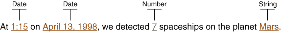

# 处理复合消息

> 原文：[`docs.oracle.com/javase/tutorial/i18n/format/messageFormat.html`](https://docs.oracle.com/javase/tutorial/i18n/format/messageFormat.html)

复合消息可能包含几种类型的变量：日期、时间、字符串、数字、货币和百分比。为了以与语言环境无关的方式格式化复合消息，您构造一个模式，将其应用于 `MessageFormat` 对象，并将此模式存储在 `ResourceBundle` 中。

通过逐步执行示例程序，本节演示了如何国际化复合消息。示例程序使用了 [`MessageFormat`](https://docs.oracle.com/javase/8/docs/api/java/text/MessageFormat.html) 类。此程序的完整源代码在名为 `MessageFormatDemo.java` 的文件中。德语区域设置属性在名为 `MessageBundle_de_DE.properties` 的文件中。

## 1\. 识别消息中的变量

假设您想要国际化以下消息：



请注意，我们已经划线标出了变量数据，并确定了将表示这些数据的对象的类型。

## 2\. 在 ResourceBundle 中隔离消息模式

将消息存储在名为 `MessageBundle` 的 `ResourceBundle` 中，如下所示：

```java
ResourceBundle messages =
   ResourceBundle.getBundle("MessageBundle", currentLocale);

```

这个 `ResourceBundle` 是由每个 `Locale` 的属性文件支持的。由于 `ResourceBundle` 名称为 `MessageBundle`，因此美国英语的属性文件名为 `MessageBundle_en_US.properties`。此文件的内容如下：

```java
template = At {2,time,short} on {2,date,long}, \
    we detected {1,number,integer} spaceships on \
    the planet {0}.
planet = Mars

```

属性文件的第一行包含消息模式。如果您将此模式与步骤 1 中显示的消息文本进行比较，您将看到在消息文本中的每个变量都由大括号括起的参数替换。每个参数以称为参数编号的数字开头，该数字与保存参数值的 `Object` 数组中的元素的索引相匹配。请注意，在模式中，参数编号没有特定顺序。您可以将参数放置在模式的任何位置。唯一的要求是参数编号在参数值数组中有一个匹配的元素。

下一步讨论了参数值数组，但首先让我们看一下模式中的每个参数。以下表格提供了有关参数的一些详细信息：

在 `MessageBundle_en_US.properties` 中为 `template` 参数提供参数

| 参数 | 描述 |
| --- | --- |
| `{2,time,short}` | 一个 `Date` 对象的时间部分。`short` 样式指定了 `DateFormat.SHORT` 格式化样式。 |
| `{2,date,long}` | 一个`Date`对象的日期部分。相同的`Date`对象用于日期和时间变量。在参数的`Object`数组中，保存`Date`对象的元素的索引为 2。 （这在下一步中描述。） |
| `{1,number,integer}` | 一个带有`integer`数字样式的`Number`对象。 |
| `{0}` | 与`planet`键对应的`ResourceBundle`中的`String`。 |

对于参数语法的完整描述，请参阅[`MessageFormat`](https://docs.oracle.com/javase/8/docs/api/java/text/MessageFormat.html)类的 API 文档。

## 3\. 设置消息参数

以下代码行为模式中的每个参数分配值。`messageArguments`数组中元素的索引与模式中的参数编号相匹配。例如，索引为 1 的`Integer`元素对应于模式中的`{1,number,integer}`参数。因为必须进行翻译，所以元素 0 处的`String`对象将使用`getString`方法从`ResourceBundle`中获取。以下是定义消息参数数组的代码：

```java
Object[] messageArguments = {
    messages.getString("planet"),
    new Integer(7),
    new Date()
};

```

## 4\. 创建格式化程序

接下来，创建一个`MessageFormat`对象。您设置`Locale`，因为消息包含应以区域敏感的方式格式化的`Date`和`Number`对象。

```java
MessageFormat formatter = new MessageFormat("");
formatter.setLocale(currentLocale);

```

## 5\. 使用模式和参数格式化消息

这一步展示了模式、消息参数和格式化程序如何协同工作。首先，使用`getString`方法从`ResourceBundle`中获取模式`String`。模式的关键是`template`。使用`applyPattern`方法将模式`String`传递给格式化程序。然后通过调用`format`方法使用消息参数的数组格式化消息。`format`方法返回的`String`已经准备好显示。所有这些只需两行代码就可以完成：

```java
formatter.applyPattern(messages.getString("template"));
String output = formatter.format(messageArguments);

```

## 6\. 运行演示程序

演示程序打印了英语和德语区域设置的翻译消息，并正确格式化了日期和时间变量。请注意，英语和德语动词（"detected"和"entdeckt"）相对于变量的位置不同：

```java
currentLocale = en_US
At 10:16 AM on July 31, 2009, we detected 7
spaceships on the planet Mars.
currentLocale = de_DE
Um 10:16 am 31\. Juli 2009 haben wir 7 Raumschiffe
auf dem Planeten Mars entdeckt.

```
