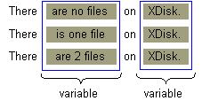

# 处理复数形式

> 原文：[`docs.oracle.com/javase/tutorial/i18n/format/choiceFormat.html`](https://docs.oracle.com/javase/tutorial/i18n/format/choiceFormat.html)

如果消息中的单词既可能是复数形式又可能是单数形式，则可能会有所变化。使用`ChoiceFormat`类，您可以将数字映射到一个单词或短语，从而构造语法正确的消息。

在英语中，单词的复数和单数形式通常是不同的。当您构造涉及数量的消息时，这可能会带来问题。例如，如果您的消息报告磁盘上的文件数量，则可能存在以下变化：

```java
There are no files on XDisk.
There is one file on XDisk.
There are 2 files on XDisk.

```

解决这个问题的最快方法是创建一个像这样的`MessageFormat`模式：

```java
There are {0,number} file(s) on {1}.

```

不幸的是，前面的模式导致了不正确的语法：

```java
There are 1 file(s) on XDisk.

```

只要使用[`ChoiceFormat`](https://docs.oracle.com/javase/8/docs/api/java/text/ChoiceFormat.html)类，你就可以做得更好。在本节中，您将通过一个名为`ChoiceFormatDemo`的示例程序逐步学习如何处理消息中的复数。该程序还使用了在前一节中讨论的`MessageFormat`类，即处理复合消息。

## 1\. 定义消息模式

首先，识别消息中的变量：



然后，用参数替换消息中的变量，创建一个可以应用于`MessageFormat`对象的模式：

```java
There {0} on {1}.

```

磁盘名称的参数，由`{1}`表示，处理起来相当简单。您只需像处理`MessageFormat`模式中的任何其他`String`变量一样对待它。此参数匹配参数值数组中索引为 1 的元素。（参见步骤 7。）

处理参数`{0}`更加复杂，原因有几个：

+   此参数替换的短语随文件数量的变化而变化。为了在运行时构造这个短语，您需要将文件数量映射到特定的`String`。例如，数字 1 将映射到包含短语`is one file`的`String`。`ChoiceFormat`类允许您执行必要的映射。

+   如果磁盘包含多个文件，则短语中包含一个整数。`MessageFormat`类允许您将数字插入到短语中。

## 2\. 创建一个 ResourceBundle

因为消息文本必须被翻译，所以将其隔离在一个`ResourceBundle`中：

```java
ResourceBundle bundle = ResourceBundle.getBundle(
    "ChoiceBundle", currentLocale);

```

示例程序使用属性文件支持`ResourceBundle`。`ChoiceBundle_en_US.properties`包含以下内容：

```java
pattern = There {0} on {1}.
noFiles = are no files
oneFile = is one file
multipleFiles = are {2} files

```

此属性文件的内容显示了消息将如何构建和格式化。第一行包含了`MessageFormat`的模式。（参见步骤 1。）其他行包含了将替换模式中参数`{0}`的短语。`multipleFiles` 键的短语包含了参数`{2}`，该参数将被一个数字替换。

这是属性文件的法语版本，`ChoiceBundle_fr_FR.properties`

```java
pattern = Il {0} sur {1}.
noFiles = n'y a pas de fichiers
oneFile = y a un fichier
multipleFiles = y a {2} fichiers

```

## 3\. 创建消息格式化器

在此步骤中，您实例化`MessageFormat`并设置其`Locale`：

```java
MessageFormat messageForm = new MessageFormat("");
messageForm.setLocale(currentLocale);

```

## 4\. 创建选择格式化器

`ChoiceFormat`对象允许您根据`double`数字选择特定的`String`。`double`数字的范围，以及它们映射到的`String`对象，都在数组中指定：

```java
double[] fileLimits = {0,1,2};
String [] fileStrings = {
    bundle.getString("noFiles"),
    bundle.getString("oneFile"),
    bundle.getString("multipleFiles")
};

```

`ChoiceFormat` 将`double`数组中的每个元素映射到具有相同索引的`String`数组中的元素。在示例代码中，0 映射到调用`bundle.getString("noFiles")`返回的`String`。巧合的是，索引与`fileLimits`数组中的值相同。如果代码将`fileLimits[0]`设置为七，`ChoiceFormat`将把数字 7 映射到`fileStrings[0]`。

在实例化`ChoiceFormat`时，您需要指定`double`和`String`数组：

```java
ChoiceFormat choiceForm = new ChoiceFormat(fileLimits, fileStrings);

```

## 5\. 应用模式

还记得您在步骤 1 中构建的模式吗？现在是从`ResourceBundle`中检索模式并应用到`MessageFormat`对象的时候了：

```java
String pattern = bundle.getString("pattern");
messageForm.applyPattern(pattern);

```

## 6\. 分配格式

在此步骤中，您将在步骤 4 中创建的`ChoiceFormat`对象分配给`MessageFormat`对象：

```java
Format[] formats = {choiceForm, null, NumberFormat.getInstance()};
messageForm.setFormats(formats);

```

`setFormats`方法将`Format`对象分配给消息模式中的参数。在调用`setFormats`方法之前，必须调用`applyPattern`方法。以下表格显示了`Format`数组的元素如何对应于消息模式中的参数：

## `ChoiceFormatDemo` 程序的`Format`数组

| 数组元素 | 模式参数 |
| --- | --- |
| `choiceForm` | `{0}` |
| `null` | `{1}` |
| `NumberFormat.getInstance()` | `{2}` |

## 7\. 设置参数并格式化消息

在运行时，程序将变量分配给传递给`MessageFormat`对象的参数数组。数组中的元素对应于模式中的参数。例如，`messageArgument[1]`映射到模式参数`{1}`，其中包含磁盘名称的`String`。在上一步中，程序将`ChoiceFormat`对象分配给模式的参数`{0}`。因此，分配给`messageArgument[0]`的数字确定`ChoiceFormat`对象选择哪个`String`。如果`messageArgument[0]`大于或等于 2，则包含短语`are {2} files`的`String`将替换模式中的参数`{0}`。分配给`messageArgument[2]`的数字将替换模式参数`{2}`的位置。以下是尝试此操作的代码：

```java
Object[] messageArguments = {null, "XDisk", null};

for (int numFiles = 0; numFiles < 4; numFiles++) {
    messageArguments[0] = new Integer(numFiles);
    messageArguments[2] = new Integer(numFiles);
    String result = messageForm.format(messageArguments);
    System.out.println(result);
}

```

## 8\. 运行演示程序

将程序显示的消息与第 2 步的`ResourceBundle`中的短语进行比较。注意`ChoiceFormat`对象选择了正确的短语，`MessageFormat`对象用于构建适当的消息。`ChoiceFormatDemo`程序的输出如下：

```java
currentLocale = en_US
There are no files on XDisk.
There is one file on XDisk.
There are 2 files on XDisk.
There are 3 files on XDisk.

currentLocale = fr_FR
Il n'y a pas des fichiers sur XDisk.
Il y a un fichier sur XDisk.
Il y a 2 fichiers sur XDisk.
Il y a 3 fichiers sur XDisk.

```
