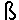
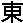

# 术语

> 原文：[`docs.oracle.com/javase/tutorial/i18n/text/terminology.html`](https://docs.oracle.com/javase/tutorial/i18n/text/terminology.html)

*字符*是具有语义值的最小文本单位。

*字符集*是一组可能被多种语言使用的字符集合。例如，拉丁字符集被英语和大多数欧洲语言使用，而希腊字符集仅被希腊语使用。

*编码字符集*是一个字符集，其中每个字符被分配一个唯一的数字。

*代码点*是可以在编码字符集中使用的值。代码点是一个 32 位的`int`数据类型，其中低 21 位表示有效的代码点值，而高 11 位为 0。

Unicode 的*代码单元*是一个 16 位的`char`值。例如，想象一个包含字母"abc"后跟 Deseret 长 I 的`String`，它用两个`char`值表示。该字符串包含四个字符，四个代码点，但五个代码单元。

要在 Unicode 中表示一个字符，十六进制值前缀为字符串 U+。Unicode 标准的有效代码点范围是 U+0000 到 U+10FFFF，包括两端。拉丁字符 A 的代码点值为 U+0041。代表欧元货币的字符€，其代码点值为 U+20AC。Deseret 字母表中的第一个字母，长 I，其代码点值为 U+10400。

以下表格显示了几个字符的代码点值：

| 字符 | Unicode 代码点 | 符号 |
| --- | --- | --- |
| 拉丁 A | U+0041  |  |
| 拉丁尖 S | U+00DF  |  |
| 东方汉字 | U+6771  |  |
| Deseret, LONG I | U+10400  |  |

如前所述，范围在 U+10000 到 U+10FFFF 之间的字符称为补充字符。从 U+0000 到 U+FFFF 的字符集有时被称为*基本多语言平面（BMP）*。

更多术语可以在更多信息页面上列出的*Unicode 术语词汇表*中找到。
