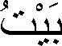

# 字符边界

> 原文：[`docs.oracle.com/javase/tutorial/i18n/text/char.html`](https://docs.oracle.com/javase/tutorial/i18n/text/char.html)

如果您的应用程序允许最终用户突出显示单个字符或逐个字符地移动光标穿过文本，则需要定位字符边界。要创建一个定位字符边界的`BreakIterator`，您可以调用`getCharacterInstance`方法，如下所示：

```java
BreakIterator characterIterator =
    BreakIterator.getCharacterInstance(currentLocale);

```

这种类型的`BreakIterator`检测用户字符之间的边界，而不仅仅是 Unicode 字符。

用户字符可能由多个 Unicode 字符组成。例如，用户字符ü可以由组合 Unicode 字符\u0075（u）和\u00a8（¨）组成。然而，这并不是最好的例子，因为字符ü也可以用单个 Unicode 字符\u00fc 表示。我们将借助阿拉伯语言来举一个更现实的例子。

在阿拉伯语中，房子的单词是：



这个词包含三个用户字符，但它由以下六个 Unicode 字符组成：

```java
String house = "\u0628" + "\u064e" + "\u064a" + "\u0652" + "\u067a" + "\u064f";

```

字符串`house`中位置 1、3 和 5 的 Unicode 字符是变音符号。阿拉伯语需要变音符号，因为它们可以改变单词的含义。示例中的变音符号是非间隔字符，因为它们出现在基本字符的上方。在阿拉伯语文字处理器中，您不能在屏幕上每个 Unicode 字符移动一次光标。相反，您必须为每个用户字符移动一次光标，这可能由多个 Unicode 字符组成。因此，您必须使用`BreakIterator`来扫描字符串中的用户字符。

示例程序`BreakIteratorDemo`创建一个`BreakIterator`来扫描阿拉伯字符。程序将这个`BreakIterator`与先前创建的`String`对象一起传递给名为`listPositions`的方法：

```java
BreakIterator arCharIterator = BreakIterator.getCharacterInstance(
                                   new Locale ("ar","SA"));
listPositions (house, arCharIterator);

```

`listPositions`方法使用`BreakIterator`来定位字符串中的字符边界。请注意，`BreakIteratorDemo`使用`setText`方法将特定字符串分配给`BreakIterator`。程序使用`first`方法检索第一个字符边界，然后调用`next`方法，直到返回常量`BreakIterator.DONE`。此例程的代码如下：

```java
static void listPositions(String target, BreakIterator iterator) {

    iterator.setText(target);
    int boundary = iterator.first();

    while (boundary != BreakIterator.DONE) {
        System.out.println (boundary);
        boundary = iterator.next();
    }
}

```

`listPositions`方法打印出字符串`house`中用户字符的以下边界位置。请注意，变音符号的位置（1、3、5）没有列出：

```java
0
2
4
6

```
