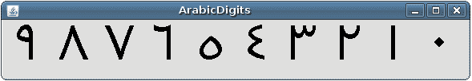
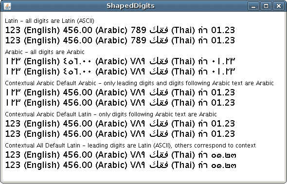

# 将拉丁数字转换为其他 Unicode 数字

> 原文：[`docs.oracle.com/javase/tutorial/i18n/text/shapedDigits.html`](https://docs.oracle.com/javase/tutorial/i18n/text/shapedDigits.html)

默认情况下，当文本包含数字值时，这些值将使用拉丁（欧洲）数字显示。如果希望使用其他 Unicode 数字形状，请使用[`java.awt.font.NumericShaper`](https://docs.oracle.com/javase/8/docs/api/java/awt/font/NumericShaper.html)类。`NumericShaper` API 使您能够以任何 Unicode 数字形状显示内部表示为 ASCII 值的数字值。

下面的代码片段来自`ArabicDigits`示例，展示了如何使用`NumericShaper`实例将拉丁数字转换为阿拉伯数字。确定整形操作的行已加粗。

```java
ArabicDigitsPanel(String fontname) {
    HashMap map = new HashMap();
    Font font = new Font(fontname, Font.PLAIN, 60);
    map.put(TextAttribute.FONT, font);
    map.put(TextAttribute.NUMERIC_SHAPING,
        NumericShaper.getShaper(NumericShaper.ARABIC));

    FontRenderContext frc = new FontRenderContext(null, false, false);
    layout = new TextLayout(text, map, frc);
}

// ...

public void paint(Graphics g) {
    Graphics2D g2d = (Graphics2D)g;
    layout.draw(g2d, 10, 50);
}

```

获取阿拉伯数字的`NumericShaper`实例，并将其放入`HashMap`中，用于[`TextLayout.NUMERIC_SHAPING`](https://docs.oracle.com/javase/8/docs/api/java/awt/font/TextAttribute.html#NUMERIC_SHAPING)属性键。哈希映射传递给`TextLayout`实例。在`paint`方法中呈现文本后，数字以所需脚本显示。在此示例中，拉丁数字 0 到 9 以阿拉伯数字形式显示。



前面的示例使用`NumericShaper.ARABIC`常量来检索所需的整形器，但[`NumericShaper`](https://docs.oracle.com/javase/8/docs/api/java/awt/font/NumericShaper.html#field_summary)类为许多语言提供了常量。这些常量被定义为位掩码，并称为`NumericShaper` *基于位掩码的常量*。

## 基于枚举的范围常量

指定特定数字集的另一种方法是使用[`NumericShaper.Range`](https://docs.oracle.com/javase/8/docs/api/java/awt/font/NumericShaper.Range.html)枚举类型（enum）。这个枚举在 Java SE 7 版本中引入，还提供了一组[常量](https://docs.oracle.com/javase/8/docs/api/java/awt/font/NumericShaper.Range.html#field_summary)。尽管这些常量是使用不同的机制定义的，但`NumericShaper.ARABIC`位掩码在功能上等同于`NumericShaper.Range.ARABIC`枚举，并且每种常量类型都有相应的`getShaper`方法：

+   [`getShaper(int singleRange)`](https://docs.oracle.com/javase/8/docs/api/java/awt/font/NumericShaper.html#getShaper-int-)

+   [`getShaper(NumericShaper.Range singleRange)`](https://docs.oracle.com/javase/8/docs/api/java/awt/font/NumericShaper.html#getShaper-java.awt.font.NumericShaper.Range-)

`ArabicDigitsEnum`示例与 ArabicDigits 示例相同，只是使用`NumericShaper.Range`枚举来指定语言脚本：

```java
ArabicDigitsEnumPanel(String fontname) {
    HashMap map = new HashMap();
    Font font = new Font(fontname, Font.PLAIN, 60);
    map.put(TextAttribute.FONT, font);
    map.put(TextAttribute.NUMERIC_SHAPING,
        NumericShaper.getShaper(NumericShaper.Range.ARABIC));
    FontRenderContext frc = new FontRenderContext(null, false, false);
    layout = new TextLayout(text, map, frc);
}

```

两个`getShaper`方法都接受`singleRange`参数。使用任一常量类型，你都可以指定一组特定于脚本的数字范围。基于位掩码的常量可以使用`OR`操作符组合，或者你可以创建一组`NumericShaper.Range`枚举。以下显示了如何使用每种常量类型定义范围：

```java
NumericShaper.MONGOLIAN | NumericShaper.THAI |
NumericShaper.TIBETAN
EnumSet.of(
    NumericShaper.Range.MONGOLIAN,
    NumericShaper.Range.THAI,
    NumericShaper.Range.TIBETAN)

```

你可以查询`NumericShaper`对象，以确定它支持哪些范围，使用基于位掩码的整形器的`getRanges`方法或基于枚举的整形器的`getRangeSet`方法。

* * *

**注意：**

你可以使用传统的基于位掩码的常量或`Range`枚举常量。在决定使用哪种时，有一些考虑因素：

+   `Range` API 需要 JDK 7 或更高版本。

+   `Range` API 覆盖的 Unicode 范围比位掩码 API 多。

+   位掩码 API 比`Range` API 快一点。

* * *

## 根据语言环境渲染数字

`ArabicDigits` 示例旨在使用特定语言的整形器，但有时必须根据语言环境渲染数字。例如，如果数字之前的文本使用泰语书写，则优先使用泰语数字。如果文本显示为藏文，则优先使用藏文数字。

你可以使用其中一个`getContextualShaper`方法来实现这一点。

+   [getContextualShaper(int ranges)](https://docs.oracle.com/javase/8/docs/api/java/awt/font/NumericShaper.html#getContextualShaper-int-)

+   [getContextualShaper(int ranges, int defaultContext)](https://docs.oracle.com/javase/8/docs/api/java/awt/font/NumericShaper.html#getContextualShaper-int-int-)

+   [getContextualShaper(Set<NumericShaper.Range> ranges)](https://docs.oracle.com/javase/8/docs/api/java/awt/font/NumericShaper.html#getContextualShaper-java.util.Set-)

+   [getContextualShaper(Set<NumericShaper.Range> ranges, NumericShaper.Range defaultContext)](https://docs.oracle.com/javase/8/docs/api/java/awt/font/NumericShaper.html#getContextualShaper-java.util.Set-java.awt.font.NumericShaper.Range-)

前两种方法使用位掩码常量，后两种使用枚举常量。接受`defaultContext`参数的方法允许你指定在数字值显示在文本之前时使用的初始整形器。当没有定义默认上下文时，任何前导数字都将使用拉丁形状显示。

`ShapedDigits` 示例展示了整形器的工作原理。显示了五种文本布局：

1.  第一个布局不使用整形器；所有数字都显示为拉丁文。

1.  第二个布局将所有数字形状为阿拉伯数字，不考虑语言环境。

1.  第三个布局使用了一个使用阿拉伯数字的上下文整形器。默认上下文被定义为阿拉伯文。

1.  第四个布局使用了一个使用阿拉伯数字的上下文形状器，但该形状器没有指定默认上下文。

1.  第五个布局使用了一个使用`ALL_RANGES`位掩码的上下文形状器，但该形状器没有指定默认上下文。



以下代码行展示了如果使用形状器，则如何定义：

1.  没有使用形状器。

1.  `NumericShaper arabic = NumericShaper.getShaper(NumericShaper.ARABIC);`

1.  `NumericShaper contextualArabic = NumericShaper.getContextualShaper(NumericShaper.ARABIC, NumericShaper.ARABIC);`

1.  `NumericShaper contextualArabicASCII = NumericShaper.getContextualShaper(NumericShaper.ARABIC);`

1.  `NumericShaper contextualAll = NumericShaper.getContextualShaper(NumericShaper.ALL_RANGES);`

查看`ShapedDigits.java`示例以获取更多实现细节。
