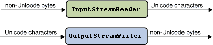
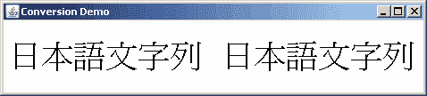

# 字符流和字节流

> 原文：[`docs.oracle.com/javase/tutorial/i18n/text/stream.html`](https://docs.oracle.com/javase/tutorial/i18n/text/stream.html)

`java.io`包提供了允许您在 Unicode 字符流和非 Unicode 文本的字节流之间进行转换的类。使用[`InputStreamReader`](https://docs.oracle.com/javase/8/docs/api/java/io/InputStreamReader.html)类，您可以将字节流转换为字符流。您可以使用[`OutputStreamWriter`](https://docs.oracle.com/javase/8/docs/api/java/io/OutputStreamWriter.html)类将字符流转换为字节流。以下图示说明了转换过程：



当您创建`InputStreamReader`和`OutputStreamWriter`对象时，您需要指定要转换的字节编码。例如，要将 UTF-8 编码的文本文件转换为 Unicode，您可以创建一个`InputStreamReader`如下：

```java
FileInputStream fis = new FileInputStream("test.txt");
InputStreamReader isr = new InputStreamReader(fis, "UTF8");

```

如果省略编码标识符，`InputStreamReader`和`OutputStreamWriter`将依赖于默认编码。您可以通过调用`getEncoding`方法来确定`InputStreamReader`或`OutputStreamWriter`使用的编码，如下所示：

```java
InputStreamReader defaultReader = new InputStreamReader(fis);
String defaultEncoding = defaultReader.getEncoding();

```

下面的示例向您展示如何使用`InputStreamReader`和`OutputStreamWriter`类执行字符集转换。此示例的完整源代码在`StreamConverter.java`中。此程序显示日文字符。在尝试之前，请验证系统上是否已安装适当的字体。如果您使用与版本 1.1 兼容的 JDK 软件，请复制`font.properties`文件，然后用`font.properties.ja`文件替换它。

`StreamConverter`程序将`String`对象中的一系列 Unicode 字符转换为以 UTF-8 编码的字节的`FileOutputStream`。执行转换的方法称为`writeOutput`：

```java
static void writeOutput(String str) {
    try {
        FileOutputStream fos = new FileOutputStream("test.txt");
        Writer out = new OutputStreamWriter(fos, "UTF8");
        out.write(str);
        out.close();
    } 
    catch (IOException e) {
        e.printStackTrace();
    }
}

```

`readInput`方法从由`writeOutput`方法创建的文件中读取以 UTF-8 编码的字节。`InputStreamReader`对象将 UTF-8 编码的字节转换为 Unicode，并以`String`形式返回结果。`readInput`方法如下：

```java
static String readInput() {
    StringBuffer buffer = new StringBuffer();
    try {
        FileInputStream fis = new FileInputStream("test.txt");
        InputStreamReader isr = new InputStreamReader(fis, "UTF8");
        Reader in = new BufferedReader(isr);
        int ch;
        while ((ch = in.read()) > -1) {
            buffer.append((char)ch);
        }
        in.close();
        return buffer.toString();
    } 
    catch (IOException e) {
        e.printStackTrace();
        return null;
    }
}

```

`StreamConverter`程序的`main`方法调用`writeOutput`方法创建一个以 UTF-8 编码的字节文件。`readInput`方法读取相同的文件，将字节转换回 Unicode。以下是`main`方法的源代码：

```java
public static void main(String[] args) {
    String jaString = new String("\u65e5\u672c\u8a9e\u6587\u5b57\u5217");
    writeOutput(jaString); 
    String inputString = readInput();
    String displayString = jaString + " " + inputString;
    new ShowString(displayString, "Conversion Demo");
}

```

原始字符串（`jaString`）应与新创建的字符串（`inputString`）完全相同。为了显示这两个字符串相同，程序将它们连接起来，并使用 `ShowString` 对象显示它们。`ShowString` 类使用 `Graphics.drawString` 方法显示字符串。此类的源代码在 `ShowString.java` 中。当 `StreamConverter` 程序实例化 `ShowString` 时，会出现以下窗口。显示的字符重复验证了这两个字符串是相同的：


