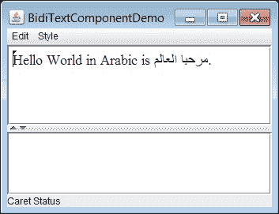
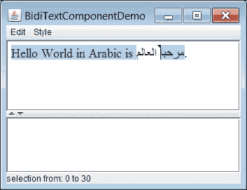
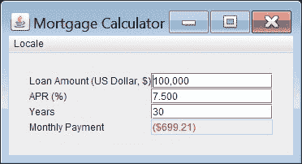
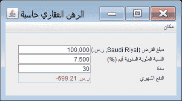

# 使用 JTextComponent 类处理双向文本

> 原文：[`docs.oracle.com/javase/tutorial/i18n/text/bidi.html`](https://docs.oracle.com/javase/tutorial/i18n/text/bidi.html)

本节讨论如何使用[`JTextComponent`](https://docs.oracle.com/javase/8/docs/api/javax/swing/text/JTextComponent.html)类处理双向文本。双向文本是包含从左到右和从右到左两个方向运行的文本。双向文本的一个示例是包含从右到左运行的阿拉伯文本（包含从左到右运行的数字）。显示和管理双向文本更加困难；但是[`JTextComponent`](https://docs.oracle.com/javase/8/docs/api/javax/swing/text/JTextComponent.html)会为您处理这些问题。

下面涵盖了以下主题：

+   确定双向文本的方向性

+   显示和移动插入符

+   命中测试

+   高亮选择

+   设置组件方向

欲了解更多信息，或者如果您想更好地控制处理这些问题，请参阅处理双向文本在 2D 图形教程中。

## 确定双向文本的方向性

示例`BidiTextComponentDemo.java`，基于`TextComponentDemo.java`，在[`JTextPane`](https://docs.oracle.com/javase/8/docs/api/javax/swing/JTextPane.html)对象中显示双向文本。在大多数情况下，Java 平台可以确定双向 Unicode 文本的方向性：



### 在 JTextComponent 对象中明确指定文本运行方向

您可以指定[`JTextComponent`](https://docs.oracle.com/javase/8/docs/api/javax/swing/text/JTextComponent.html)对象的[`Document`](https://docs.oracle.com/javase/8/docs/api/javax/swing/text/Document.html)对象的运行方向。例如，以下语句指定[`JTextPane`](https://docs.oracle.com/javase/8/docs/api/javax/swing/JTextPane.html)对象`textPane`中的文本从右到左运行：

```java
textPane.getDocument().putProperty(
    TextAttribute.RUN_DIRECTION,
    TextAttribute.RUN_DIRECTION_RTL);

```

或者，您可以根据语言环境指定特定 Swing 组件的组件方向。例如，以下语句指定对象`textPane`的组件方向基于 ar-SA 语言环境：

```java
Locale arabicSaudiArabia = 
    new Locale.Builder().setLanguage("ar").setRegion("SA").build();

textPane.setComponentOrientation(
    ComponentOrientation.getOrientation(arabicSaudiArabia));

```

因为阿拉伯语的运行方向是从右到左，所以`textPane`对象中包含的文本的运行方向也是从右到左。

有关更多信息，请参阅设置组件方向。

## 显示和移动插入符

在可编辑文本中，*插入符*用于图形表示当前插入点，即文本中新字符将插入的位置。在`BidiTextComponentDemo.java`示例中，插入符包含一个小三角形，指向插入字符将显示的方向。

默认情况下，[`JTextComponent`](https://docs.oracle.com/javase/8/docs/api/javax/swing/text/JTextComponent.html)对象创建一个键映射（类型为[`Keymap`](https://docs.oracle.com/javase/8/docs/api/javax/swing/text/Keymap.html)），该键映射作为所有[`JTextComponent`](https://docs.oracle.com/javase/8/docs/api/javax/swing/text/JTextComponent.html)实例共享的默认键映射。键映射允许应用程序将按键绑定到操作。默认键映射（用于支持插入符移动的[`JTextComponent`](https://docs.oracle.com/javase/8/docs/api/javax/swing/text/JTextComponent.html)对象）包括将插入符向前和向后移动与左右箭头键绑定，从而支持通过双向文本移动插入符。

## 点击测试

通常，设备空间中的位置必须转换为文本偏移量。例如，当用户在可选择文本上单击鼠标时，鼠标的位置将被转换为文本偏移量，并用作选择范围的一端。从逻辑上讲，这是定位插入符的逆过程。

您可以将插入符监听器附加到[`JTextComponent`](https://docs.oracle.com/javase/8/docs/api/javax/swing/text/JTextComponent.html)的实例上。插入符监听器使您能够处理插入符事件，这些事件发生在插入符移动或文本组件中的选择更改时。您可以使用[`addCaretListener`](https://docs.oracle.com/javase/8/docs/api/javax/swing/text/JTextComponent.html#addCaretListener-javax.swing.event.CaretListener-)方法附加插入符监听器。有关更多信息，请参见如何编写插入符监听器。

## 高亮选择

一段选定的字符范围在图形上由一个高亮区域表示，该区域是以反色或不同背景颜色显示字形的区域。

[`JTextComponent`](https://docs.oracle.com/javase/8/docs/api/javax/swing/text/JTextComponent.html)对象实现了逻辑高亮。这意味着选定的字符在文本模型中始终是连续的，而高亮区域可以是不连续的。以下是逻辑高亮的示例：



## 设置组件方向

Swing 的布局管理器了解区域设置如何影响用户界面；不需要为每个区域设置创建新的布局。例如，在文本从右到左流动的区域，布局管理器将以相同的方向排列组件。

示例 `InternationalizedMortgageCalculator.java` 已本地化为英语，美国；英语，英国；法语，法国；法语，加拿大；以及阿拉伯语，沙特阿拉伯。

以下示例使用 en-US 区域设置：



以下示例使用 ar-SA 区域设置：



请注意，组件的布局与相应区域设置的方向相同：en-US 为从左到右，ar-SA 为从右到左。示例 `InternationalizedMortgageCalculator.java` 调用方法 [`applyComponentOrientation`](https://docs.oracle.com/javase/8/docs/api/java/awt/Component.html#applyComponentOrientation-java.awt.ComponentOrientation-) 和 [`getOrientation`](https://docs.oracle.com/javase/8/docs/api/java/awt/ComponentOrientation.html#getOrientation-java.util.Locale-) 来指定其组件的方向：

```java
private static JFrame frame;

// ...

private static void createAndShowGUI(Locale currentLocale) {

    // Create and set up the window.
    // ...
    // Add contents to the window.
    // ...
    frame.applyComponentOrientation(
        ComponentOrientation.getOrientation(currentLocale));
    // ...
  }

```

示例 `InternationalizedMortgageCalculator.java` 需要以下资源文件：

+   `resources/Resources.properties`

+   `resources/Resources_ar.properties`

+   `resources/Resources_fr.properties`
