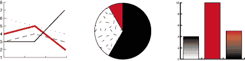
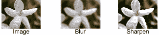

# 教程：2D 图形

> 原文：[`docs.oracle.com/javase/tutorial/2d/index.html`](https://docs.oracle.com/javase/tutorial/2d/index.html)

本教程向你介绍了 Java 2D™ API，并展示了如何在 Java 程序中显示和打印 2D 图形。本教程适用于希望丰富其对 Java 2D API 知识的开发人员，以及计算机图形初学者。几乎每个部分都包含相关示例来说明特定功能。Java 2D API 可以轻松执行以下任务：

+   绘制线条、矩形和任何其他几何形状。

+   用纯色、渐变和纹理填充这些形状。

+   使用选项绘制文本，对字体和渲染过程进行精细控制。

+   绘制图像，可选择应用滤镜操作。

+   在上述任何渲染操作期间应用诸如合成和变换等操作。

本章还解释了较不熟悉的概念，如合成。

*使用 2D 图形 API 显示复杂图表*

*使用图像滤镜操作*

本章描述了在屏幕和离屏图像、表面和打印机设备上绘制的概念。本教程涵盖了 Java 2D API 的最常见用法，并简要描述了一些更高级功能。

 介绍了关键的 Java 2D 概念，并描述了 Java 2D 渲染模型。这节课比本教程的其他课程更具概念性，它让你深入了解基本概念和类描述。

 使用一个开发的示例向你展示如何获取 Graphics 对象并将其用于常见的图形渲染任务。

 教你如何使用 API 绘制图形基元和任意形状，以及如何应用花哨的描边和填充样式。

 展示了如何有效地使用文本 API，包括如何创建具有所需属性的`Font`对象，测量文本，并确定系统中可用字体的名称。

 解释了如何创建 BufferedImage 对象，执行图像滤镜操作，并在图像上绘制。

 教你如何将 2D 图形渲染到打印机，打印复杂文档，并使用打印服务。

 解释了如何执行变换，裁剪绘图区域，合成重叠图形，指定渲染偏好，并控制渲染质量。
