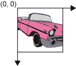

# 坐标

> 原文：[`docs.oracle.com/javase/tutorial/2d/overview/coordinate.html`](https://docs.oracle.com/javase/tutorial/2d/overview/coordinate.html)

Java 2D API 维护两个坐标空间：

+   *用户空间* – 指定图形基元的空间

+   *设备空间* – 输出设备（如屏幕、窗口或打印机）的坐标系统

用户空间是一个设备无关的逻辑坐标系统，即您的程序使用的坐标空间。传递给 Java 2D 渲染例程的所有几何图形都是使用用户空间坐标指定的。

当使用从用户空间到设备空间的默认转换时，用户空间的原点是组件绘图区域的左上角。*x*坐标向右增加，*y*坐标向下增加，如下图所示。窗口的左上角是 0,0。所有坐标都使用整数指定，通常足够。但是，有些情况需要浮点数甚至双精度，这也是支持的。

设备空间是一个依赖设备的坐标系统，根据目标渲染设备而变化。虽然窗口或屏幕的坐标系统可能与打印机的坐标系统非常不同，但这些差异对 Java 程序是不可见的。在渲染过程中，用户空间和设备空间之间的必要转换是自动执行的。
