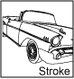
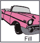
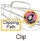
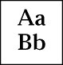

# Java 2D 渲染

> 原文：[`docs.oracle.com/javase/tutorial/2d/overview/rendering.html`](https://docs.oracle.com/javase/tutorial/2d/overview/rendering.html)

Java 2D API 在不同类型设备上提供统一的渲染模型。在应用程序级别，无论目标渲染设备是屏幕还是打印机，渲染过程都是相同的。当需要显示组件时，其`paint`或`update`方法会自动使用适当的`Graphics`上下文调用。

Java 2D API 包括[`java.awt.Graphics2D`](https://docs.oracle.com/javase/8/docs/api/java/awt/Graphics2D.html)类，该类扩展了[`Graphics`](https://docs.oracle.com/javase/8/docs/api/java/awt/Graphics.html)类，以提供对 Java 2D API 增强图形和渲染功能的访问。这些功能包括：

+   渲染任何几何原语的轮廓，使用笔画和填充属性（`draw` 方法）。

+   通过使用颜色或图案指定的填充属性（`fill` 方法）来填充任何几何原语的内部。

+   渲染任何文本字符串（`drawString` 方法）。字体属性用于将字符串转换为字形，然后用颜色或图案指定的填充。

+   渲染指定的图像（`drawImage` 方法）。

此外，`Graphics2D`类支持特定形状的`drawOval`和`fillRect`等`Graphics`渲染方法。上面列出的所有方法可以分为两组：

1.  绘制形状的方法

1.  影响渲染的方法

第二组方法使用形成`Graphics2D`上下文的状态属性，用于以下目的：

+   变化笔画宽度

+   更改如何连接笔画

+   设置裁剪路径以限制渲染区域

+   在渲染对象时平移、旋转、缩放或倾斜对象

+   定义颜色和图案以填充形状

+   指定如何组合多个图形对象

在应用程序中使用 Java 2D API 功能，将传递给组件渲染方法的`Graphics`对象转换为`Graphics2D`对象。例如：

```java
public void paint (Graphics g) {
    Graphics2D g2 = (Graphics2D) g;
    ...
}

```

如下图所示，`Graphics2D`类的渲染上下文包含几个属性。

|  | *笔属性*应用于形状的轮廓。此笔画属性使您能够用任何点大小和虚线模式绘制线条，并对线条应用端点和连接装饰。 |
| --- | --- |
|  | *填充属性*应用于形状的内部。此填充属性使您能够用纯色、渐变和图案填充形状。 |
|  | *compositing attribute* 在渲染对象重叠现有对象时使用。 |
|  | *transform* 属性在渲染过程中应用，将渲染对象从用户空间转换为设备空间坐标。通过该属性还可以应用可选的平移、旋转、缩放或剪切变换。 |
|  | *clip* 类型将渲染限制在用于定义剪切路径的 `Shape` 对象轮廓内的区域。任何用于定义剪切的 `Shape` 对象。 |
|  | *font* 属性用于将文本字符串转换为字形。 |
|  | *Rendering hints* 指定在速度和质量之间的权衡偏好。例如，您可以指定是否应使用抗锯齿，如果该功能可用的话。另请参阅 控制渲染质量。 |

要了解更多关于变换和合成的内容，请参阅 Java2D 中的高级主题。

当设置属性时，会传递适当的属性对象。如下例所示，要将绘画属性更改为蓝绿色渐变填充，您需要构造一个 `GradientPaint` 对象，然后调用 `setPaint` 方法。

```java
gp = new GradientPaint(0f,0f,blue,0f,30f,green);
g2.setPaint(gp);

```
