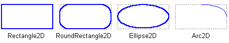
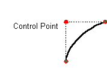
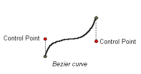
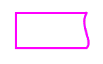

# 几何基元

> 原文：[`docs.oracle.com/javase/tutorial/2d/overview/primitives.html`](https://docs.oracle.com/javase/tutorial/2d/overview/primitives.html)

Java 2D API 提供了一组有用的标准形状，如点、线、矩形、弧、椭圆和曲线。定义常见几何基元的最重要的包是`java.awt.geom`包。任意形状可以由直线几何基元的组合表示。

`Shape`接口表示具有轮廓和内部的几何形状。此接口提供了一组用于描述和检查二维几何对象的常见方法，并支持曲线线段和多个子形状。[`Graphics`](https://docs.oracle.com/javase/8/docs/api/java/awt/Graphics.html)类仅支持直线段。[`Shape`](https://docs.oracle.com/javase/8/docs/api/java/awt/Shape.html)接口可以支持曲线段。

关于如何绘制和填充形状的更多详细信息，请参阅几何处理课程。

## 点

`Point2D`类定义了表示(x, y)坐标空间中位置的点。Java 2D API 中的术语“点”与像素不同。点没有面积，不包含颜色，也不能呈现。

点用于创建其他形状。`Point2D`类还包括一种计算两点之间距离的方法。

## 线

`Line2D`类是表示一条线的抽象类。线的坐标可以作为双精度数检索。`Line2D`类包括几种设置线端点的方法。

您还可以使用下面描述的`GeneralPath`类创建直线段。

## 矩形形状

`Rectangle2D`、`RoundRectangle2D`、`Arc2D`和`Ellipse2D`基元都是从`RectangularShape`类派生的。此类定义了可以由矩形边界框描述的`Shape`对象的方法。`RectangularShape`对象的几何形状可以从完全包围`Shape`轮廓的矩形中推断出来。

## 二次和三次曲线

`QuadCurve2D`使您能够创建二次参数曲线段。二次曲线由两个端点和一个控制点定义。

`CubicCurve2D`类使您能够创建三次参数曲线段。三次曲线由两个端点和两个控制点定义。以下是二次和三次曲线的示例。请参阅描边和填充图形基元以获取三次和二次曲线的实现。

此图表示一个二次曲线。

此图表示一个三次曲线。

## 任意形状

`GeneralPath`类使您能够通过指定沿着形状边界的一系列位置来构造任意形状。这些位置可以通过线段、二次曲线或三次（贝塞尔）曲线连接。以下形状可以通过三条线段和一条三次曲线创建。有关此形状实现的更多信息，请参见描边和填充图形基元。

## 区域

使用`Area`类，您可以对任意两个`Shape`对象执行布尔运算，如并集、交集和差集。这种技术通常被称为*构造性区域几何*，使您能够快速创建复杂的`Shape`对象，而无需描述每条线段或曲线。
