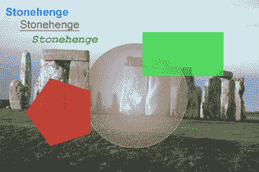

# 图像

> 原文：[`docs.oracle.com/javase/tutorial/2d/overview/images.html`](https://docs.oracle.com/javase/tutorial/2d/overview/images.html)

在 Java 2D API 中，图像通常是一个矩形的二维像素数组，其中每个*像素*表示图像该位置的颜色，而维度表示图像显示时的水平范围（宽度）和垂直范围（高度）。

表示此类图像最重要的图像类是`java.awt.image.BufferedImage`类。Java 2D API 将这些图像的内容存储在内存中，以便可以直接访问。

应用程序可以直接创建一个`BufferedImage`对象，或从外部图像格式（如 PNG 或 GIF）获取图像。

在任一情况下，应用程序可以通过使用 Java 2D API 图形调用在图像上绘制。因此，图像不仅限于显示照片类型的图像。不同的对象，如线条艺术、文本和其他图形，甚至其他图像都可以绘制到图像上（如下图所示）。

Java 2D API 允许您对`BufferedImage`应用图像过滤操作，并包括几个内置过滤器。例如，`ConvolveOp`过滤器可用于模糊或锐化图像。

然后生成的图像可以绘制到屏幕上，发送到打印机上，或保存为 PNG、GIF 等图形格式。要了解更多关于图像的信息，请参阅使用图像课程。
