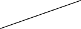
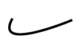
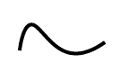
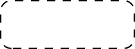
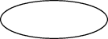

# 绘制几何图元

> 原文：[`docs.oracle.com/javase/tutorial/2d/geometry/primitives.html`](https://docs.oracle.com/javase/tutorial/2d/geometry/primitives.html)

Java 2D API 提供了几个定义常见几何对象（如点、线、曲线和矩形）的类。这些几何类是[`java.awt.geom`](https://docs.oracle.com/javase/8/docs/api/java/awt/geom/package-frame.html)包的一部分。

[`PathIterator`](https://docs.oracle.com/javase/8/docs/api/java/awt/geom/PathIterator.html)接口定义了从路径中检索元素的方法。

[`Shape`](https://docs.oracle.com/javase/8/docs/api/java/awt/Shape.html)接口提供了一组描述和检查几何路径对象的方法。该接口由[`GeneralPath`](https://docs.oracle.com/javase/8/docs/api/java/awt/geom/GeneralPath.html)类和其他几何类实现。

本节中的所有示例都是通过使用`java.awt.geom`包创建几何图形，然后通过使用[`Graphics2D`](https://docs.oracle.com/javase/8/docs/api/java/awt/Graphics2D.html)类来呈现它们。首先，您需要获取一个`Graphics2D`对象，例如通过将`paint()`方法的`Graphics`参数进行强制转换。

```java
public void paint (Graphics g) {
    Graphics2D g2 = (Graphics2D) g;
    ...
}

```

## 点

[`Point`](https://docs.oracle.com/javase/8/docs/api/java/awt/Point.html)类创建一个表示(x,y)坐标空间中位置的点。子类`Point2D.Float`和`Point2D.Double`分别提供存储点坐标的浮点和双精度。

```java
//Create Point2D.Double
Point2D.Double point = new Point2D.Double(x, y);

```

要创建坐标为 0,0 的点，您可以使用默认构造函数`Point2D.Double()`。

您可以使用`setLocation`方法设置点的位置如下：

+   `setLocation(double x, double y)` – 以双精度值设置点的位置-定义坐标。

+   `setLocation(Point2D p)` – 使用另一个点的坐标设置点的位置。

此外，`Point2D`类有方法来计算当前点与给定坐标点之间的距离，或者两点之间的距离。

## 线

[`Line2D`](https://docs.oracle.com/javase/8/docs/api/java/awt/geom/Line2D.html)类表示(x, y)坐标空间中的线段。`Line2D.Float`和`Line2D.Double`子类指定了浮点和双精度的线。例如：

```java
// draw Line2D.Double
g2.draw(new Line2D.Double(x1, y1, x2, y2));

```



该类包括几个`setLine()`方法来定义线的端点。

或者，可以使用`Line2D.Float`类的构造函数指定线的端点如下：

+   `Line2D.Float(float X1, float Y1, float X2, float Y2)`

+   `Line2D.Float(Point2D p1, Point2D p2)`

在`Graphics2D`类中使用 Stroke 对象定义线路径的笔画。

## 曲线

`java.awt.geom`包使您能够创建二次或三次曲线段。

### 二次曲线段

[`QuadCurve2D`](https://docs.oracle.com/javase/8/docs/api/java/awt/geom/QuadCurve2D.html)类实现了`Shape`接口。该类表示(x, y)坐标空间中的二次参数曲线段。`QuadCurve2D.Float`和`QuadCurve2D.Double`子类指定了浮点和双精度的二次曲线。

几个`setCurve`方法用于指定曲线的两个端点和控制点，其坐标可以直接定义，通过其他点的坐标定义，或使用给定数组。

一个非常有用的方法，`setCurve(QuadCurve2D)`，设置具有与提供的曲线相同端点和控制点的二次曲线。例如：

```java
// create new QuadCurve2D.Float
QuadCurve2D q = new QuadCurve2D.Float();
// draw QuadCurve2D.Float with set coordinates
q.setCurve(x1, y1, ctrlx, ctrly, x2, y2);
g2.draw(q);

```



### 三次曲线段

[`CubicCurve2D`](https://docs.oracle.com/javase/8/docs/api/java/awt/geom/CubicCurve2D.html)类还实现了[`Shape`](https://docs.oracle.com/javase/8/docs/api/java/awt/Shape.html)接口。该类表示(x, y)坐标空间中的三次参数曲线段。`CubicCurve2D.Float`和`CubicCurve2D.Double`子类指定了浮点和双精度的三次曲线。

`CubicCurve2D`类具有设置曲线的类似方法，与`QuadraticCurve2D`类相同，只是有第二个控制点。例如：

```java
// create new CubicCurve2D.Double
CubicCurve2D c = new CubicCurve2D.Double();
// draw CubicCurve2D.Double with set coordinates
c.setCurve(x1, y1, ctrlx1,
           ctrly1, ctrlx2, ctrly2, x2, y2);
g2.draw(c);

```



## 矩形

在下面的示例中表示的原语的类扩展了`RectangularShape`类，该类实现了`Shape`接口并添加了一些自己的方法。

这些方法使您能够获取有关形状位置和大小的信息，检查矩形的中心点，并设置形状的边界。

[`Rectangle2D`](https://docs.oracle.com/javase/8/docs/api/java/awt/geom/Rectangle2D.html)类表示由位置(x, y)和尺寸(w x h)定义的矩形。`Rectangle2D.Float`和`Rectangle2D.Double`子类指定了浮点和双精度的矩形。例如：

```java
// draw Rectangle2D.Double
g2.draw(new Rectangle2D.Double(x, y,
                               rectwidth,
                               rectheight));

```


[`RoundRectangle2D`](https://docs.oracle.com/javase/8/docs/api/java/awt/geom/RoundRectangle2D.html)类表示具有圆角的矩形，由位置(x, y)、尺寸(w x h)和圆角的宽度和高度定义。`RoundRectangle2D.Float`和`RoundRectangle2D.Double`子类指定了浮点和双精度的圆角矩形。

圆角矩形由以下参数指定：

+   位置

+   宽度

+   高度

+   圆角弧的宽度

+   圆角弧的高度

要设置`RoundRectangle2D`对象的位置、大小和弧度，请使用方法`setRoundRect(double a, double y, double w, double h, double arcWidth, double arcHeight)`。例如：

```java
// draw RoundRectangle2D.Double
g2.draw(new RoundRectangle2D.Double(x, y,
                                   rectwidth,
                                   rectheight,
                                   10, 10));

```



## 椭圆

[`Ellipse2D`](https://docs.oracle.com/javase/8/docs/api/java/awt/geom/Ellipse2D.html)类表示由边界矩形定义的椭圆。`Ellipse2D.Float`和`Ellipse2D.Double`子类指定了以浮点和双精度表示的椭圆。

椭圆由位置、宽度和高度完全定义。例如：

```java
// draw Ellipse2D.Double
g2.draw(new Ellipse2D.Double(x, y,
                             rectwidth,
                             rectheight));

```



## 弧

要绘制椭圆的一部分，您可以使用[`Arc2D`](https://docs.oracle.com/javase/8/docs/api/java/awt/geom/Arc2D.html)类。这个类表示由边界矩形、起始角度、角度范围和闭合类型定义的弧。`Arc2D.Float`和`Arc2D.Double`子类指定了以浮点和双精度表示的弧。

`Arc2D`类定义了这个类中对应常量表示的三种弧形：OPEN、PIE 和 CHORD。


有几种方法可以设置弧的大小和参数：

+   直接，通过坐标

+   通过提供的`Point2D`和`Dimension2D`

+   通过复制现有的`Arc2D`

此外，您可以使用`setArcByCenter`方法来指定从中心点开始的弧，给定其坐标和半径。

```java
// draw Arc2D.Double
g2.draw(new Arc2D.Double(x, y,
                         rectwidth,
                         rectheight,
                         90, 135,
                         Arc2D.OPEN));

```


`ShapesDemo2D.java`代码示例包含了所有描述的几何原语的实现。有关本节中所代表的类和方法的更多信息，请参阅[`java.awt.geom`](https://docs.oracle.com/javase/8/docs/api/java/awt/geom/package-summary.html)规范。
