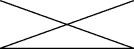
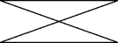

# 绘制任意形状

> 原文：[`docs.oracle.com/javase/tutorial/2d/geometry/arbitrary.html`](https://docs.oracle.com/javase/tutorial/2d/geometry/arbitrary.html)

您已经学会了如何绘制`java.awt.geom`包中表示的大多数形状。要创建更复杂的几何图形，如多边形、折线或星形，您可以使用此包中的另一个类`GeneralPath`。

此类实现了[`Shape`](https://docs.oracle.com/javase/8/docs/api/java/awt/Shape.html)接口，表示由线段、二次曲线和三次曲线构成的几何路径。此类中的三个构造函数可以使用默认绕组规则(`WIND_NON_ZERO`)、给定的绕组规则(`WIND_NON_ZERO`或`WIND_EVEN_ODD`)或指定的初始坐标容量创建[`GeneralPath`](https://docs.oracle.com/javase/8/docs/api/java/awt/geom/GeneralPath.html)对象。绕组规则指定了如何确定路径的内部。

```java
public void paint (Graphics g) {
    Graphics2D g2 = (Graphics2D) g;
    ...
}

```

要创建一个空的`GeneralPath`实例，请调用`new GeneralPath()`，然后使用以下方法向形状添加线段：

+   `moveTo(float x, float y)` – 将路径的当前点移动到给定点

+   `lineTo(float x, float y)` – 向当前路径添加一个直线段

+   `quadTo(float ctrlx, float ctrly, float x2, floaty2)` – 向当前路径添加一个二次曲线段

+   `curveTo(float ctrlx1, float ctrly1, float ctrlx2, float ctrly2, float x3, floaty3)` – 向当前路径添加一个三次曲线段

+   `closePath()` – 关闭当前路径

以下示例说明了如何使用`GeneralPath`绘制折线：

|

```java
// draw GeneralPath (polyline)
int x2Points[] = {0, 100, 0, 100};
int y2Points[] = {0, 50, 50, 0};
GeneralPath polyline = 
        new GeneralPath(GeneralPath.WIND_EVEN_ODD, x2Points.length);

polyline.moveTo (x2Points[0], y2Points[0]);

for (int index = 1; index < x2Points.length; index++) {
         polyline.lineTo(x2Points[index], y2Points[index]);
};

g2.draw(polyline);

```

|  |
| --- |

此示例说明了如何使用`GeneralPath`绘制多边形：

|

```java
// draw GeneralPath (polygon)
int x1Points[] = {0, 100, 0, 100};
int y1Points[] = {0, 50, 50, 0};
GeneralPath polygon = 
        new GeneralPath(GeneralPath.WIND_EVEN_ODD,
                        x1Points.length);
polygon.moveTo(x1Points[0], y1Points[0]);

for (int index = 1; index < x1Points.length; index++) {
        polygon.lineTo(x1Points[index], y1Points[index]);
};

polygon.closePath();
g2.draw(polygon);

```

|  |
| --- |

请注意，最后两个代码示例之间唯一的区别是`closePath()`方法。此方法通过向上一次`moveTo`的坐标绘制一条直线，从而将折线变成多边形。

要将特定路径添加到您的`GeneralPath`对象的末尾，您可以使用`append()`方法之一。`ShapesDemo2D.java`代码示例包含了任意形状的额外实现。
