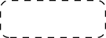

# 描边和填充图形原语

> 原文：[`docs.oracle.com/javase/tutorial/2d/geometry/strokeandfill.html`](https://docs.oracle.com/javase/tutorial/2d/geometry/strokeandfill.html)

您已经知道如何创建不同的几何原语和更复杂的形状。本课程教授如何为图形添加一些颜色和花哨的轮廓，并表示填充和描边：

+   *填充* - 是用纯色、颜色渐变或纹理图案绘制形状内部的过程

+   *描边* - 是绘制形状轮廓的过程，应用描边宽度、线条样式和颜色属性

要将花哨的线条样式和填充图案应用于几何原语，需在呈现之前更改[`Graphics2D`](https://docs.oracle.com/javase/8/docs/api/java/awt/Graphics2D.html)上下文中的描边和绘制属性。例如，通过创建适当的[`Stroke`](https://docs.oracle.com/javase/8/docs/api/java/awt/Stroke.html)对象来绘制虚线。在呈现线条之前，将此描边添加到`Graphics2D`上下文中，调用`setStroke`方法。同样，通过创建`GradientPaint`对象并将其添加到`Graphics2D`上下文中，可以将渐变填充应用于`Shape`对象。

以下代码行丰富了几何原语的填充和描边上下文：

```java
// draw RoundRectangle2D.Double

final static float dash1[] = {10.0f};
    final static BasicStroke dashed =
        new BasicStroke(1.0f,
                        BasicStroke.CAP_BUTT,
                        BasicStroke.JOIN_MITER,
                        10.0f, dash1, 0.0f);
g2.setStroke(dashed);
g2.draw(new RoundRectangle2D.Double(x, y,
                                   rectWidth,
                                   rectHeight,
                                   10, 10));

```



```java
// fill Ellipse2D.Double
redtowhite = new GradientPaint(0,0,color.RED,100, 0,color.WHITE);
g2.setPaint(redtowhite);
g2.fill (new Ellipse2D.Double(0, 0, 100, 50));

```


`ShapesDemo2D.java`代码示例代表了描边和填充的额外实现。

## 定义花哨的线条样式和填充图案

使用 Java 2D 的`Stroke`和`Paint`类，可以定义花哨的线条样式和填充图案。

### 线条样式

线条样式由`Graphics2D`呈现上下文中的描边属性定义。要设置描边属性，需创建一个`BasicStroke`对象并将其传递给`Graphics2D`的`setStroke`方法。

一个`BasicStroke`对象保存有关线宽、连接样式、端点样式和虚线样式的信息。当使用`draw`方法呈现`Shape`时，将使用此信息。

*线宽*是线条垂直于其轨迹的厚度。线宽以用户坐标单位的`float`值指定，当使用默认变换时，这些单位大致相当于 1/72 英寸。

*连接样式*是应用在两条线段相遇处的装饰。`BasicStroke`支持以下三种连接样式：

 `JOIN_BEVEL`

 `JOIN_MITER`

 `JOIN_ROUND`

*端点样式*是应用在线段结束处的装饰。`BasicStroke`支持以下三种端点样式：

 `CAP_BUTT`

 `CAP_ROUND`

 `CAP_SQUARE`

*虚线样式*定义了沿着线长度应用的不透明和透明部分的模式。虚线样式由一个虚线数组和一个虚线相位定义。*虚线数组*定义了虚线模式。数组中的交替元素表示用户坐标单位中的虚线长度和虚线之间的空间长度。元素 0 表示第一个虚线，元素 1 表示第一个空格，依此类推。*虚线相位*是虚线模式中的偏移量，也以用户坐标单位指定。虚线相位指示应用于线的开头的虚线模式的哪个部分。

### 填充图案

填充图案由`Graphics2D`渲染上下文中的`paint`属性定义。要设置`paint`属性，您需要创建一个实现`Paint`接口的对象实例，并将其传递给`Graphics2D`的`setPaint`方法。

以下三个类实现了`Paint`接口：`Color`、`GradientPaint`和`TexturePaint`。

要创建一个`GradientPaint`，您需要指定起始位置和颜色以及结束位置和颜色。渐变沿着连接两个位置的线从一种颜色变化到另一种颜色。例如：


`TexturePaint`类的图案由`BufferedImage`类定义。要创建一个`TexturePaint`对象，您需要指定包含图案的图像和用于复制和锚定图案的矩形。以下图像表示了这个特性：


