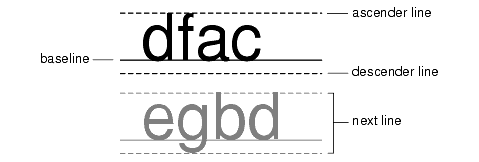

# 字体概念

> 原文：[`docs.oracle.com/javase/tutorial/2d/text/fontconcepts.html`](https://docs.oracle.com/javase/tutorial/2d/text/fontconcepts.html)

本节介绍了[`Font`](https://docs.oracle.com/javase/8/docs/api/java/awt/Font.html)类，支持详细字体信息的规范和复杂排版功能的使用。

一个[`Font`](https://docs.oracle.com/javase/8/docs/api/java/awt/Font.html)对象表示系统上可用的字体集合中的字体面实例。常见字体面的示例包括 Helvetica Bold 和 Courier Bold Italic。一个[`Font`](https://docs.oracle.com/javase/8/docs/api/java/awt/Font.html)对象关联三个名称：其逻辑名称、族名称和字体面名称：

+   一个[`Font`](https://docs.oracle.com/javase/8/docs/api/java/awt/Font.html)对象的*逻辑名称*是映射到系统上可用的特定字体之一的名称。在 Java 中指定[`Font`](https://docs.oracle.com/javase/8/docs/api/java/awt/Font.html)时，请使用*字体面名称*而不是逻辑名称。您可以通过调用[`getName`](https://docs.oracle.com/javase/8/docs/api/java/awt/Font.html#getName--)方法从`Font`中获取逻辑名称。要获取映射到系统上可用的特定字体的逻辑名称列表，请调用[java.awt.GraphicsEnvironment.getAvailableFontFamilyNames](https://docs.oracle.com/javase/8/docs/api/java/awt/GraphicsEnvironment.html#getAvailableFontFamilyNames--)方法。

    查看**物理和逻辑字体**以获取更多信息。

+   一个[`Font`](https://docs.oracle.com/javase/8/docs/api/java/awt/Font.html)对象的*族名称*是确定跨多个字体面的排版设计的字体族名称，如 Helvetica。通过[`getFamily`](https://docs.oracle.com/javase/8/docs/api/java/awt/Font.html#getFamily--)方法检索族名称。

+   一个[`Font`](https://docs.oracle.com/javase/8/docs/api/java/awt/Font.html)对象的*字体面名称*指的是系统上安装的实际字体。这是您在指定字体时应该使用的名称。通常被称为*字体名称*。通过调用[`getFontName`](https://docs.oracle.com/javase/8/docs/api/java/awt/Font.html#getFontName--)检索字体名称。要确定系统上可用的字体面，请调用[`java.awt.GraphicsEnvironment.getAllFonts`](https://docs.oracle.com/javase/8/docs/api/java/awt/GraphicsEnvironment.html#getAllFonts--)方法。

您可以通过[`getAttributes`](https://docs.oracle.com/javase/8/docs/api/java/awt/Font.html#getAttributes--)方法访问有关[`Font`](https://docs.oracle.com/javase/8/docs/api/java/awt/Font.html)的信息。[`Font`](https://docs.oracle.com/javase/8/docs/api/java/awt/Font.html)对象的属性包括其名称、大小、变换和字体特征，如粗细和姿势。

一个[`LineMetrics`](https://docs.oracle.com/javase/8/docs/api/java/awt/font/LineMetrics.html)对象封装了与[`Font`](https://docs.oracle.com/javase/8/docs/api/java/awt/Font.html)相关的测量信息，如其上升、下降和行间距：

+   *上升*是基线到上升线的距离。这个距离代表大写字母的典型高度，但有些字符可能会延伸到上升线以上。

+   *下降*是基线到下行线的距离。大多数字符的最低点将落在下降线内，但有些字符可能会延伸到下行线以下。

+   *行间距*是推荐的从下行线底部到下一行顶部的距离。

以下图显示了上升线、基线和下行线的位置：

这些信息用于正确定位字符沿着一行，以及相对于彼此定位行。您可以通过[`getAscent`](https://docs.oracle.com/javase/8/docs/api/java/awt/font/LineMetrics.html#getAscent--)、[`getDescent`](https://docs.oracle.com/javase/8/docs/api/java/awt/font/LineMetrics.html#getDescent--)和[`getLeading`](https://docs.oracle.com/javase/8/docs/api/java/awt/font/LineMetrics.html#getLeading--)方法访问这些行度量。您还可以通过`LineMetrics`类访问有关[`Font`](https://docs.oracle.com/javase/8/docs/api/java/awt/Font.html)对象的高度、基线以及下划线和删除线特性的信息。
