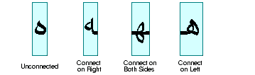
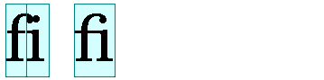
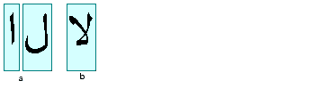

# 文本布局概念

> 原文：[`docs.oracle.com/javase/tutorial/2d/text/textlayoutconcepts.html`](https://docs.oracle.com/javase/tutorial/2d/text/textlayoutconcepts.html)

在显示一段文本之前，必须使用适当的字形和连字对其进行正确的形状和定位。这个过程被称为*文本布局*。文本布局过程涉及以下内容：

+   使用适当的字形和连字来形状文本

+   正确排序文本

+   测量和定位文本

用于排列文本的信息也对执行文本操作（如插入符定位、点击检测和高亮显示）是必要的。查看处理双向文本以获取有关这些文本操作的更多信息。

要开发可以部署在国际市场的软件，文本必须以符合适当书写系统规则的方式排列在不同语言中。

本节涵盖以下主题：

+   形状文本

+   排序文本

+   测量和定位文本

## 形状文本

*字形*是一个或多个字符的视觉表示。字形的形状、大小和位置取决于其上下文。根据字体和样式，可以使用许多不同的字形来表示单个字符或字符组合。

例如，在手写草书文本中，特定字符的形状可能会因其与相邻字符的连接方式而异。

在某些书写系统中，特别是阿拉伯文中，必须始终考虑字形的上下文。与英语不同，阿拉伯文中的草书形式是强制性的；在阿拉伯文中，不能不使用草书形式呈现文本。

根据上下文，这些草书形式在形状上可能有很大差异。例如，阿拉伯字母*heh*有以下图中显示的四种草书形式：

尽管这四种形式彼此非常不同，但这种草书形式的变化与英语中的草书写作并无根本区别。

在某些情况下，两个字形的形状甚至可以发生更大变化，合并成一个单一的字形。这种合并的字形称为*连字*。例如，大多数英文字体包含以下图中显示的连字*fi*：

合并的字形考虑了字母*f*的悬挑，并以一种自然的方式组合字符，而不是简单地让字母相撞。

阿拉伯文中也使用连字，有些连字的使用是强制性的；在不使用适当的连字的情况下呈现某些字符组合是不可接受的。当从阿拉伯字符形成连字时，形状甚至比在英文中更根本地改变。例如，下图说明了当两个阿拉伯字符在一起时如何组合成单个连字。

## 文本排序

在 Java 编程语言中，文本使用 Unicode 字符编码进行编码。使用 Unicode 字符编码的文本以*逻辑顺序*存储在内存中。逻辑顺序是字符和单词被读取和写入的顺序。逻辑顺序不一定与*视觉顺序*相同，即对应字形显示的顺序。

特定书写系统（脚本）中字形的视觉顺序称为*脚本顺序*。例如，罗马文本的脚本顺序是从左到右，而阿拉伯文和希伯来文的脚本顺序是从右到左。

一些书写系统除了脚本顺序外，还有规则来排列文本行上的字形和单词。例如，阿拉伯文和希伯来文的数字是从左到右排列的，即使字母是从右到左排列的。这意味着阿拉伯文和希伯来文，即使没有嵌入英文文本，也是真正的双向文本。更多信息请参见处理双向文本。

## 测量和定位文本

除非您使用等宽字体，否则字体中的不同字符具有不同的宽度。这意味着所有文本的定位和测量都必须考虑到确切使用了哪些字符，而不仅仅是数量。例如，要在比例字体中右对齐显示的数字列，您不能简单地使用额外的空格来定位文本。为了正确对齐列，您需要知道每个数字的确切宽度，以便相应调整。

文本通常使用多种字体和样式显示，如粗体或斜体。在这种情况下，即使是相同的字符也可能有不同的形状和宽度，这取决于其样式。为了正确定位、测量和呈现文本，您需要跟踪每个单独的字符*和*应用于该字符的样式。幸运的是，[`TextLayout`](https://docs.oracle.com/javase/8/docs/api/java/awt/font/TextLayout.html)类可以为您完成这些工作。

要正确显示希伯来文和阿拉伯文等语言的文本，需要测量和定位每个单独的字符，并将其放置在相邻字符的上下文中。由于字符的形状和位置可能会根据上下文而变化，因此在不考虑上下文的情况下测量和定位此类文本会产生不可接受的结果。

此外，Java SE 为您提供了[`FontMetrics`](https://docs.oracle.com/javase/8/docs/api/java/awt/FontMetrics.html)类，它使您能够获取由[`Font`](https://docs.oracle.com/javase/8/docs/api/java/awt/Font.html)对象渲染的文本的测量值，比如字体中一行文本的高度。您可以利用这些信息在 Java 图形应用程序中精确定位文本。更多信息请参见测量文本。
