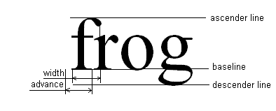

# 测量文本

> 原文：[`docs.oracle.com/javase/tutorial/2d/text/measuringtext.html`](https://docs.oracle.com/javase/tutorial/2d/text/measuringtext.html)

要正确测量文本，您需要学习一些方法和一些要避免的错误。字体度量是由[`Font`](https://docs.oracle.com/javase/8/docs/api/java/awt/Font.html)对象呈现的文本的测量，例如字体中一行文本的高度。测量文本最常见的方法是使用封装了这些度量信息的[`FontMetrics`](https://docs.oracle.com/javase/8/docs/api/java/awt/FontMetrics.html)实例。例如：

```java
// get metrics from the graphics
FontMetrics metrics = graphics.getFontMetrics(font);
// get the height of a line of text in this
// font and render context
int hgt = metrics.getHeight();
// get the advance of my text in this font
// and render context
int adv = metrics.stringWidth(text);
// calculate the size of a box to hold the
// text with some padding.
Dimension size = new Dimension(adv+2, hgt+2);

```

对于许多应用程序来说，这种方式足以均匀间隔文本行或调整 Swing 组件的大小。

注意以下内容：

+   这些度量是从[`Graphics`](https://docs.oracle.com/javase/8/docs/api/java/awt/Graphics.html)类中获取的，因为这个类封装了`FontRenderContext`，这是准确测量文本所需的。在屏幕分辨率下，字体会根据易读性进行调整。随着文本大小的增加，这种调整并不是线性缩放的。因此，在 20 pt 时，字体显示的文本长度不会正好是在 10 pt 时的两倍。除了文本本身和字体之外，用于测量文本的另一个重要信息是`FontRenderContext`。该方法包括从用户空间到设备像素的变换，用于测量文本。

+   高度报告时没有参考任何特定文本字符串。例如，在文本编辑器中，您希望每行文本之间具有相同的行间距时，这是有用的。

+   `stringWidth()`返回文本的前进宽度。*前进宽度*是从文本原点到随后呈现的字符串位置的距离。

在使用这些方法测量文本时，请注意文本可以向字体高度和字符串前进的矩形定义之外的任何方向延伸。



通常，最简单的解决方案是确保文本不被裁剪，例如，由围绕文本的组件。在可能导致文本被裁剪的情况下添加填充。

如果此解决方案不足够，Java 2D 软件中的其他文本测量 API 可以返回矩形边界框。这些框考虑了要测量的特定文本的高度和像素化效果。
